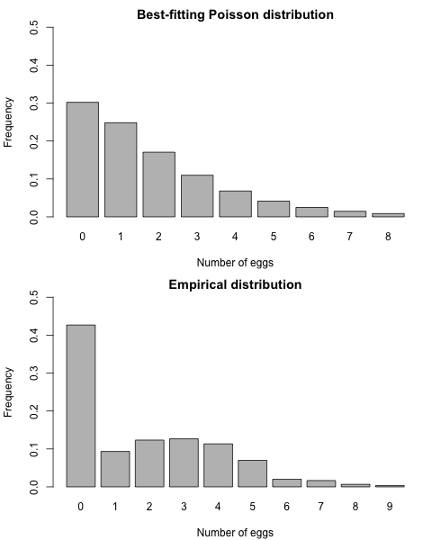

<br>
<span style='color:green'>**Theme Song**</span>
<br>

<audio src="music/California-Dreaming-Chorus.mp3" controls></audio>
<br>

------

# Setting

## SCSS Setup

<style>
pre {
  overflow-x: auto;
}
pre code {
  word-wrap: normal;
  white-space: pre;
}
.table-hover > tbody > tr:hover { 
  background-color: #8D918D;
}
</style>

```{r class.source = 'bg-success', class.output = 'bg-primary', message = FALSE, warning = FALSE}
#if(!suppressPackageStartupMessages(require('BBmisc'))) {
#  install.packages('BBmisc', dependencies = TRUE, INSTALL_opts = '--no-lock')
#}
suppressPackageStartupMessages(library('BBmisc'))
#remotes::install_github("rstudio/sass")
#lib('sass')
suppressPackageStartupMessages(library('sass'))
```

```{scss class.source = 'bg-success', class.output = 'bg-primary'}
/* https://stackoverflow.com/a/66029010/3806250 */
h1 { color: #002C54; }
h2 { color: #2F496E; }
h3 { color: #375E97; }
h4 { color: #375E97; }
h5 { color: #375E97; }

/* ----------------------------------------------------------------- */
/* https://gist.github.com/himynameisdave/c7a7ed14500d29e58149#file-broken-gradient-animation-less */
.hover01 {
  /* color: #FFD64D; */
  background: linear-gradient(155deg, #EDAE01 0%, #FFEB94 100%);
  transition: all 0.45s;
  &:hover{
    background: linear-gradient(155deg, #EDAE01 20%, #FFEB94 80%);
    }
  }

.hover02 {
  color: #FFD64D;
  background: linear-gradient(155deg, #002C54 0%, #4CB5F5 100%);
  transition: all 0.45s;
  &:hover{
    background: linear-gradient(155deg, #002C54 20%, #4CB5F5 80%);
    }
  }

.hover03 {
  color: #FFD64D;
  background: linear-gradient(155deg, #A10115 0%, #FF3C5C 100%);
  transition: all 0.45s;
  &:hover{
    background: linear-gradient(155deg, #A10115 20%, #FF3C5C 80%);
    }
  }
```

```{r global_options, class.source = 'hover01', class.output = 'hover02'}
## https://stackoverflow.com/a/36846793/3806250
options(width = 999)
knitr::opts_chunk$set(class.source = 'hover01', class.output = 'hover02', class.error = 'hover03')
```

<br><br>

## Setup

```{r warning=FALSE, message=FALSE}
pkgs <- c('devtools', 'knitr', 'kableExtra', 'tidyr', 
          'readr', 'lubridate', 'data.table', 'reprex', 
          'timetk', 'plyr', 'dplyr', 'stringr', 'magrittr', 
          'tdplyr', 'tidyverse', 'formattable', 
          'echarts4r', 'paletteer')

suppressAll(lib(pkgs))
# load_pkg(pkgs)

## Set the timezone but not change the datetime
Sys.setenv(TZ = 'Asia/Tokyo')
## options(knitr.table.format = 'html') will set all kableExtra tables to be 'html', otherwise need to set the parameter on every single table.
options(warn = -1, knitr.table.format = 'html')#, digits.secs = 6)

## https://stackoverflow.com/questions/39417003/long-vectors-not-supported-yet-abnor-in-rmd-but-not-in-r-script
knitr::opts_chunk$set(warning = FALSE, message = FALSE)
#, 
                      #cache = TRUE, cache.lazy = FALSE)

rm(pkgs)
```

<br><br>

# 受講生によるテスト：The MCMC algorithm for zero-inflated mixtures

5月17日 15:59 JST までに提出

**課題を受ける準備はできていますか？**

以下に提出のための指示が表示されます。

<br><br>

## 説明

This assignment is similar to one you already completed in Lesson 3. However, in this case you are asked to use an MCMC algorithm to perform Bayesian inference on the model parameters, instead of an EM algorithm to find maximum likelihood estimators.

A biologist is interest in characterizing the number of eggs laid by a particular bird species. To do this, they sample $n=300$ nests on a site in Southern California. The observations are contained in the attached file `nestsize.csv`:

[nestsize.csv](https://github.com/englianhu/Coursera-Bayesian-Statistics-Mixture-Models/blob/main/data/nestsize.csv)

The following graph compares the empirical distribution of the data against a Poison distribution whose parameter has been set to its maximum likelihood estimator:



As you can see, the Poisson distribution underestimates the number of empty nests in the data, and overestimates the number of nests with either 1 or 2 eggs.  To address this, you are asked to modify the implementation of the MCMC algorithm contained in the Reading "Sample code for MCMC example 1" so that you can fit a mixture between a point mass at zero and a Poisson distribution (we call this a "zero-inflated Poisson" distribution):

$f(x) = w \delta_0(x) + (1-w) \frac{e^{-\lambda} \lambda^x}{x!} \quad \quad x \in \{0,1,2,\ldots\}$

where $\delta_0(x)$ represents the degenerate distribution placing all of its mass at zero. You then should run your algorithm for $5,000$ iterations (after a burn-in period of $1,000$ iterations) with the data contained in `nestsize.csv` and report your estimates of the posterior means, rounded to two decimal places.

In carrying out this assignment assume the following priors for your unknown parameters: $\omega \sim Uni[0,1]$ and $\lambda \sim Exp(1)$.

<br><br>

### Review criteria

The code you generate should follow the same structure as "Sample code for MCMC example 1". In particular, focus on a Gibss sampler that alternates between the full conditionals for $\omega$, $\lambda$ and the latent component indicators $c_1, \ldots, c_n$.  Peer reviewers will be asked to check whether the different pieces of code have been adequately modified to reflect the fact that (1) parameters have been initialized in a reasonable way, (2) each of the two full conditional distributions associated with the sampler are correct, and (2) the numerical values that you obtain are correct.  To simplify the peer-review process, assume that component 1 corresponds to the point mass at zero, while component 2 corresponds to the Poisson distribution.

<br><br>

## 自分の提出物

### Assignment

```{r error=TRUE}


```

```{r error=TRUE}


```


<br><br>

### Marking


<br><br>

## ピアレビュー

### 1st Peer

#### Asignment


#### Marking


<br>

### 2nd Peer

#### Asignment


#### Marking


<br>

### 3rd Peer

#### Asignment


#### Marking


<br>

### 4th Peer

#### Asignment


#### Marking


<br>

### 5th Peer

#### Asignment


#### Marking


<br>

### 6th Peer

#### Asignment


#### Marking


<br><br>

## ディスカッション

<br><br>

# Appendix

## Blooper

## Documenting File Creation 

It's useful to record some information about how your file was created.

- File creation date: 2021-05-24
- File latest updated date: `r today('Asia/Tokyo')`
- `r R.version.string`
- [**rmarkdown** package](https://github.com/rstudio/rmarkdown) version: `r packageVersion('rmarkdown')`
- File version: 1.0.0
- Author Profile: [®γσ, Eng Lian Hu](https://github.com/scibrokes/owner)
- GitHub: [Source Code](https://github.com/englianhu/coursera-bayesian-statistics-mixture-models)
- Additional session information:

```{r info, warning=FALSE, error=TRUE, results='asis'}
suppressMessages(require('dplyr', quietly = TRUE))
suppressMessages(require('magrittr', quietly = TRUE))
suppressMessages(require('formattable', quietly = TRUE))
suppressMessages(require('knitr', quietly = TRUE))
suppressMessages(require('kableExtra', quietly = TRUE))

sys1 <- devtools::session_info()$platform %>%
  unlist %>%
  data.frame(Category = names(.), session_info = .)
rownames(sys1) <- NULL

sys2 <- data.frame(Sys.info()) %>%
  dplyr::mutate(Category = rownames(.)) %>%
  .[2:1]
names(sys2)[2] <- c('Sys.info')
rownames(sys2) <- NULL

if (nrow(sys1) == 9 & nrow(sys2) == 8) {
  sys2 %<>% rbind(., data.frame(
  Category = 'Current time', 
  Sys.info = paste(as.character(lubridate::now('Asia/Tokyo')), 'JST🗾')))
} else {
  sys1 %<>% rbind(., data.frame(
  Category = 'Current time', 
  session_info = paste(as.character(lubridate::now('Asia/Tokyo')), 'JST🗾')))
}

sys <- cbind(sys1, sys2) %>%
  kbl(caption = 'Additional session information:') %>%
  kable_styling(bootstrap_options = c('striped', 'hover', 'condensed', 'responsive')) %>%
  row_spec(0, background = 'DimGrey', color = 'yellow') %>%
  column_spec(1, background = 'CornflowerBlue', color = 'red') %>%
  column_spec(2, background = 'grey', color = 'black') %>%
  column_spec(3, background = 'CornflowerBlue', color = 'blue') %>%
  column_spec(4, background = 'grey', color = 'white') %>%
  row_spec(9, bold = T, color = 'yellow', background = '#D7261E')

rm(sys1, sys2)
sys
```

## Reference

<br>

---

<br>
