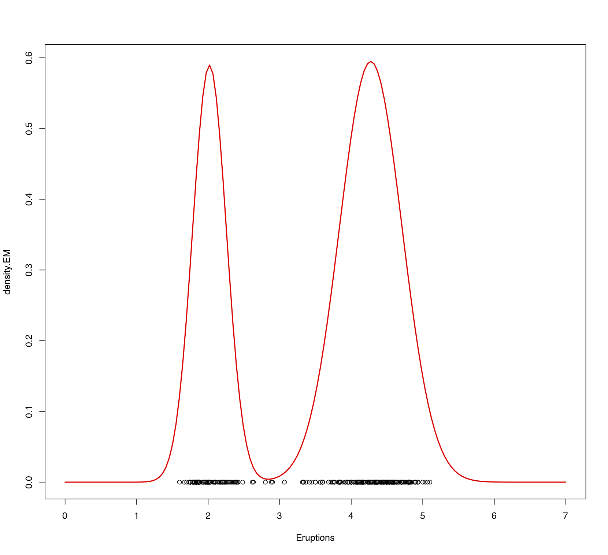

<br>
<span style='color:green'>**Theme Song**</span>
<br>

<audio src="music/California-Dreaming-Chorus.mp3" controls></audio>
<br>

------

# Setting

## SCSS Setup

<style>
pre {
  overflow-x: auto;
}
pre code {
  word-wrap: normal;
  white-space: pre;
}
.table-hover > tbody > tr:hover { 
  background-color: #8D918D;
}
</style>

```{r class.source='bg-success', class.output='bg-primary', message = FALSE, warning = FALSE}
# install.packages("remotes")
library('BBmisc', 'rmsfuns')
#remotes::install_github("rstudio/sass")
lib('sass')
```

```{scss class.source='bg-success', class.output='bg-primary'}
/* https://stackoverflow.com/a/66029010/3806250 */
h1 { color: #002C54; }
h2 { color: #2F496E; }
h3 { color: #375E97; }
h4 { color: #556DAC; }
h5 { color: #92AAC7; }

/* ----------------------------------------------------------------- */
/* https://gist.github.com/himynameisdave/c7a7ed14500d29e58149#file-broken-gradient-animation-less */
.hover01 {
  /* color: #FFD64D; */
  background: linear-gradient(155deg, #EDAE01 0%, #FFEB94 100%);
  transition: all 0.45s;
  &:hover{
    background: linear-gradient(155deg, #EDAE01 20%, #FFEB94 80%);
    }
  }

.hover02 {
  color: #FFD64D;
  background: linear-gradient(155deg, #002C54 0%, #4CB5F5 100%);
  transition: all 0.45s;
  &:hover{
    background: linear-gradient(155deg, #002C54 20%, #4CB5F5 80%);
    }
  }

.hover03 {
  color: #FFD64D;
  background: linear-gradient(155deg, #A10115 0%, #FF3C5C 100%);
  transition: all 0.45s;
  &:hover{
    background: linear-gradient(155deg, #A10115 20%, #FF3C5C 80%);
    }
  }
```

```{r global_options, class.source='hover01', class.output='hover02'}
## https://stackoverflow.com/a/36846793/3806250
options(width = 999)
knitr::opts_chunk$set(class.source = 'hover01', class.output = 'hover02', class.error = 'hover03')
```

<br><br>

## Setup

```{r warning=FALSE, message=FALSE}
if(!suppressPackageStartupMessages(require('BBmisc'))) {
  install.packages('BBmisc', dependencies = TRUE, INSTALL_opts = '--no-lock')
}
suppressPackageStartupMessages(require('BBmisc'))
# suppressPackageStartupMessages(require('rmsfuns'))

pkgs <- c('devtools', 'knitr', 'kableExtra', 'tidyr', 
          'readr', 'lubridate', 'data.table', 'reprex', 
          'timetk', 'plyr', 'dplyr', 'stringr', 'magrittr', 
          'tdplyr', 'tidyverse', 'formattable', 
          'echarts4r', 'paletteer')

suppressAll(lib(pkgs))
# load_pkg(pkgs)

## Set the timezone but not change the datetime
Sys.setenv(TZ = 'Asia/Tokyo')
## options(knitr.table.format = 'html') will set all kableExtra tables to be 'html', otherwise need to set the parameter on every single table.
options(warn = -1, knitr.table.format = 'html')#, digits.secs = 6)

## https://stackoverflow.com/questions/39417003/long-vectors-not-supported-yet-abnor-in-rmd-but-not-in-r-script
knitr::opts_chunk$set(message = FALSE, warning = FALSE)#, 
                      #cache = TRUE, cache.lazy = FALSE)

rm(pkgs)
```

<br><br>

# 受講生によるテスト：The EM algorithm and density estimation

**課題を受ける準備はできていますか？**

以下に提出のための指示が表示されます。

## 説明

The R dataset `faithful` contains data on waiting time between eruptions (the column named `waiting`) and the duration of the eruption (the column named `eruptions`) for the famous Old Faithful geyser in Yellowstone National Park, Wyoming, USA.  

You are asked to modify the <u>EM algorithm</u> provided in "Sample code for density estimation problems" to provide a density estimate the marginal distribution of the duration of the eruptions using a <u>location-and-scale</u> mixture of 2 univariate Gaussian distributions (as opposed to the <u>location</u> mixture of 6 univariate Gaussian distributions that we used for the `galaxies` dataset).

<br><br>

### Review criteria

Reviewers will check whether the code has been modified correctly, and whether the density estimate you generate appears correct.  Please remember that you are being asked to use a location-and-scale mixture to generate the density estimate, so the "Sample code for density estimation problems" cannot be used directly and requires some modification.  Before submitting your answer, it might be useful to compare the density estimate generated by your algorithm against a kernel density estimate generated by the R function `density()`.  While they should not be identical, they should be similar.

<br><br>

## 自分の提出物

### Assignment

Provide an EM algorithm to fit the two-component, location-and-scale mixture of Gaussians.

```{r error=TRUE}

```

Provide code to generate the density estimate on a grid consisting of 150 points in the interval [0,7].

```{r error=TRUE}

```

Provide the a graph of the density estimate on the interval [0,7].

```{r error=TRUE}

```

### Marking

**Is the E step implemented correctly?**

There are a couple of ways in which the E step can be implemented. This is an example that uses $\omega$ and $1-\omega$ as the weights of the two components

```{r error=TRUE}
## E step
v = array(0, dim=c(n,2))
for(i in 1:n){
  v[i,1] = log(w) + dnorm(x[i], mu[1], sigma[1], log=T)
  v[i,2] = log(1-w) + dnorm(x[i], mu[2], sigma[2], log=T)
  v[i,]  = exp(v[i,] - max(v[i,]))/sum(exp(v[i,] - max(v[i,]))) 
}
```

An alternative implementation that is also valid would parameterize the weights in terms of $\omega_1$ and $\omega_2$, so be open minded when grading.

- 0点 No
- 1点 Yes

**Is the M step implemented correctly?**

The exact form of the implementation of the M step also depends on how the weights are parameterized. Assuming that $\omega$ and $1-\omega$ are used,

```{r error=TRUE}
## M step
# Weights
w  = mean(v[,1])
# Means
mu = rep(0, 2)
for(k in 1:2){
  for(i in 1:n){
    mu[k]    = mu[k] + v[i,k]*x[i]
  }
  mu[k] = mu[k]/sum(v[,k])
}
# Variances
sigma = rep(0,2)
for(k in 1:2){
  for(i in 1:n){
    sigma[k] = sigma[k] + v[i,k]*(x[i] - mu[k])^2
  }
  sigma[k] = sqrt(sigma[k]/sum(v[,k]))
}
```

As always, please remember that there are multiple ways to achieve the same goal in R.

- 0点 No
- 1点 Yes

**Does the code to generate the density estimate appear correct?**

This is an example that, as before, assumes that the weights are parameterized as ww and $1-\omega$.

```{r error=TRUE}
xx  = seq(0,7,length=150)
nxx = length(xx)
density.EM = rep(0, nxx)
for(s in 1:nxx){
  density.EM[s] = density.EM[s] + w*dnorm(xx[s], mu[1], sigma[1]) + 
                                  (1-w)*dnorm(xx[s], mu[2], sigma[2])
}
plot(xx, density.EM, col="red", lwd=2, type="l")
points(x,rep(0,n))
```

- 0点 No
- 1点 Yes

**Does the graph appear to be correct?**

The density estimate should look similar to the Figure below.  Note that the variance of both components is clearly different.



The complete code for the EM algorithm follows:

```{r error=TRUE}
###### Setup data
x = faithful$eruptions
n = length(x)

###### EM algorithm to fit the location-and-scale mixture of 2 Gaussians
w      = 0.5          
mu     = c(mean(x)-sd(x), mean(x)+sd(x))
sigma  = rep(sd(x)/4,2)

s  = 0
sw = FALSE
QQ = -Inf
QQ.out = NULL
epsilon = 10^(-5)

while(!sw){
  ## E step
  v = array(0, dim=c(n,2))
  for(i in 1:n){
    v[i,1] = log(w) + dnorm(x[i], mu[1], sigma[1], log=T)
    v[i,2] = log(1-w) + dnorm(x[i], mu[2], sigma[2], log=T)
    v[i,]  = exp(v[i,] - max(v[i,]))/sum(exp(v[i,] - max(v[i,]))) 
  }

  ## M step
  # Weights
  w  = mean(v[,1])
  # Means
  mu = rep(0, 2)
  for(k in 1:2){
    for(i in 1:n){
      mu[k]    = mu[k] + v[i,k]*x[i]
    }
    mu[k] = mu[k]/sum(v[,k])
  }
  # Variances
  sigma = rep(0,2)
  for(k in 1:2){
    for(i in 1:n){
      sigma[k] = sigma[k] + v[i,k]*(x[i] - mu[k])^2
    }
    sigma[k] = sqrt(sigma[k]/sum(v[,k]))
  }
  ## Check convergence
  QQn = 0
  for(i in 1:n){
    QQn = QQn + v[i,1]*(log(w) + dnorm(x[i],mu[1],sigma[1],log=TRUE)) +
                v[i,2]*(log(1-w) + dnorm(x[i],mu[2],sigma[2],log=TRUE))
  }
  if(abs(QQn-QQ)/abs(QQn)<epsilon){
    sw=TRUE
  }
  QQ = QQn
  QQ.out = c(QQ.out, QQ)
  s = s + 1
  print(paste(s, QQn))
}

xx  = seq(0,7,length=150)
nxx = length(xx)
density.EM = rep(0, nxx)
for(s in 1:nxx){
  density.EM[s] = density.EM[s] + w*dnorm(xx[s], mu[1], sigma[1]) + 
                                  (1-w)*dnorm(xx[s], mu[2], sigma[2])
}
plot(xx, density.EM, col="red", lwd=2, type="l", xlab="Eruptions")
points(x,rep(0,n))
```

- 0点 No
- 1点 Yes

<br><br>

## ピアレビュー

### 1st Peer

#### Assignment

Provide an EM algorithm to fit the two-component, location-and-scale mixture of Gaussians.

```{r error=TRUE}
while(!sw){
  ## E step
  v = array(0, dim=c(n,KK))
  for(k in 1:KK){
    v[,k] = log(w[k]) + dnorm(x, mu[k], sigma,log=TRUE)  
  }
  for(i in 1:n){
    v[i,] = exp(v[i,] - max(v[i,]))/sum(exp(v[i,] - max(v[i,])))
  }
  
  ## M step
  # Weights
  w = apply(v,2,mean)
  mu = rep(0, KK)
  for(k in 1:KK){
    for(i in 1:n){
      mu[k]    = mu[k] + v[i,k]*x[i]
    }
    mu[k] = mu[k]/sum(v[,k])
  }
  # Standard deviations
  sigma = 0
  for(i in 1:n){
    for(k in 1:KK){
      sigma = sigma + v[i,k]*(x[i] - mu[k])^2
    }
  }
  sigma = sqrt(sigma/sum(v))
  
  ##Check convergence
  KLn = 0
  for(i in 1:n){
    for(k in 1:KK){
      KLn = KLn + v[i,k]*(log(w[k]) + dnorm(x[i], mu[k], sigma, log=TRUE))
    }
  }
  if(abs(KLn-KL)/abs(KLn)<epsilon){
    sw=TRUE
  }
  KL = KLn
  KL.out = c(KL.out, KL)
  s = s + 1
  print(paste(s, KLn))
}
```

Provide code to generate the density estimate on a grid consisting of 150 points in the interval [0,7].

```{r error=TRUE}
xx  = seq(0,7,length.out=150)
nxx = length(xx)
density.EM = rep(0, nxx)
for(s in 1:nxx){
  for(k in 1:KK){
    density.EM[s] = density.EM[s] + w[k]*dnorm(xx[s], mu[k], sigma)
  }
}
```

Provide the a graph of the density estimate on the interval [0,7].

Here is the code to generate the graph. I apparently can not copy the graph to this window.

```{r error=TRUE}
 ## Plot Bayesian estimate with pointwise credible bands along with kernel density estimate and frequentist point estimate
colscale = c("black", "blue", "red")
yy = density(x)
density.mcmc.lq = apply(density.mcmc, 2, quantile, 0.025)
density.mcmc.uq = apply(density.mcmc, 2, quantile, 0.975)
plot(xx, density.mcmc.m, type="n",ylim=c(0,max(density.mcmc.uq)),xlab="Eruption Duration", ylab="Density")
polygon(c(xx,rev(xx)), c(density.mcmc.lq, rev(density.mcmc.uq)), col="grey", border="grey")
lines(xx, density.mcmc.m, col=colscale[1], lwd=2)
lines(xx, density.EM, col=colscale[2], lty=2, lwd=2)
lines(yy, col=colscale[3], lty=3, lwd=2)
points(x, rep(0,n))
legend(27000, 0.00017, c("KDE","EM","MCMC"), col=colscale[c(3,2,1)], lty=c(3,2,1), lwd=2, bty="n")
```

#### Marking

**Is the E step implemented correctly?**

There are a couple of ways in which the E step can be implemented. This is an example that uses $\omega$ and $1-\omega$ as the weights of the two components

```{r error=TRUE}
## E step
v = array(0, dim=c(n,2))
for(i in 1:n){
  v[i,1] = log(w) + dnorm(x[i], mu[1], sigma[1], log=T)
  v[i,2] = log(1-w) + dnorm(x[i], mu[2], sigma[2], log=T)
  v[i,]  = exp(v[i,] - max(v[i,]))/sum(exp(v[i,] - max(v[i,]))) 
}
```

An alternative implementation that is also valid would parameterize the weights in terms of $\omega_1$ and $\omega_2$, so be open minded when grading.

- 0点 No
- <span style='color:green;'>1点 Yes</span>

**Is the M step implemented correctly?**

The exact form of the implementation of the M step also depends on how the weights are parameterized. Assuming that $\omega$ and $1-\omega$ are used,

```{r error=TRUE}
## M step
# Weights
w  = mean(v[,1])
# Means
mu = rep(0, 2)
for(k in 1:2){
  for(i in 1:n){
    mu[k]    = mu[k] + v[i,k]*x[i]
  }
  mu[k] = mu[k]/sum(v[,k])
}
# Variances
sigma = rep(0,2)
for(k in 1:2){
  for(i in 1:n){
    sigma[k] = sigma[k] + v[i,k]*(x[i] - mu[k])^2
  }
  sigma[k] = sqrt(sigma[k]/sum(v[,k]))
}
```

As always, please remember that there are multiple ways to achieve the same goal in R.

- 0点 No
- <span style='color:green;'>1点 Yes</span>

**Does the code to generate the density estimate appear correct?**

This is an example that, as before, assumes that the weights are parameterized as ww and $1-\omega$.

```{r error=TRUE}
xx  = seq(0,7,length=150)
nxx = length(xx)
density.EM = rep(0, nxx)
for(s in 1:nxx){
  density.EM[s] = density.EM[s] + w*dnorm(xx[s], mu[1], sigma[1]) + 
                                  (1-w)*dnorm(xx[s], mu[2], sigma[2])
}
plot(xx, density.EM, col="red", lwd=2, type="l")
points(x,rep(0,n))
```

- <span style='color:red;'>0点 No</span>
- 1点 Yes

**Does the graph appear to be correct?**

The density estimate should look similar to the Figure below.  Note that the variance of both components is clearly different.


The complete code for the EM algorithm follows:

```{r error=TRUE}
###### Setup data
x = faithful$eruptions
n = length(x)

###### EM algorithm to fit the location-and-scale mixture of 2 Gaussians
w      = 0.5          
mu     = c(mean(x)-sd(x), mean(x)+sd(x))
sigma  = rep(sd(x)/4,2)

s  = 0
sw = FALSE
QQ = -Inf
QQ.out = NULL
epsilon = 10^(-5)

while(!sw){
  ## E step
  v = array(0, dim=c(n,2))
  for(i in 1:n){
    v[i,1] = log(w) + dnorm(x[i], mu[1], sigma[1], log=T)
    v[i,2] = log(1-w) + dnorm(x[i], mu[2], sigma[2], log=T)
    v[i,]  = exp(v[i,] - max(v[i,]))/sum(exp(v[i,] - max(v[i,]))) 
  }

  ## M step
  # Weights
  w  = mean(v[,1])
  # Means
  mu = rep(0, 2)
  for(k in 1:2){
    for(i in 1:n){
      mu[k]    = mu[k] + v[i,k]*x[i]
    }
    mu[k] = mu[k]/sum(v[,k])
  }
  # Variances
  sigma = rep(0,2)
  for(k in 1:2){
    for(i in 1:n){
      sigma[k] = sigma[k] + v[i,k]*(x[i] - mu[k])^2
    }
    sigma[k] = sqrt(sigma[k]/sum(v[,k]))
  }
  ## Check convergence
  QQn = 0
  for(i in 1:n){
    QQn = QQn + v[i,1]*(log(w) + dnorm(x[i],mu[1],sigma[1],log=TRUE)) +
                v[i,2]*(log(1-w) + dnorm(x[i],mu[2],sigma[2],log=TRUE))
  }
  if(abs(QQn-QQ)/abs(QQn)<epsilon){
    sw=TRUE
  }
  QQ = QQn
  QQ.out = c(QQ.out, QQ)
  s = s + 1
  print(paste(s, QQn))
}

xx  = seq(0,7,length.out=150)
nxx = length(xx)
density.EM = rep(0, nxx)
for(s in 1:nxx){
  density.EM[s] = density.EM[s] + w*dnorm(xx[s], mu[1], sigma[1]) + 
                                  (1-w)*dnorm(xx[s], mu[2], sigma[2])
}
plot(xx, density.EM, col="red", lwd=2, type="l", xlab="Eruptions")
points(x,rep(0,n))
```

- <span style='color:red;'>0点 No</span>
- 1点 Yes

<br>

### 2nd Peer

#### Assignment

Provide an EM algorithm to fit the two-component, location-and-scale mixture of Gaussians.

```{r error=TRUE}
## Initialize the parameters
w     = rep(1,KK)/KK
mu    = rnorm(KK, mean(x), sd(x))
sigma = rep(sd(x)/KK, KK)

epsilon = 0.000001
s       = 0
sw      = FALSE
KL      = -Inf
KL.out  = NULL

print(paste(w, mu, sigma))
while(!sw){
  ## E step
  v = array(0, dim=c(n,KK))
  for(k in 1:KK){
    v[,k] = log(w[k]) + dnorm(x, mu[k], sigma[k],log=TRUE)  
  }
  for(i in 1:n){
    v[i,] = exp(v[i,] - max(v[i,]))/sum(exp(v[i,] - max(v[i,])))
  }
  
  ## M step
  # Weights
  w = apply(v,2,mean)
  mu = rep(0, KK)
  for(k in 1:KK){
    for(i in 1:n){
      mu[k]    = mu[k] + v[i,k]*x[i]
    }
    mu[k] = mu[k]/sum(v[,k])
  }
  # Standard deviations
  sigma = rep(0,KK)
  for(k in 1:KK){
    for(i in 1:n){
      sigma[k] = sigma[k] + v[i,k]*(x[i] - mu[k])^2
    }
    sigma[k] = sqrt(sigma[k]/sum(v[,k]))
  }
  
  ##Check convergence
  KLn = 0
  for(i in 1:n){
    for(k in 1:KK){
      KLn = KLn + v[i,k]*(log(w[k]) + dnorm(x[i], mu[k], sigma[k], log=TRUE))
    }
  }
  if(abs(KLn-KL)/abs(KLn)<epsilon){
    sw=TRUE
  }
  KL = KLn
  KL.out = c(KL.out, KL)
  s = s + 1
  print(paste(w, mu, sigma))
  print(paste(s, KLn))
}
```

Provide code to generate the density estimate on a grid consisting of 150 points in the interval [0,7].

```{r error=TRUE}
## Plot EM Density Estimate
Eruptions  = seq(0, 7,length.out=300)
nxx = length(xx)
density.EM = rep(0, nxx)
for(s in 1:nxx){
  for(k in 1:KK){
    density.EM[s] = density.EM[s] + w[k]*dnorm(Eruptions[s], mu[k], sigma[k])
  }
}

yy = density(x)
plot(Eruptions, density.EM, col="red", lwd=2, type="l")
points(x, rep(0,n))
```

Provide the a graph of the density estimate on the interval [0,7].

Here is the code to generate the graph. I apparently can not copy the graph to this window.

```{r error=TRUE}

```

#### Marking

**Is the E step implemented correctly?**

There are a couple of ways in which the E step can be implemented. This is an example that uses $\omega$ and $1-\omega$ as the weights of the two components

```{r error=TRUE}
## E step
v = array(0, dim=c(n,2))
for(i in 1:n){
  v[i,1] = log(w) + dnorm(x[i], mu[1], sigma[1], log=T)
  v[i,2] = log(1-w) + dnorm(x[i], mu[2], sigma[2], log=T)
  v[i,]  = exp(v[i,] - max(v[i,]))/sum(exp(v[i,] - max(v[i,]))) 
}
```

An alternative implementation that is also valid would parameterize the weights in terms of $\omega_1$ and $\omega_2$, so be open minded when grading.

- 0点 No
- 1点 Yes

**Is the M step implemented correctly?**

The exact form of the implementation of the M step also depends on how the weights are parameterized. Assuming that $\omega$ and $1-\omega$ are used,

```{r error=TRUE}
## M step
# Weights
w  = mean(v[,1])
# Means
mu = rep(0, 2)
for(k in 1:2){
  for(i in 1:n){
    mu[k]    = mu[k] + v[i,k]*x[i]
  }
  mu[k] = mu[k]/sum(v[,k])
}
# Variances
sigma = rep(0,2)
for(k in 1:2){
  for(i in 1:n){
    sigma[k] = sigma[k] + v[i,k]*(x[i] - mu[k])^2
  }
  sigma[k] = sqrt(sigma[k]/sum(v[,k]))
}
```

As always, please remember that there are multiple ways to achieve the same goal in R.

- 0点 No
- 1点 Yes

**Does the code to generate the density estimate appear correct?**

This is an example that, as before, assumes that the weights are parameterized as ww and $1-\omega$.

```{r error=TRUE}
xx  = seq(0,7,length=150)
nxx = length(xx)
density.EM = rep(0, nxx)
for(s in 1:nxx){
  density.EM[s] = density.EM[s] + w*dnorm(xx[s], mu[1], sigma[1]) + 
                                  (1-w)*dnorm(xx[s], mu[2], sigma[2])
}
plot(xx, density.EM, col="red", lwd=2, type="l")
points(x,rep(0,n))
```

- 0点 No
- 1点 Yes

**Does the graph appear to be correct?**

The density estimate should look similar to the Figure below.  Note that the variance of both components is clearly different.


The complete code for the EM algorithm follows:

```{r error=TRUE}
###### Setup data
x = faithful$eruptions
n = length(x)

###### EM algorithm to fit the location-and-scale mixture of 2 Gaussians
w      = 0.5          
mu     = c(mean(x)-sd(x), mean(x)+sd(x))
sigma  = rep(sd(x)/4,2)

s  = 0
sw = FALSE
QQ = -Inf
QQ.out = NULL
epsilon = 10^(-5)

while(!sw){
  ## E step
  v = array(0, dim=c(n,2))
  for(i in 1:n){
    v[i,1] = log(w) + dnorm(x[i], mu[1], sigma[1], log=T)
    v[i,2] = log(1-w) + dnorm(x[i], mu[2], sigma[2], log=T)
    v[i,]  = exp(v[i,] - max(v[i,]))/sum(exp(v[i,] - max(v[i,]))) 
  }

  ## M step
  # Weights
  w  = mean(v[,1])
  # Means
  mu = rep(0, 2)
  for(k in 1:2){
    for(i in 1:n){
      mu[k]    = mu[k] + v[i,k]*x[i]
    }
    mu[k] = mu[k]/sum(v[,k])
  }
  # Variances
  sigma = rep(0,2)
  for(k in 1:2){
    for(i in 1:n){
      sigma[k] = sigma[k] + v[i,k]*(x[i] - mu[k])^2
    }
    sigma[k] = sqrt(sigma[k]/sum(v[,k]))
  }
  ## Check convergence
  QQn = 0
  for(i in 1:n){
    QQn = QQn + v[i,1]*(log(w) + dnorm(x[i],mu[1],sigma[1],log=TRUE)) +
                v[i,2]*(log(1-w) + dnorm(x[i],mu[2],sigma[2],log=TRUE))
  }
  if(abs(QQn-QQ)/abs(QQn)<epsilon){
    sw=TRUE
  }
  QQ = QQn
  QQ.out = c(QQ.out, QQ)
  s = s + 1
  print(paste(s, QQn))
}

xx  = seq(0,7,length=150)
nxx = length(xx)
density.EM = rep(0, nxx)
for(s in 1:nxx){
  density.EM[s] = density.EM[s] + w*dnorm(xx[s], mu[1], sigma[1]) + 
                                  (1-w)*dnorm(xx[s], mu[2], sigma[2])
}
plot(xx, density.EM, col="red", lwd=2, type="l", xlab="Eruptions")
points(x,rep(0,n))
```

- 0点 No
- 1点 Yes

<br>

### 3rd Peer

#### Assignment

Provide an EM algorithm to fit the two-component, location-and-scale mixture of Gaussians.

```{r error=TRUE}

```

Provide code to generate the density estimate on a grid consisting of 150 points in the interval [0,7].

```{r error=TRUE}

```

Provide the a graph of the density estimate on the interval [0,7].

Here is the code to generate the graph. I apparently can not copy the graph to this window.

```{r error=TRUE}

```

#### Marking

**Is the E step implemented correctly?**

There are a couple of ways in which the E step can be implemented. This is an example that uses $\omega$ and $1-\omega$ as the weights of the two components

```{r error=TRUE}
## E step
v = array(0, dim=c(n,2))
for(i in 1:n){
  v[i,1] = log(w) + dnorm(x[i], mu[1], sigma[1], log=T)
  v[i,2] = log(1-w) + dnorm(x[i], mu[2], sigma[2], log=T)
  v[i,]  = exp(v[i,] - max(v[i,]))/sum(exp(v[i,] - max(v[i,]))) 
}
```

An alternative implementation that is also valid would parameterize the weights in terms of $\omega_1$ and $\omega_2$, so be open minded when grading.

- 0点 No
- 1点 Yes

**Is the M step implemented correctly?**

The exact form of the implementation of the M step also depends on how the weights are parameterized. Assuming that $\omega$ and $1-\omega$ are used,

```{r error=TRUE}
## M step
# Weights
w  = mean(v[,1])
# Means
mu = rep(0, 2)
for(k in 1:2){
  for(i in 1:n){
    mu[k]    = mu[k] + v[i,k]*x[i]
  }
  mu[k] = mu[k]/sum(v[,k])
}
# Variances
sigma = rep(0,2)
for(k in 1:2){
  for(i in 1:n){
    sigma[k] = sigma[k] + v[i,k]*(x[i] - mu[k])^2
  }
  sigma[k] = sqrt(sigma[k]/sum(v[,k]))
}
```

As always, please remember that there are multiple ways to achieve the same goal in R.

- 0点 No
- 1点 Yes

**Does the code to generate the density estimate appear correct?**

This is an example that, as before, assumes that the weights are parameterized as ww and $1-\omega$.

```{r error=TRUE}
xx  = seq(0,7,length=150)
nxx = length(xx)
density.EM = rep(0, nxx)
for(s in 1:nxx){
  density.EM[s] = density.EM[s] + w*dnorm(xx[s], mu[1], sigma[1]) + 
                                  (1-w)*dnorm(xx[s], mu[2], sigma[2])
}
plot(xx, density.EM, col="red", lwd=2, type="l")
points(x,rep(0,n))
```

- 0点 No
- 1点 Yes

**Does the graph appear to be correct?**

The density estimate should look similar to the Figure below.  Note that the variance of both components is clearly different.


The complete code for the EM algorithm follows:

```{r error=TRUE}
###### Setup data
x = faithful$eruptions
n = length(x)

###### EM algorithm to fit the location-and-scale mixture of 2 Gaussians
w      = 0.5          
mu     = c(mean(x)-sd(x), mean(x)+sd(x))
sigma  = rep(sd(x)/4,2)

s  = 0
sw = FALSE
QQ = -Inf
QQ.out = NULL
epsilon = 10^(-5)

while(!sw){
  ## E step
  v = array(0, dim=c(n,2))
  for(i in 1:n){
    v[i,1] = log(w) + dnorm(x[i], mu[1], sigma[1], log=T)
    v[i,2] = log(1-w) + dnorm(x[i], mu[2], sigma[2], log=T)
    v[i,]  = exp(v[i,] - max(v[i,]))/sum(exp(v[i,] - max(v[i,]))) 
  }

  ## M step
  # Weights
  w  = mean(v[,1])
  # Means
  mu = rep(0, 2)
  for(k in 1:2){
    for(i in 1:n){
      mu[k]    = mu[k] + v[i,k]*x[i]
    }
    mu[k] = mu[k]/sum(v[,k])
  }
  # Variances
  sigma = rep(0,2)
  for(k in 1:2){
    for(i in 1:n){
      sigma[k] = sigma[k] + v[i,k]*(x[i] - mu[k])^2
    }
    sigma[k] = sqrt(sigma[k]/sum(v[,k]))
  }
  ## Check convergence
  QQn = 0
  for(i in 1:n){
    QQn = QQn + v[i,1]*(log(w) + dnorm(x[i],mu[1],sigma[1],log=TRUE)) +
                v[i,2]*(log(1-w) + dnorm(x[i],mu[2],sigma[2],log=TRUE))
  }
  if(abs(QQn-QQ)/abs(QQn)<epsilon){
    sw=TRUE
  }
  QQ = QQn
  QQ.out = c(QQ.out, QQ)
  s = s + 1
  print(paste(s, QQn))
}

xx  = seq(0,7,length=150)
nxx = length(xx)
density.EM = rep(0, nxx)
for(s in 1:nxx){
  density.EM[s] = density.EM[s] + w*dnorm(xx[s], mu[1], sigma[1]) + 
                                  (1-w)*dnorm(xx[s], mu[2], sigma[2])
}
plot(xx, density.EM, col="red", lwd=2, type="l", xlab="Eruptions")
points(x,rep(0,n))
```

- 0点 No
- 1点 Yes

<br><br>

## ディスカッション

<br><br>

# Appendix

## Blooper

## Documenting File Creation 

It's useful to record some information about how your file was created.

- File creation date: 2021-05-24
- File latest updated date: `r today('Asia/Tokyo')`
- `r R.version.string`
- [**rmarkdown** package](https://github.com/rstudio/rmarkdown) version: `r packageVersion('rmarkdown')`
- File version: 1.0.0
- Author Profile: [®γσ, Eng Lian Hu](https://github.com/scibrokes/owner)
- GitHub: [Source Code](https://github.com/englianhu/coursera-bayesian-statistics-mixture-models)
- Additional session information:

```{r info, warning=FALSE, error=TRUE, results='asis'}
suppressMessages(require('dplyr', quietly = TRUE))
suppressMessages(require('magrittr', quietly = TRUE))
suppressMessages(require('formattable', quietly = TRUE))
suppressMessages(require('knitr', quietly = TRUE))
suppressMessages(require('kableExtra', quietly = TRUE))

sys1 <- devtools::session_info()$platform %>% 
  unlist %>% data.frame(Category = names(.), session_info = .)
rownames(sys1) <- NULL

sys2 <- data.frame(Sys.info()) %>% 
  dplyr::mutate(Category = rownames(.)) %>% .[2:1]
names(sys2)[2] <- c('Sys.info')
rownames(sys2) <- NULL

if (nrow(sys1) == 9 & nrow(sys2) == 8) {
  sys2 %<>% rbind(., data.frame(
  Category = 'Current time', 
  Sys.info = paste(as.character(lubridate::now('Asia/Tokyo')), 'JST🗾')))
} else {
  sys1 %<>% rbind(., data.frame(
  Category = 'Current time', 
  session_info = paste(as.character(lubridate::now('Asia/Tokyo')), 'JST🗾')))
}

sys <- cbind(sys1, sys2) %>% 
  kbl(caption = 'Additional session information:') %>% 
  kable_styling(bootstrap_options = c('striped', 'hover', 'condensed', 'responsive')) %>% 
  row_spec(0, background = 'DimGrey', color = 'yellow') %>% 
  column_spec(1, background = 'CornflowerBlue', color = 'red') %>% 
  column_spec(2, background = 'grey', color = 'black') %>% 
  column_spec(3, background = 'CornflowerBlue', color = 'blue') %>% 
  column_spec(4, background = 'grey', color = 'white') %>% 
  row_spec(9, bold = T, color = 'yellow', background = '#D7261E')

rm(sys1, sys2)
sys
```

## Reference

<br><br>
