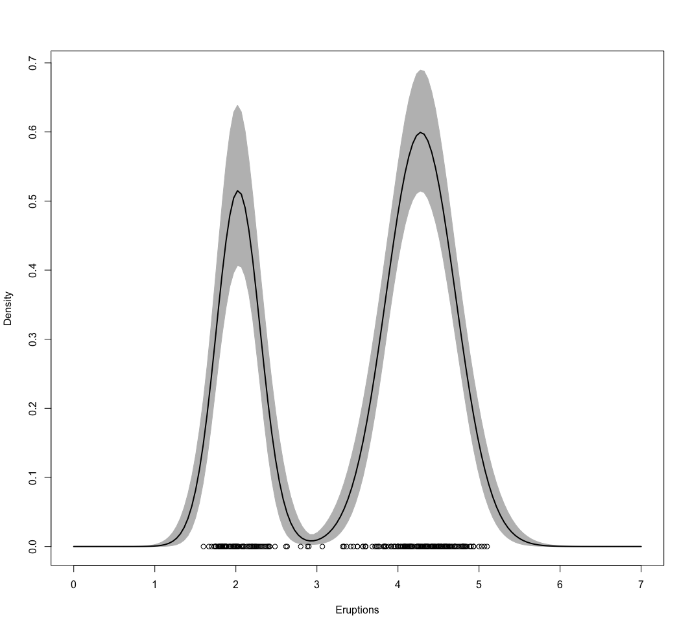
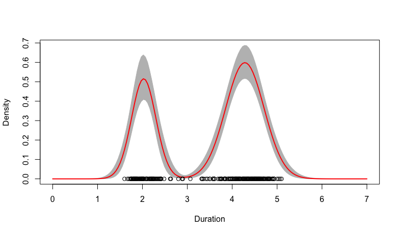
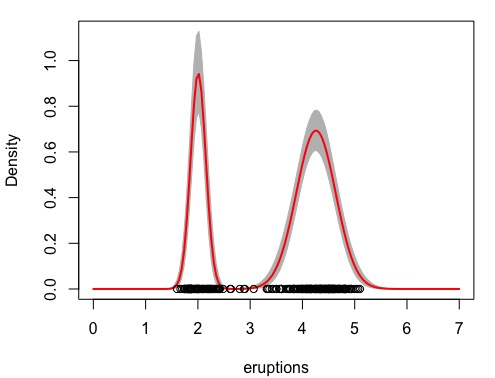

<br>
<span style='color:green'>**Theme Song**</span>
<br>

<audio src="music/California-Dreaming-Chorus.mp3" controls></audio>
<br>

------

# Setting

## SCSS Setup

<style>
pre {
  overflow-x: auto;
}
pre code {
  word-wrap: normal;
  white-space: pre;
}
.table-hover > tbody > tr:hover { 
  background-color: #8D918D;
}
</style>

```{r class.source='bg-success', class.output='bg-primary', message = FALSE, warning = FALSE}
# install.packages("remotes")
library('BBmisc', 'rmsfuns')
#remotes::install_github("rstudio/sass")
lib('sass')
```

```{scss class.source='bg-success', class.output='bg-primary'}
/* https://stackoverflow.com/a/66029010/3806250 */
h1 { color: #002C54; }
h2 { color: #2F496E; }
h3 { color: #375E97; }
h4 { color: #556DAC; }
h5 { color: #92AAC7; }

/* ----------------------------------------------------------------- */
/* https://gist.github.com/himynameisdave/c7a7ed14500d29e58149#file-broken-gradient-animation-less */
.hover01 {
  /* color: #FFD64D; */
  background: linear-gradient(155deg, #EDAE01 0%, #FFEB94 100%);
  transition: all 0.45s;
  &:hover{
    background: linear-gradient(155deg, #EDAE01 20%, #FFEB94 80%);
    }
  }

.hover02 {
  color: #FFD64D;
  background: linear-gradient(155deg, #002C54 0%, #4CB5F5 100%);
  transition: all 0.45s;
  &:hover{
    background: linear-gradient(155deg, #002C54 20%, #4CB5F5 80%);
    }
  }

.hover03 {
  color: #FFD64D;
  background: linear-gradient(155deg, #A10115 0%, #FF3C5C 100%);
  transition: all 0.45s;
  &:hover{
    background: linear-gradient(155deg, #A10115 20%, #FF3C5C 80%);
    }
  }
```

```{r global_options, class.source='hover01', class.output='hover02'}
## https://stackoverflow.com/a/36846793/3806250
options(width = 999)
knitr::opts_chunk$set(class.source = 'hover01', class.output = 'hover02', class.error = 'hover03')
```

<br><br>

## Setup

```{r warning=FALSE, message=FALSE}
if(!suppressPackageStartupMessages(require('BBmisc'))) {
  install.packages('BBmisc', dependencies = TRUE, INSTALL_opts = '--no-lock')
}
suppressPackageStartupMessages(require('BBmisc'))
# suppressPackageStartupMessages(require('rmsfuns'))

pkgs <- c('devtools', 'knitr', 'kableExtra', 'tidyr', 
          'readr', 'lubridate', 'reprex', 'echarts4r', 
          'timetk', 'plyr', 'dplyr', 'stringr', 'magrittr', 
          'tdplyr', 'tidyverse', 'formattable', 
          'paletteer')

suppressAll(lib(pkgs))
# load_pkg(pkgs)

## Set the timezone but not change the datetime
Sys.setenv(TZ = 'Asia/Tokyo')
## options(knitr.table.format = 'html') will set all kableExtra tables to be 'html', otherwise need to set the parameter on every single table.
options(warn = -1, knitr.table.format = 'html')#, digits.secs = 6)

## https://stackoverflow.com/questions/39417003/long-vectors-not-supported-yet-abnor-in-rmd-but-not-in-r-script
knitr::opts_chunk$set(message = FALSE, warning = FALSE)#, 
                      #cache = TRUE, cache.lazy = FALSE)

rm(pkgs)
```

<br><br>

# 受講生によるテスト：MCMC algorithms and density estimation

**課題をすぐに提出してください**

課題の提出期限は、`5月31日 15:59 JST`ですが、可能であれば1日か2日早く提出してください。 早い段階で提出すると、他の受講生のレビューを時間内に得る可能性が高くなります。

<br><br>

## 説明

The R dataset `faithful` contains data on waiting time between eruptions (the column named waiting) and the duration of the eruption (the column named eruptions) for the famous Old Faithful geyser in Yellowstone National Park, Wyoming, USA.  

In this case, you are asked to modify the <u>MCMC algorithm</u> provided in "Sample code for density estimation problems" (as opposed to the EM algorithm you used in the previous peer assignment) to provide a (Bayesian) density estimate the marginal distribution of the duration of the eruptions using a <u>location-and-scale</u> mixture of 2 univariate Gaussian distributions (as opposed to the location mixture of 6 univariate Gaussian distributions that we used for the galaxies dataset).  Assume that the priors are $\omega∼Beta(1,1)$, $\mu_k∼Normal(η,\tau^2)$ and $1/σ^2_k∼Gamma(d,q)$, where $\eta$, $\tau^2$, $d$ and $q$ are selected using an empirical Bayes approach similar to the one we used in "Sample code for density estimation problems".

<br><br>

### Review criteria

Reviewers will check whether the code has been modified correctly, and whether the density estimate you generate appears correct.  Please remember that you are being asked to use a location-and-scale mixture to generate the density estimate, so the "Sample code for density estimation problems" cannot be used directly and requires some modification.  Before submitting your answer, it might be useful to compare the density estimate generated by your algorithm against a kernel density estimate generated by the R function `density()`, and agains the answer to the previous peer assignment.

<br><br>

## 自分の提出物

### Assignment

Provide an MCMC algorithm to fit the two-component, location-and-scale mixture of Gaussians.

```{r error=TRUE}
## Load package
#if(!suppressPackageStartupMessages(require('invgamma'))) {
  ##install.packages('invgamma', dependencies = TRUE, INSTALL_opts = '--no-lock')
#  devtools::install_github('dkahle/invgamma', force=TRUE)
#}

## these few packages have `rinvgamma` function.
#library('EDISON', 'extraDistr', 'MCMCpack')

## function in 'invgamma' will be more accurate than 'MCMCpack'
#suppressPackageStartupMessages(require('invgamma'))
suppressAll(lib('EDISON', 'extraDistr', 'MCMCpack', 'invgamma'))
```

```{r error=TRUE}
### Get a "Bayesian" kernel density estimator based on the same location mixture of 6 normals
## Priors set up using an "empirical Bayes" approach
### Loading data and setting up global variables
library(MASS)
library(MCMCpack)
data(faithful)
KK      <- 2  # As asked
x       <- faithful[,1]
n       <- length(x)
aa      <- rep(1,KK)  
eta     <- mean(x)    
tau     <- sqrt(var(x))
dd      <- 2
qq      <- var(x)/KK
mu_0    <- rnorm(KK, eta, tau)
sigma_0 <- invgamma::rinvgamma(KK, dd, qq)

## Initialize the parameters
w       <- rep(1,KK)/KK
mu      <- rnorm(KK, mean(x), sd(x))
sigma   <- sd(x)/KK
cc      <- sample(1:KK, n, replace=TRUE, prob=w)

## Number of iterations of the sampler
rrr     <- 12000
burn    <- 2000

## Storing the samples
cc.out    <- array(0, dim=c(rrr, n))
w.out     <- array(0, dim=c(rrr, KK))
mu.out    <- array(0, dim=c(rrr, KK))
sigma.out <- rep(0, rrr)
logpost   <- rep(0, rrr)
```

```{r error=TRUE}
for(s in 1:rrr){
  # Sample the indicators
  for(i in 1:n){
    v <- rep(0,KK)
    for(k in 1:KK){
      v[k] <- log(w[k]) + dnorm(x[i], mu[k], sigma, log=TRUE)  #Compute the log of the weights
    }
    v     <- exp(v - max(v))/sum(exp(v - max(v)))
    cc[i] <- sample(1:KK, 1, replace=TRUE, prob=v)
  }
  
  # Sample the weights
  ## https://cran.r-project.org/web/packages/rBeta2009/rBeta2009.pdf
  ## gtools, extraDistr, MCMCpack also have rbeta and rdirichlet functions.
  w <- as.vector(rdirichlet(1, aa + tabulate(cc, nbins=KK)))
  
  # Sample the means
  for(k in 1:KK){
    nk       <- sum(cc==k)
    xsumk    <- sum(x[cc==k])
    tau2.hat <- 1/(nk/sigma^2 + 1/sigma_0[k]^2)
    mu.hat   <- tau2.hat*(xsumk/sigma^2 + mu_0[k]/sigma_0[k]^2)
    mu[k]    <- rnorm(1, mu.hat, sqrt(tau2.hat))
  }
  
  # Sample the variances
  dd.star    <- dd + n/2
  qq.star    <- qq + sum((x - mu[cc])^2)/2
  sigma      <- sqrt(1/rgamma(1, dd.star, qq.star))
  
  # Store samples
  cc.out[s,]   <- cc
  w.out[s,]    <- w
  mu.out[s,]   <- mu
  sigma.out[s] <- sigma
  for(i in 1:n){
    logpost[s] <- logpost[s] + log(w[cc[i]]) + dnorm(x[i], mu[cc[i]], sigma, log=TRUE)
  }
  logpost[s]   <- logpost[s] + log(ddirichlet(w, aa))
  for(k in 1:KK){
    logpost[s] <- logpost[s] + dnorm(mu[k], eta, tau, log=TRUE)
  }
  logpost[s]   <- logpost[s] + dgamma(1/sigma^2, dd, qq, log=TRUE) - 4*log(sigma)
  if(s/500==floor(s/500)){
    print(paste("s =",s))
  }
}
```

Provide code to generate the density estimate on a grid consisting of 150 points in the interval [0,7].

```{r error=TRUE}
xx  <- seq(0,7,length.out=150)
nxx <- length(xx)

## Plot EM Density Estimate
density.EM = rep(0, nxx)
for(s in 1:nxx){
  for(k in 1:KK){
    density.EM[s] = density.EM[s] + w[k]*dnorm(Eruptions[s], mu[k], sigma[k])
  }
}

#yy = density(x)
#plot(Eruptions, density.EM, col="red", lwd=2, type="l")
#plot(xx, rep(density.EM, 2), col="red", lwd=2, type="l")
#points(x, rep(0,n))

## Compute the samples of the density over a dense grid
density.mcmc <- array(0, dim=c(rrr-burn,length(xx)))
for(s in 1:(rrr-burn)){
    for(k in 1:KK){
        density.mcmc[s,] <- density.mcmc[s,] + w.out[s+burn,k]*dnorm(xx,mu.out[s+burn,k],sigma.out[s+burn])
    }
}
density.mcmc.m <- apply(density.mcmc , 2, mean)
```

Provide the a graph of the density estimate on the interval [0,7].

```{r error=TRUE}
## Plot Bayesian estimate with pointwise credible bands along with kernel density estimate and frequentist point estimate
colscale <- c("black", "blue", "red")
yy <- density(x)
density.mcmc.lq <- replace_na(apply(density.mcmc, 2, quantile, 0.025, na.rm=TRUE), 0)
density.mcmc.uq <- replace_na(apply(density.mcmc, 2, quantile, 0.975, na.rm=TRUE), 0)

plot(xx, density.mcmc.m, type="n",ylim=c(0,max(density.mcmc.uq)),xlab="Eruption Duration", ylab="Density")
polygon(c(xx,rev(xx)), c(density.mcmc.lq, rev(density.mcmc.uq)), col="grey", border="grey")
lines(xx, density.mcmc.m, col=colscale[1], lwd=2)
lines(xx, density.EM, col=colscale[2], lty=2, lwd=2)
lines(yy, col=colscale[3], lty=3, lwd=2)
points(x, rep(0,n))
legend(5, 0.45, c("KDE","EM","MCMC"), col=colscale[c(3,2,1)], lty=c(3,2,1), lwd=2, bty="n")
```

### Marking

**Is the sampler for $c$ correct?**

The full conditional for $c_i$ is given by,

\begin{align}
\Pr(c_i = 1|...) = \frac{\omega\frac{1}{\sqrt[]{2\pi\sigma_1}}exp\left\{-\frac{1}{2\sigma^2_1}(x_i-\mu_1)^2\right\}}{\omega\frac{1}{\sqrt[]{2\pi\sigma_1}}exp\left\{-\frac{1}{2\sigma^2_1}(x_i-\mu_1)^2\right\}+(1-\omega)\frac{1}{\sqrt[]{2\pi\sigma_2}}exp\left\{-\frac{1}{2\sigma^2_2}(x_i-\mu_2)^2\right\}}
\end{align}

(This assumes that the mixture weights are parameterized as 

```{r error=TRUE}
for(i in 1:n){
  v    = rep(0,2)
  v[1] = log(w) + dnorm(x[i], mu[1], sigma[1], log=TRUE)  #Compute the log of the weights
  v[2] = log(1-w) + dnorm(x[i], mu[2], sigma[2], log=TRUE)  #Compute the log of the weights
  v    = exp(v - max(v))/sum(exp(v - max(v)))
  cc[i] = sample(1:2, 1, replace=TRUE, prob=v)
}
```

- 0点 No
- 1点 Yes

**Is the sampler for $\omega$ correct?**

The full conditional is simply 

$$
\omega \mid \cdots \mbox{Beta} \left(\alpha_1 + \sum_{i=1}^{n} \mathbf{1}(c_i=1), \alpha_2 + \sum_{i=1}^{n} \mathbf{1}(c_i=2)\right)
$$

The following one line of code implements it:

```{r error=TRUE}
w = rbeta(1, aa[1] + sum(cc==1), aa[2] + sum(cc==2))
```

- 0点 No
- 1点 Yes

**Are the sampler for $\mu$ correct?**

$$
\mu_k \mid \cdots \mbox{Normal}\left( \left[ \frac{n_k}{\sigma_k^2} + \frac{1}{\tau^2} \right]^{-1}\left[ \frac{\sum_{i:c_i=k} x_i}{\sigma_k^2} + \frac{\eta}{\tau^2} \right], \left[ \frac{n_k}{\sigma_k^2} + \frac{1}{\tau^2} \right]^{-1}\right)
$$

The following code implements the sampler:

```{r error=TRUE}
# Sample the means
for(k in 1:2){
  nk       = sum(cc==k)
  xsumk    = sum(x[cc==k])
  tau2.hat = 1/(nk/sigma[k]^2 + 1/tau^2)
  mu.hat   = tau2.hat*(xsumk/sigma[k]^2 + eta/tau^2)
  mu[k]    = rnorm(1, mu.hat, sqrt(tau2.hat))
}
```

Remember, however, that there are various ways in which the implementation could proceed.

- 0点 No
- 1点 Yes

**Are the samplers for $\sigma_k$ correct?**

The full conditional takes the form:

$$
1/\sigma^2_k \mid \cdots \mbox{Gamma}\left(d + \frac{n_k}{2} , q + \frac{1}{2} \sum_{i:c_k=k} (x_i - \mu_k)^2 \right)
$$

The following code implements the sampler:

```{r error=TRUE}
# Sample the variances
for(k in 1:2){
  nk    = sum(cc==k)
  dd.star = dd + nk/2
  qq.star = qq + sum((x[cc==k] - mu[k])^2)/2
  sigma[k] = sqrt(1/rgamma(1, dd.star, qq.star))
}
```

Remember, however, that there are various ways in which the implementation could proceed.

- 0点 No
- 1点 Yes

**Does the code to generate the density estimate appear correct?**

This is an example that, as before, assumes that the weights are parameterized as $\omega$ and $1- \omega$.

```{r error=TRUE}
## Plot Bayesian estimate with pointwise credible bands
density.mcmc.lq = replace_na(apply(density.mcmc, 2, quantile, 0.025, na.rm=TRUE), 0)
density.mcmc.uq = replace_na(apply(density.mcmc, 2, quantile, 0.975, na.rm=TRUE), 0)
plot(xx, density.mcmc.m, type="n",ylim=c(0,max(density.mcmc.uq)),xlab="Eruptions", ylab="Density")
polygon(c(xx,rev(xx)), c(density.mcmc.lq, rev(density.mcmc.uq)), col="grey", border="grey")
lines(xx, density.mcmc.m, col="black", lwd=2)
points(x, rep(0,n))
```

Note that this will generate not only a point estimate, but also pointwise credible intervals.

- 0点 No
- 1点 Yes

**Does the graph appear to be correct?**

The density estimate should look similar to the Figure below. Note that the variance of both components is clearly different.



The full code for the MCMC algorithm follows:

```{r error=TRUE}
x = faithful$eruptions
n = length(x)
plot(density(x))
points(x,rep(0,n))

## Priors set up using an "empirical Bayes" approach
aa  = rep(1,2)  
eta = mean(x)    
tau = sqrt(var(x))
dd  = 2
qq  = var(x)/2

## Initialize the parameters
w     = 1/2
mu    = rnorm(2, mean(x), sd(x))
sigma = rep(sd(x)/2,2)
cc    = sample(1:2, n, replace=T, prob=c(1/2,1/2))

## Number of iterations of the sampler
rrr   = 12000
burn  = 2000

## Storing the samples
cc.out    = array(0, dim=c(rrr, n))
w.out     = rep(0, rrr)
mu.out    = array(0, dim=c(rrr, 2))
sigma.out = array(0, dim=c(rrr, 2))
logpost   = rep(0, rrr)

for(s in 1:rrr){
  # Sample the indicators
  for(i in 1:n){
    v    = rep(0,2)
    v[1] = log(w) + dnorm(x[i], mu[1], sigma[1], log=TRUE)  #Compute the log of the weights
    v[2] = log(1-w) + dnorm(x[i], mu[2], sigma[2], log=TRUE)  #Compute the log of the weights
    v    = exp(v - max(v))/sum(exp(v - max(v)))
    cc[i] = sample(1:2, 1, replace=TRUE, prob=v)
  }
  
  # Sample the weights
  w = rbeta(1, aa[1] + sum(cc==1), aa[2] + sum(cc==2))
  
  # Sample the parameters of the components
  for(k in 1:2){
    # Sample the means
    nk    = sum(cc==k)
    xsumk = sum(x[cc==k])
    tau2.hat = 1/(nk/sigma[k]^2 + 1/tau^2)
    mu.hat  = tau2.hat*(xsumk/sigma[k]^2 + eta/tau^2)
    mu[k]   = rnorm(1, mu.hat, sqrt(tau2.hat))
    # Sample the variances
    dd.star = dd + nk/2
    qq.star = qq + sum((x[cc==k] - mu[k])^2)/2
    sigma[k] = sqrt(1/rgamma(1, dd.star, qq.star))
  }
  
  # Store samples
  cc.out[s,]    = cc
  w.out[s]     = w
  mu.out[s,]    = mu
  sigma.out[s,] = sigma
  logpost[s] = 0
  for(i in 1:n){
    if(cc[i] == 1){
      logpost[s] = logpost[s] + log(w) + dnorm(x[i], mu[1], sigma[1], log=TRUE)
    }else{
      logpost[s] = logpost[s] + log(1-w) + dnorm(x[i], mu[2], sigma[2], log=TRUE)
    }
  }
  logpost[s] = logpost[s] + dbeta(w, aa[1], aa[2], log=TRUE)
  for(k in 1:2){
    logpost[s] = logpost[s] + dnorm(mu[k], eta, tau, log = T) + dgamma(1/sigma[k]^2, dd, qq)/sigma[k]^4
  }
  if(s/500==floor(s/500)){
    print(paste("s =",s))
  }
}

## Compute the samples of the density over a dense grid
xx  = seq(0,7,length=150)
density.mcmc = array(0, dim=c(rrr-burn,length(xx)))
for(s in 1:(rrr-burn)){
  density.mcmc[s,] = density.mcmc[s,] + w.out[s+burn]*dnorm(xx,mu.out[s+burn,1],sigma.out[s+burn,1]) + 
                               (1-w.out[s+burn])*dnorm(xx,mu.out[s+burn,2],sigma.out[s+burn,2])
}
density.mcmc.m = apply(density.mcmc , 2, mean)

## Plot Bayesian estimate with pointwise credible bands
density.mcmc.lq = replace_na(apply(density.mcmc, 2, quantile, 0.025, na.rm=TRUE), 0)
density.mcmc.uq = replace_na(apply(density.mcmc, 2, quantile, 0.975, na.rm=TRUE), 0)
plot(xx, density.mcmc.m, type="n",ylim=c(0,max(density.mcmc.uq)),xlab="Eruptions", ylab="Density")
polygon(c(xx,rev(xx)), c(density.mcmc.lq, rev(density.mcmc.uq)), col="grey", border="grey")
lines(xx, density.mcmc.m, col="black", lwd=2)
points(x, rep(0,n))
```

- 0点 No
- 1点 Yes

<br><br>

## ピアレビュー

### 1st Peer

#### Assignment

Provide an MCMC algorithm to fit the two-component, location-and-scale mixture of Gaussians.

```{r error=TRUE}
### Get a "Bayesian" kernel density estimator based on the same location mixture of 6 normals
## Priors set up using an "empirical Bayes" approach
library(MASS)
library(MCMCpack)
data(faithful)
KK = 2          # As asked
x  = faithful[,1]
aa      = rep(1,KK)  
eta     = mean(x)    
tau     = sqrt(var(x))
dd      = 2
qq      = var(x)/KK
mu_0    = rnorm(KK, eta, tau)
sigma_0 = rinvgamma(KK, dd, qq)

## Initialize the parameters
w     = rep(1,KK)/KK
mu    = rnorm(KK, mean(x), sd(x))
sigma = sd(x)/KK
cc    = sample(1:KK, n, replace=T, prob=w)

## Number of iterations of the sampler
rrr   = 12000
burn  = 2000

## Storing the samples
cc.out    = array(0, dim=c(rrr, n))
w.out     = array(0, dim=c(rrr, KK))
mu.out    = array(0, dim=c(rrr, KK))
sigma.out = rep(0, rrr)
logpost   = rep(0, rrr)
```

```{r error=TRUE}
for(s in 1:rrr){
  
  # Sample the indicators
  for(i in 1:n){
    v = rep(0, KK)
    
    for(k in 1:KK){
      v[k] = log(w[k]) + dnorm(x[i], mu[k], sigma, log = TRUE)  #Compute the log of the weights
    }
    v      = exp(v - max(v))/sum(exp(v - max(v)))
    cc[i]  = sample(1:KK, 1, replace = TRUE, prob = v)
  }
  
  # Sample the weights
  w = as.vector(rdirichlet(1, aa + tabulate(cc, nbins=KK)))
  
  # Sample the means
  for(k in 1:KK){
    nk       = sum(cc==k)
    xsumk    = sum(x[cc==k])
    tau2.hat = 1/(nk/sigma^2 + 1/sigma_0[k]^2)
    mu.hat   = tau2.hat*(xsumk/sigma^2 + mu_0[k]/sigma_0[k]^2)
    mu[k]    = rnorm(1, mu.hat, sqrt(tau2.hat))
  }
  
  # Sample the variances
  dd.star = dd + n/2
  qq.star = qq + sum((x - mu[cc])^2)/2
  sigma   = sqrt(1/rgamma(1, dd.star, qq.star))
  
  # Store samples
  cc.out[s,]   = cc
  w.out[s,]    = w
  mu.out[s,]   = mu
  sigma.out[s] = sigma
  
  for(i in 1:n){
    logpost[s] = logpost[s] + log(w[cc[i]]) + dnorm(x[i], mu[cc[i]], sigma, log = TRUE)
  }
  logpost[s] = logpost[s] + log(ddirichlet(w, aa))
  for(k in 1:KK){
    logpost[s] = logpost[s] + dnorm(mu[k], eta, tau, log = TRUE)
  }
  logpost[s] = logpost[s] + dgamma(1/sigma^2, dd, qq, log = TRUE) - 4*log(sigma)
  
  if(s/500==floor(s/500)){
    print(paste("s =",s))
  }
}
```

Provide code to generate the density estimate on a grid consisting of 150 points in the interval [0,7].

```{r error=TRUE}
xx  = seq(0,7,length.out=150)
nxx = length(xx)

## Compute the samples of the density over a dense grid
density.mcmc = array(0, dim = c(rrr-burn, length(xx)))
for(s in 1:(rrr-burn)){
    for(k in 1:KK){
        density.mcmc[s,] = density.mcmc[s,] + w.out[s+burn,k]*dnorm(xx,mu.out[s+burn,k],sigma.out[s+burn])
    }
}
density.mcmc.m = apply(density.mcmc , 2, mean)
```

Provide the a graph of the density estimate on the interval [0,7].

```{r error=TRUE}
## Plot Bayesian estimate with pointwise credible bands along with kernel density estimate and frequentist point estimate
colscale = c("black", "blue", "red")
yy = density(x)
density.mcmc.lq = replace_na(apply(density.mcmc, 2, quantile, 0.025, na.rm=TRUE), 0)
density.mcmc.uq = replace_na(apply(density.mcmc, 2, quantile, 0.975, na.rm=TRUE), 0)

plot(xx, density.mcmc.m, type="n",ylim=c(0,max(density.mcmc.uq)),xlab="Eruption Duration", ylab="Density")

polygon(c(xx,rev(xx)), c(density.mcmc.lq, rev(density.mcmc.uq)), col="grey", border="grey")
lines(xx, density.mcmc.m, col=colscale[1], lwd=2)
lines(xx, density.EM, col=colscale[2], lty=2, lwd=2)
lines(yy, col=colscale[3], lty=3, lwd=2)
points(x, rep(0,n))
legend(5, 0.45, c("KDE","EM","MCMC"), col=colscale[c(3,2,1)], lty=c(3,2,1), lwd=2, bty="n")
```

#### Marking

**Is the sampler for $c$ correct?**

The full conditional for $c_i$ is given by,

$$
\Pr(c_i = 1|...) = \frac{\omega\frac{1}{\sqrt[]{2\pi\sigma_1}}exp\left\{-\frac{1}{2\sigma^2_1}(x_i-\mu_1)^2\right\}}{\omega\frac{1}{\sqrt[]{2\pi\sigma_1}}exp\left\{-\frac{1}{2\sigma^2_1}(x_i-\mu_1)^2\right\}+(1-\omega)\frac{1}{\sqrt[]{2\pi\sigma_2}}exp\left\{-\frac{1}{2\sigma^2_2}(x_i-\mu_2)^2\right\}}
$$

(This assumes that the mixture weights are parameterized as 

```{r error=TRUE}
for(i in 1:n){
  v    = rep(0,2)
  v[1] = log(w) + dnorm(x[i], mu[1], sigma[1], log=TRUE)  #Compute the log of the weights
  v[2] = log(1-w) + dnorm(x[i], mu[2], sigma[2], log=TRUE)  #Compute the log of the weights
  v    = exp(v - max(v))/sum(exp(v - max(v)))
  cc[i] = sample(1:2, 1, replace=TRUE, prob=v)
}
```

- 0点 No
- 1点 Yes

**Is the sampler for $\omega$ correct?**

The full conditional is simply 

$$
\omega \mid \cdots \mbox{Beta} \left(\alpha_1 + \sum_{i=1}^{n} \mathbf{1}(c_i=1), \alpha_2 + \sum_{i=1}^{n} \mathbf{1}(c_i=2)\right)
$$

The following one line of code implements it:

```{r error=TRUE}
w = rbeta(1, aa[1] + sum(cc==1), aa[2] + sum(cc==2))
```

- 0点 No
- 1点 Yes

**Are the sampler for $\mu$ correct?**

$$
\mu_k \mid \cdots \mbox{Normal}\left( \left[ \frac{n_k}{\sigma_k^2} + \frac{1}{\tau^2} \right]^{-1}\left[ \frac{\sum_{i:c_i=k} x_i}{\sigma_k^2} + \frac{\eta}{\tau^2} \right], \left[ \frac{n_k}{\sigma_k^2} + \frac{1}{\tau^2} \right]^{-1}\right)
$$

The following code implements the sampler:

```{r error=TRUE}
# Sample the means
for(k in 1:2){
  nk       = sum(cc==k)
  xsumk    = sum(x[cc==k])
  tau2.hat = 1/(nk/sigma[k]^2 + 1/tau^2)
  mu.hat   = tau2.hat*(xsumk/sigma[k]^2 + eta/tau^2)
  mu[k]    = rnorm(1, mu.hat, sqrt(tau2.hat))
}
```

Remember, however, that there are various ways in which the implementation could proceed.

- 0点 No
- 1点 Yes

**Are the samplers for $\sigma_k$ correct?**

The full conditional takes the form:

$$
1/\sigma^2_k \mid \cdots \mbox{Gamma}\left(d + \frac{n_k}{2} , q + \frac{1}{2} \sum_{i:c_k=k} (x_i - \mu_k)^2 \right)
$$

The following code implements the sampler:

```{r error=TRUE}
# Sample the variances
for(k in 1:2){
  nk    = sum(cc==k)
  dd.star = dd + nk/2
  qq.star = qq + sum((x[cc==k] - mu[k])^2)/2
  sigma[k] = sqrt(1/rgamma(1, dd.star, qq.star))
}
```

Remember, however, that there are various ways in which the implementation could proceed.

- 0点 No
- 1点 Yes

**Does the code to generate the density estimate appear correct?**

This is an example that, as before, assumes that the weights are parameterized as $\omega$ and $1- \omega$.

```{r error=TRUE}
## Plot Bayesian estimate with pointwise credible bands
density.mcmc.lq = replace_na(apply(density.mcmc, 2, quantile, 0.025, na.rm=TRUE), 0)
density.mcmc.uq = replace_na(apply(density.mcmc, 2, quantile, 0.975, na.rm=TRUE), 0)
plot(xx, density.mcmc.m, type="n",ylim=c(0,max(density.mcmc.uq)),xlab="Eruptions", ylab="Density")
polygon(c(xx,rev(xx)), c(density.mcmc.lq, rev(density.mcmc.uq)), col="grey", border="grey")
lines(xx, density.mcmc.m, col="black", lwd=2)
points(x, rep(0,n))
```

Note that this will generate not only a point estimate, but also pointwise credible intervals.

- 0点 No
- 1点 Yes

**Does the graph appear to be correct?**

The density estimate should look similar to the Figure below. Note that the variance of both components is clearly different.


The full code for the MCMC algorithm follows:

```{r error=TRUE}
x = faithful$eruptions
n = length(x)
plot(density(x))
points(x,rep(0,n))

## Priors set up using an "empirical Bayes" approach
aa  = rep(1,2)  
eta = mean(x)    
tau = sqrt(var(x))
dd  = 2
qq  = var(x)/2

## Initialize the parameters
w     = 1/2
mu    = rnorm(2, mean(x), sd(x))
sigma = rep(sd(x)/2,2)
cc    = sample(1:2, n, replace=T, prob=c(1/2,1/2))

## Number of iterations of the sampler
rrr   = 12000
burn  = 2000

## Storing the samples
cc.out    = array(0, dim=c(rrr, n))
w.out     = rep(0, rrr)
mu.out    = array(0, dim=c(rrr, 2))
sigma.out = array(0, dim=c(rrr, 2))
logpost   = rep(0, rrr)

for(s in 1:rrr){
  # Sample the indicators
  for(i in 1:n){
    v    = rep(0,2)
    v[1] = log(w) + dnorm(x[i], mu[1], sigma[1], log=TRUE)  #Compute the log of the weights
    v[2] = log(1-w) + dnorm(x[i], mu[2], sigma[2], log=TRUE)  #Compute the log of the weights
    v    = exp(v - max(v))/sum(exp(v - max(v)))
    cc[i] = sample(1:2, 1, replace=TRUE, prob=v)
  }
  
  # Sample the weights
  w = rbeta(1, aa[1] + sum(cc==1), aa[2] + sum(cc==2))
  
  # Sample the parameters of the components
  for(k in 1:2){
    # Sample the means
    nk    = sum(cc==k)
    xsumk = sum(x[cc==k])
    tau2.hat = 1/(nk/sigma[k]^2 + 1/tau^2)
    mu.hat  = tau2.hat*(xsumk/sigma[k]^2 + eta/tau^2)
    mu[k]   = rnorm(1, mu.hat, sqrt(tau2.hat))
    # Sample the variances
    dd.star = dd + nk/2
    qq.star = qq + sum((x[cc==k] - mu[k])^2)/2
    sigma[k] = sqrt(1/rgamma(1, dd.star, qq.star))
  }
  
  # Store samples
  cc.out[s,]    = cc
  w.out[s]     = w
  mu.out[s,]    = mu
  sigma.out[s,] = sigma
  logpost[s] = 0
  for(i in 1:n){
    if(cc[i] == 1){
      logpost[s] = logpost[s] + log(w) + dnorm(x[i], mu[1], sigma[1], log=TRUE)
    }else{
      logpost[s] = logpost[s] + log(1-w) + dnorm(x[i], mu[2], sigma[2], log=TRUE)
    }
  }
  logpost[s] = logpost[s] + dbeta(w, aa[1], aa[2], log=TRUE)
  for(k in 1:2){
    logpost[s] = logpost[s] + dnorm(mu[k], eta, tau, log = T) + dgamma(1/sigma[k]^2, dd, qq)/sigma[k]^4
  }
  if(s/500==floor(s/500)){
    print(paste("s =",s))
  }
}

## Compute the samples of the density over a dense grid
xx  = seq(0,7,length=150)
density.mcmc = array(0, dim=c(rrr-burn,length(xx)))
for(s in 1:(rrr-burn)){
  density.mcmc[s,] = density.mcmc[s,] + w.out[s+burn]*dnorm(xx,mu.out[s+burn,1],sigma.out[s+burn,1]) + 
                               (1-w.out[s+burn])*dnorm(xx,mu.out[s+burn,2],sigma.out[s+burn,2])
}
density.mcmc.m = apply(density.mcmc , 2, mean)

## Plot Bayesian estimate with pointwise credible bands
density.mcmc.lq = replace_na(apply(density.mcmc, 2, quantile, 0.025, na.rm=TRUE), 0)
density.mcmc.uq = replace_na(apply(density.mcmc, 2, quantile, 0.975, na.rm=TRUE), 0)
plot(xx, density.mcmc.m, type="n",ylim=c(0,max(density.mcmc.uq)),xlab="Eruptions", ylab="Density")
polygon(c(xx,rev(xx)), c(density.mcmc.lq, rev(density.mcmc.uq)), col="grey", border="grey")
lines(xx, density.mcmc.m, col="black", lwd=2)
points(x, rep(0,n))
```

- 0点 No
- 1点 Yes

<br><br>

### 2nd Peer

#### Assignment

Provide an MCMC algorithm to fit the two-component, location-and-scale mixture of Gaussians.

```{r error=TRUE}
### Loading data and setting up global variables
library(MASS)
library(MCMCpack)
data(faithful)
KK = 2          # As asked
x  = faithful[,1]
n  = length(x)
set.seed(781209)

### Get a "Bayesian" kernel density estimator based on the same location mixture of 2 normals
## Priors set up using an "empirical Bayes" approach
aa  = rep(1,KK)  
eta = mean(x)    
tau = sqrt(var(x))
dd  = 2
qq  = var(x)/KK

w     = rep(1,KK)/KK
mu    = rnorm(KK, mean(x), sd(x))
sigma = rep(sd(x)/KK, KK)
cc    = sample(1:KK, n, replace=T, prob=w)

## Number of iterations of the sampler
rrr   = 12000
burn  = 2000

## Storing the samples
cc.out    = array(0, dim=c(rrr, n))
w.out     = array(0, dim=c(rrr, KK))
mu.out    = array(0, dim=c(rrr, KK))
sigma.out = array(0, dim=c(rrr, KK))
logpost   = rep(0, rrr)

for(s in 1:rrr){
  # Sample the indicators
  for(i in 1:n){
    v = rep(0,KK)
    for(k in 1:KK){
      v[k] = log(w[k]) + dnorm(x[i], mu[k], sigma[k], log=TRUE)  #Compute the log of the weights
    }
    v = exp(v - max(v))/sum(exp(v - max(v)))
    cc[i] = sample(1:KK, 1, replace=TRUE, prob=v)
  }
  
  # Sample the weights
  w = as.vector(rdirichlet(1, aa + tabulate(cc, nbins=KK)))
  
  # Sample the means
  for(k in 1:KK){
    nk    = sum(cc==k)
    xsumk = sum(x[cc==k])
    tau2.hat = 1/(nk/sigma[k]^2 + 1/tau^2)
    mu.hat  = tau2.hat*(xsumk/sigma[k]^2 + eta/tau^2)
    mu[k]   = rnorm(1, mu.hat, sqrt(tau2.hat))
  }
  
  # Sample the variances
  for(k in 1:KK) {
    dd.star = dd + sum(cc==k)/2
    sumsq = 0
    for(i in 1:n) {
      if (cc[i]==k) {
        sumsq = sumsq + ((x[i]-mu[k])^2)
      }
    }
    qq.star = qq + sumsq/2
    sigma[k] = sqrt(invgamma::rinvgamma(1, shape = dd.star, scale = qq.star))
  }
  
  # Store samples
  cc.out[s,]   = cc
  w.out[s,]    = w
  mu.out[s,]   = mu
  sigma.out[s,] = sigma
  for(i in 1:n){
    logpost[s] = logpost[s] + log(w[cc[i]]) + dnorm(x[i], mu[cc[i]], sigma[cc[i]], log=TRUE)
  }
  logpost[s] = logpost[s] + log(ddirichlet(w, aa))
  for(k in 1:KK){
    logpost[s] = logpost[s] + dnorm(mu[k], eta, tau, log=TRUE)
    logpost[s] = logpost[s] + log(invgamma::dinvgamma(sigma[k]^2, shape = dd, scale = qq))
  }
  if(s/500==floor(s/500)){
    print(paste("s =",s, w, mu, sigma, logpost[s]))
  }
}
```

Provide code to generate the density estimate on a grid consisting of 150 points in the interval [0,7].

```{r error=TRUE}
Eruptions = seq(0,7, length.out=150)
## Compute the samples of the density over a dense grid
density.mcmc = array(0, dim=c(rrr-burn,length(Eruptions)))
for(s in 1:(rrr-burn)){
  for(k in 1:KK){
    density.mcmc[s,] = density.mcmc[s,] + w.out[s+burn,k]*dnorm(Eruptions,mu.out[s+burn,k],sigma.out[s+burn,k])
  }
}
density.mcmc.m = apply(density.mcmc , 2, mean)

## Plot Bayesian estimate with pointwise credible bands along with kernel density estimate and frequentist point estimate
colscale = c("black", "blue", "red")
#yy = density(x)
yy = density(Eruptions)
density.mcmc.lq = replace_na(apply(density.mcmc, 2, quantile, 0.025, na.rm=TRUE), 0)
density.mcmc.uq = replace_na(apply(density.mcmc, 2, quantile, 0.975, na.rm=TRUE), 0)
plot(Eruptions, density.mcmc.m, type="n",ylim=c(0,max(density.mcmc.uq)),xlab="Duration", ylab="Density")
polygon(c(Eruptions,rev(Eruptions)), c(density.mcmc.lq, rev(density.mcmc.uq)), col="grey", border="grey")
lines(Eruptions, density.mcmc.m, col=colscale[3], lwd=2)
#lines(xx, density.EM, col=colscale[2], lty=2, lwd=2)
#lines(yy, col=colscale[3], lty=3, lwd=2)
points(x, rep(0,n))
```

Provide the a graph of the density estimate on the interval [0,7].


*Source : [](https://ibb.co/pdtNhY6)*

#### Marking

**Is the sampler for $c$ correct?**

The full conditional for $c_i$ is given by,

$$
\Pr(c_i = 1|...) = \frac{\omega\frac{1}{\sqrt[]{2\pi\sigma_1}}exp\left\{-\frac{1}{2\sigma^2_1}(x_i-\mu_1)^2\right\}}{\omega\frac{1}{\sqrt[]{2\pi\sigma_1}}exp\left\{-\frac{1}{2\sigma^2_1}(x_i-\mu_1)^2\right\}+(1-\omega)\frac{1}{\sqrt[]{2\pi\sigma_2}}exp\left\{-\frac{1}{2\sigma^2_2}(x_i-\mu_2)^2\right\}}
$$

(This assumes that the mixture weights are parameterized as 

```{r error=TRUE}
for(i in 1:n){
  v    = rep(0,2)
  v[1] = log(w) + dnorm(x[i], mu[1], sigma[1], log=TRUE)  #Compute the log of the weights
  v[2] = log(1-w) + dnorm(x[i], mu[2], sigma[2], log=TRUE)  #Compute the log of the weights
  v    = exp(v - max(v))/sum(exp(v - max(v)))
  cc[i] = sample(1:2, 1, replace=TRUE, prob=v)
}
```

- 0点 No
- 1点 Yes

**Is the sampler for $\omega$ correct?**

The full conditional is simply 

$$
\omega \mid \cdots \mbox{Beta} \left(\alpha_1 + \sum_{i=1}^{n} \mathbf{1}(c_i=1), \alpha_2 + \sum_{i=1}^{n} \mathbf{1}(c_i=2)\right)
$$

The following one line of code implements it:

```{r error=TRUE}
w = rbeta(1, aa[1] + sum(cc==1), aa[2] + sum(cc==2))
```

- 0点 No
- 1点 Yes

**Are the sampler for $\mu$ correct?**

$$
\mu_k \mid \cdots \mbox{Normal}\left( \left[ \frac{n_k}{\sigma_k^2} + \frac{1}{\tau^2} \right]^{-1}\left[ \frac{\sum_{i:c_i=k} x_i}{\sigma_k^2} + \frac{\eta}{\tau^2} \right], \left[ \frac{n_k}{\sigma_k^2} + \frac{1}{\tau^2} \right]^{-1}\right)
$$

The following code implements the sampler:

```{r error=TRUE}
# Sample the means
for(k in 1:2){
  nk       = sum(cc==k)
  xsumk    = sum(x[cc==k])
  tau2.hat = 1/(nk/sigma[k]^2 + 1/tau^2)
  mu.hat   = tau2.hat*(xsumk/sigma[k]^2 + eta/tau^2)
  mu[k]    = rnorm(1, mu.hat, sqrt(tau2.hat))
}
```

Remember, however, that there are various ways in which the implementation could proceed.

- 0点 No
- 1点 Yes

**Are the samplers for $\sigma_k$ correct?**

The full conditional takes the form:

$$
1/\sigma^2_k \mid \cdots \mbox{Gamma}\left(d + \frac{n_k}{2} , q + \frac{1}{2} \sum_{i:c_k=k} (x_i - \mu_k)^2 \right)
$$

The following code implements the sampler:

```{r error=TRUE}
# Sample the variances
for(k in 1:2){
  nk    = sum(cc==k)
  dd.star = dd + nk/2
  qq.star = qq + sum((x[cc==k] - mu[k])^2)/2
  sigma[k] = sqrt(1/rgamma(1, dd.star, qq.star))
}
```

Remember, however, that there are various ways in which the implementation could proceed.

- 0点 No
- 1点 Yes

**Does the code to generate the density estimate appear correct?**

This is an example that, as before, assumes that the weights are parameterized as $\omega$ and $1- \omega$.

```{r error=TRUE}
## Plot Bayesian estimate with pointwise credible bands
density.mcmc.lq = replace_na(apply(density.mcmc, 2, quantile, 0.025, na.rm=TRUE), 0)
density.mcmc.uq = replace_na(apply(density.mcmc, 2, quantile, 0.975, na.rm=TRUE), 0)
plot(xx, density.mcmc.m, type="n",ylim=c(0,max(density.mcmc.uq)),xlab="Eruptions", ylab="Density")
polygon(c(xx,rev(xx)), c(density.mcmc.lq, rev(density.mcmc.uq)), col="grey", border="grey")
lines(xx, density.mcmc.m, col="black", lwd=2)
points(x, rep(0,n))
```

Note that this will generate not only a point estimate, but also pointwise credible intervals.

- 0点 No
- 1点 Yes

**Does the graph appear to be correct?**

The density estimate should look similar to the Figure below. Note that the variance of both components is clearly different.


The full code for the MCMC algorithm follows:

```{r error=TRUE}
x = faithful$eruptions
n = length(x)
plot(density(x))
points(x,rep(0,n))

## Priors set up using an "empirical Bayes" approach
aa  = rep(1,2)  
eta = mean(x)    
tau = sqrt(var(x))
dd  = 2
qq  = var(x)/2

## Initialize the parameters
w     = 1/2
mu    = rnorm(2, mean(x), sd(x))
sigma = rep(sd(x)/2,2)
cc    = sample(1:2, n, replace=T, prob=c(1/2,1/2))

## Number of iterations of the sampler
rrr   = 12000
burn  = 2000

## Storing the samples
cc.out    = array(0, dim=c(rrr, n))
w.out     = rep(0, rrr)
mu.out    = array(0, dim=c(rrr, 2))
sigma.out = array(0, dim=c(rrr, 2))
logpost   = rep(0, rrr)

for(s in 1:rrr){
  # Sample the indicators
  for(i in 1:n){
    v    = rep(0,2)
    v[1] = log(w) + dnorm(x[i], mu[1], sigma[1], log=TRUE)  #Compute the log of the weights
    v[2] = log(1-w) + dnorm(x[i], mu[2], sigma[2], log=TRUE)  #Compute the log of the weights
    v    = exp(v - max(v))/sum(exp(v - max(v)))
    cc[i] = sample(1:2, 1, replace=TRUE, prob=v)
  }
  
  # Sample the weights
  w = rbeta(1, aa[1] + sum(cc==1), aa[2] + sum(cc==2))
  
  # Sample the parameters of the components
  for(k in 1:2){
    # Sample the means
    nk    = sum(cc==k)
    xsumk = sum(x[cc==k])
    tau2.hat = 1/(nk/sigma[k]^2 + 1/tau^2)
    mu.hat  = tau2.hat*(xsumk/sigma[k]^2 + eta/tau^2)
    mu[k]   = rnorm(1, mu.hat, sqrt(tau2.hat))
    # Sample the variances
    dd.star = dd + nk/2
    qq.star = qq + sum((x[cc==k] - mu[k])^2)/2
    sigma[k] = sqrt(1/rgamma(1, dd.star, qq.star))
  }
  
  # Store samples
  cc.out[s,]    = cc
  w.out[s]     = w
  mu.out[s,]    = mu
  sigma.out[s,] = sigma
  logpost[s] = 0
  for(i in 1:n){
    if(cc[i] == 1){
      logpost[s] = logpost[s] + log(w) + dnorm(x[i], mu[1], sigma[1], log=TRUE)
    }else{
      logpost[s] = logpost[s] + log(1-w) + dnorm(x[i], mu[2], sigma[2], log=TRUE)
    }
  }
  logpost[s] = logpost[s] + dbeta(w, aa[1], aa[2], log=TRUE)
  for(k in 1:2){
    logpost[s] = logpost[s] + dnorm(mu[k], eta, tau, log = T) + dgamma(1/sigma[k]^2, dd, qq)/sigma[k]^4
  }
  if(s/500==floor(s/500)){
    print(paste("s =",s))
  }
}

## Compute the samples of the density over a dense grid
xx  = seq(0,7,length=150)
density.mcmc = array(0, dim=c(rrr-burn,length(xx)))
for(s in 1:(rrr-burn)){
  density.mcmc[s,] = density.mcmc[s,] + w.out[s+burn]*dnorm(xx,mu.out[s+burn,1],sigma.out[s+burn,1]) + 
                               (1-w.out[s+burn])*dnorm(xx,mu.out[s+burn,2],sigma.out[s+burn,2])
}
density.mcmc.m = apply(density.mcmc , 2, mean)

## Plot Bayesian estimate with pointwise credible bands
density.mcmc.lq = replace_na(apply(density.mcmc, 2, quantile, 0.025, na.rm=TRUE), 0)
density.mcmc.uq = replace_na(apply(density.mcmc, 2, quantile, 0.975, na.rm=TRUE), 0)
plot(xx, density.mcmc.m, type="n",ylim=c(0,max(density.mcmc.uq)),xlab="Eruptions", ylab="Density")
polygon(c(xx,rev(xx)), c(density.mcmc.lq, rev(density.mcmc.uq)), col="grey", border="grey")
lines(xx, density.mcmc.m, col="black", lwd=2)
points(x, rep(0,n))
```

- 0点 No
- 1点 Yes

<br><br>

### 3rd Peer

#### Assignment

Provide an MCMC algorithm to fit the two-component, location-and-scale mixture of Gaussians.

```{r error=TRUE}
### Get a "Bayesian" kernel density estimator based on the same location mixture of 6 normals
## Priors set up using an "empirical Bayes" approach
library(MASS)
library(MCMCpack)
data(faithful)
KK = 2          # As asked
x  = faithful[,1]
aa  = rep(1,KK)  
eta = mean(x)    
tau = sqrt(var(x))
dd  = 2
qq  = var(x)/KK
mu_0 = rnorm(KK, eta, tau)
sigma_0 = rinvgamma(KK, dd, qq)

## Initialize the parameters
w     = rep(1,KK)/KK
mu    = rnorm(KK, mean(x), sd(x))
sigma = sd(x)/KK
cc    = sample(1:KK, n, replace=T, prob=w)

## Number of iterations of the sampler
rrr   = 12000
burn  = 2000

## Storing the samples
cc.out    = array(0, dim=c(rrr, n))
w.out     = array(0, dim=c(rrr, KK))
mu.out    = array(0, dim=c(rrr, KK))
sigma.out = rep(0, rrr)
logpost   = rep(0, rrr)
```

```{r error=TRUE}
for(s in 1:rrr){
  # Sample the indicators
  for(i in 1:n){
    v = rep(0,KK)
    for(k in 1:KK){
      v[k] = log(w[k]) + dnorm(x[i], mu[k], sigma, log=TRUE)  #Compute the log of the weights
    }
    v = exp(v - max(v))/sum(exp(v - max(v)))
    cc[i] = sample(1:KK, 1, replace=TRUE, prob=v)
  }
  
  # Sample the weights
  ## https://cran.r-project.org/web/packages/rBeta2009/rBeta2009.pdf
  w = as.vector(rdirichlet(1, aa + tabulate(cc, nbins=KK)))
  
  # Sample the means
  for(k in 1:KK){
    nk    = sum(cc==k)
    xsumk = sum(x[cc==k])
    tau2.hat = 1/(nk/sigma^2 + 1/sigma_0[k]^2)
    mu.hat  = tau2.hat*(xsumk/sigma^2 + mu_0[k]/sigma_0[k]^2)
    mu[k]   = rnorm(1, mu.hat, sqrt(tau2.hat))
  }
  
  # Sample the variances
  dd.star = dd + n/2
  qq.star = qq + sum((x - mu[cc])^2)/2
  sigma = sqrt(1/rgamma(1, dd.star, qq.star))
  
  # Store samples
  cc.out[s,]   = cc
  w.out[s,]    = w
  mu.out[s,]   = mu
  sigma.out[s] = sigma
  for(i in 1:n){
    logpost[s] = logpost[s] + log(w[cc[i]]) + dnorm(x[i], mu[cc[i]], sigma, log=TRUE)
  }
  logpost[s] = logpost[s] + log(ddirichlet(w, aa))
  for(k in 1:KK){
    logpost[s] = logpost[s] + dnorm(mu[k], eta, tau, log=TRUE)
  }
  logpost[s] = logpost[s] + dgamma(1/sigma^2, dd, qq, log=TRUE) - 4*log(sigma)
  if(s/500==floor(s/500)){
    print(paste("s =",s))
  }
}
```

Provide code to generate the density estimate on a grid consisting of 150 points in the interval [0,7].

```{r error=TRUE}
xx  = seq(0,7,length.out=150)
nxx = length(xx)

density.EM = rep(0, nxx)
for(i in 1:nxx){
  for(k in 1:KK){
    density.EM[i] = density.EM[i] + ((k-1) - w*(-1)**k) * dnorm(xx[i], mu[k], sigma[k])
  }
}
plot(xx, density.EM, col="red", lwd=2, type="l")
points(x,rep(0,n))

## Compute the samples of the density over a dense grid
density.mcmc = array(0, dim=c(rrr-burn,length(xx)))
for(s in 1:(rrr-burn)){
    for(k in 1:KK){
        density.mcmc[s,] = density.mcmc[s,] + w.out[s+burn,k]*dnorm(xx,mu.out[s+burn,k],sigma.out[s+burn])
    }
}
density.mcmc.m = apply(density.mcmc , 2, mean)
```

Provide the a graph of the density estimate on the interval [0,7].

```{r error=TRUE}
## Plot Bayesian estimate with pointwise credible bands along with kernel density estimate and frequentist point estimate
colscale = c("black", "blue", "red")
yy = density(x)
density.mcmc.lq = replace_na(apply(density.mcmc, 2, quantile, 0.025, na.rm=TRUE), 0)
density.mcmc.uq = replace_na(apply(density.mcmc, 2, quantile, 0.975, na.rm=TRUE), 0)
plot(xx, density.mcmc.m, type="n",ylim=c(0,max(density.mcmc.uq)),xlab="Eruption Duration", ylab="Density")
polygon(c(xx,rev(xx)), c(density.mcmc.lq, rev(density.mcmc.uq)), col="grey", border="grey")
lines(xx, density.mcmc.m, col=colscale[1], lwd=2)
lines(xx, density.EM, col=colscale[2], lty=2, lwd=2)
lines(yy, col=colscale[3], lty=3, lwd=2)
points(x, rep(0,n))
legend(5, 0.45, c("KDE","EM","MCMC"), col=colscale[c(3,2,1)], lty=c(3,2,1), lwd=2, bty="n")
```

#### Marking

**Is the sampler for $c$ correct?**

The full conditional for $c_i$ is given by,

$$
\Pr(c_i = 1|...) = \frac{\omega\frac{1}{\sqrt[]{2\pi\sigma_1}}exp\left\{-\frac{1}{2\sigma^2_1}(x_i-\mu_1)^2\right\}}{\omega\frac{1}{\sqrt[]{2\pi\sigma_1}}exp\left\{-\frac{1}{2\sigma^2_1}(x_i-\mu_1)^2\right\}+(1-\omega)\frac{1}{\sqrt[]{2\pi\sigma_2}}exp\left\{-\frac{1}{2\sigma^2_2}(x_i-\mu_2)^2\right\}}
$$

(This assumes that the mixture weights are parameterized as 

```{r error=TRUE}
for(i in 1:n){
  v    = rep(0,2)
  v[1] = log(w) + dnorm(x[i], mu[1], sigma[1], log=TRUE)  #Compute the log of the weights
  v[2] = log(1-w) + dnorm(x[i], mu[2], sigma[2], log=TRUE)  #Compute the log of the weights
  v    = exp(v - max(v))/sum(exp(v - max(v)))
  cc[i] = sample(1:2, 1, replace=TRUE, prob=v)
}
```

- 0点 No
- <span style='color:green'>1点 Yes</span>

**Is the sampler for $\omega$ correct?**

The full conditional is simply 

$$
\omega \mid \cdots \mbox{Beta} \left(\alpha_1 + \sum_{i=1}^{n} \mathbf{1}(c_i=1), \alpha_2 + \sum_{i=1}^{n} \mathbf{1}(c_i=2)\right)
$$

The following one line of code implements it:

```{r error=TRUE}
w = rbeta(1, aa[1] + sum(cc==1), aa[2] + sum(cc==2))
```

- 0点 No
- <span style='color:green'>1点 Yes</span>

**Are the sampler for $\mu$ correct?**

$$
\mu_k \mid \cdots \mbox{Normal}\left( \left[ \frac{n_k}{\sigma_k^2} + \frac{1}{\tau^2} \right]^{-1}\left[ \frac{\sum_{i:c_i=k} x_i}{\sigma_k^2} + \frac{\eta}{\tau^2} \right], \left[ \frac{n_k}{\sigma_k^2} + \frac{1}{\tau^2} \right]^{-1}\right)
$$

The following code implements the sampler:

```{r error=TRUE}
# Sample the means
for(k in 1:2){
  nk       = sum(cc==k)
  xsumk    = sum(x[cc==k])
  tau2.hat = 1/(nk/sigma[k]^2 + 1/tau^2)
  mu.hat   = tau2.hat*(xsumk/sigma[k]^2 + eta/tau^2)
  mu[k]    = rnorm(1, mu.hat, sqrt(tau2.hat))
}
```

Remember, however, that there are various ways in which the implementation could proceed.

- 0点 No
- <span style='color:green'>1点 Yes</span>

**Are the samplers for $\sigma_k$ correct?**

The full conditional takes the form:

$$
1/\sigma^2_k \mid \cdots \mbox{Gamma}\left(d + \frac{n_k}{2} , q + \frac{1}{2} \sum_{i:c_k=k} (x_i - \mu_k)^2 \right)
$$

The following code implements the sampler:

```{r error=TRUE}
# Sample the variances
for(k in 1:2){
  nk    = sum(cc==k)
  dd.star = dd + nk/2
  qq.star = qq + sum((x[cc==k] - mu[k])^2)/2
  sigma[k] = sqrt(1/rgamma(1, dd.star, qq.star))
}
```

Remember, however, that there are various ways in which the implementation could proceed.

- <span style='color:red'>0点 No</span>
- 1点 Yes

**Does the code to generate the density estimate appear correct?**

This is an example that, as before, assumes that the weights are parameterized as $\omega$ and $1- \omega$.

```{r error=TRUE}
## Plot Bayesian estimate with pointwise credible bands
density.mcmc.lq = replace_na(apply(density.mcmc, 2, quantile, 0.025, na.rm=TRUE), 0)
density.mcmc.uq = replace_na(apply(density.mcmc, 2, quantile, 0.975, na.rm=TRUE), 0)
plot(xx, density.mcmc.m, type="n",ylim=c(0,max(density.mcmc.uq)),xlab="Eruptions", ylab="Density")
polygon(c(xx,rev(xx)), c(density.mcmc.lq, rev(density.mcmc.uq)), col="grey", border="grey")
lines(xx, density.mcmc.m, col="black", lwd=2)
points(x, rep(0,n))
```

Note that this will generate not only a point estimate, but also pointwise credible intervals.

- 0点 No
- <span style='color:green'>1点 Yes</span>

**Does the graph appear to be correct?**

The density estimate should look similar to the Figure below. Note that the variance of both components is clearly different.


The full code for the MCMC algorithm follows:

```{r error=TRUE}
x = faithful$eruptions
n = length(x)
plot(density(x))
points(x,rep(0,n))

## Priors set up using an "empirical Bayes" approach
aa  = rep(1,2)  
eta = mean(x)    
tau = sqrt(var(x))
dd  = 2
qq  = var(x)/2

## Initialize the parameters
w     = 1/2
mu    = rnorm(2, mean(x), sd(x))
sigma = rep(sd(x)/2,2)
cc    = sample(1:2, n, replace=T, prob=c(1/2,1/2))

## Number of iterations of the sampler
rrr   = 12000
burn  = 2000

## Storing the samples
cc.out    = array(0, dim=c(rrr, n))
w.out     = rep(0, rrr)
mu.out    = array(0, dim=c(rrr, 2))
sigma.out = array(0, dim=c(rrr, 2))
logpost   = rep(0, rrr)

for(s in 1:rrr){
  # Sample the indicators
  for(i in 1:n){
    v    = rep(0,2)
    v[1] = log(w) + dnorm(x[i], mu[1], sigma[1], log=TRUE)  #Compute the log of the weights
    v[2] = log(1-w) + dnorm(x[i], mu[2], sigma[2], log=TRUE)  #Compute the log of the weights
    v    = exp(v - max(v))/sum(exp(v - max(v)))
    cc[i] = sample(1:2, 1, replace=TRUE, prob=v)
  }
  
  # Sample the weights
  w = rbeta(1, aa[1] + sum(cc==1), aa[2] + sum(cc==2))
  
  # Sample the parameters of the components
  for(k in 1:2){
    # Sample the means
    nk    = sum(cc==k)
    xsumk = sum(x[cc==k])
    tau2.hat = 1/(nk/sigma[k]^2 + 1/tau^2)
    mu.hat  = tau2.hat*(xsumk/sigma[k]^2 + eta/tau^2)
    mu[k]   = rnorm(1, mu.hat, sqrt(tau2.hat))
    # Sample the variances
    dd.star = dd + nk/2
    qq.star = qq + sum((x[cc==k] - mu[k])^2)/2
    sigma[k] = sqrt(1/rgamma(1, dd.star, qq.star))
  }
  
  # Store samples
  cc.out[s,]    = cc
  w.out[s]     = w
  mu.out[s,]    = mu
  sigma.out[s,] = sigma
  logpost[s] = 0
  for(i in 1:n){
    if(cc[i] == 1){
      logpost[s] = logpost[s] + log(w) + dnorm(x[i], mu[1], sigma[1], log=TRUE)
    }else{
      logpost[s] = logpost[s] + log(1-w) + dnorm(x[i], mu[2], sigma[2], log=TRUE)
    }
  }
  logpost[s] = logpost[s] + dbeta(w, aa[1], aa[2], log=TRUE)
  for(k in 1:2){
    logpost[s] = logpost[s] + dnorm(mu[k], eta, tau, log = T) + dgamma(1/sigma[k]^2, dd, qq)/sigma[k]^4
  }
  if(s/500==floor(s/500)){
    print(paste("s =",s))
  }
}

## Compute the samples of the density over a dense grid
xx  = seq(0,7,length=150)
density.mcmc = array(0, dim=c(rrr-burn,length(xx)))
for(s in 1:(rrr-burn)){
  density.mcmc[s,] = density.mcmc[s,] + w.out[s+burn]*dnorm(xx,mu.out[s+burn,1],sigma.out[s+burn,1]) + 
                               (1-w.out[s+burn])*dnorm(xx,mu.out[s+burn,2],sigma.out[s+burn,2])
}
density.mcmc.m = apply(density.mcmc , 2, mean)

## Plot Bayesian estimate with pointwise credible bands
density.mcmc.lq = replace_na(apply(density.mcmc, 2, quantile, 0.025, na.rm=TRUE), 0)
density.mcmc.uq = replace_na(apply(density.mcmc, 2, quantile, 0.975, na.rm=TRUE), 0)
plot(xx, density.mcmc.m, type="n",ylim=c(0,max(density.mcmc.uq)),xlab="Eruptions", ylab="Density")
polygon(c(xx,rev(xx)), c(density.mcmc.lq, rev(density.mcmc.uq)), col="grey", border="grey")
lines(xx, density.mcmc.m, col="black", lwd=2)
points(x, rep(0,n))
```

- 0点 No
- <span style='color:green'>1点 Yes</span>

<br>

### 4th Peer

#### Assignment

Provide an MCMC algorithm to fit the two-component, location-and-scale mixture of Gaussians.

```{r error=TRUE}
### Loading data and setting up global variables
library(MASS)
library(MCMCpack)
data(faithful)
KK = 2          # As asked
x  = faithful[,1]
n  = length(x)
set.seed(781209)

### Get a "Bayesian" kernel density estimator based on the same location mixture of 2 normals
## Priors set up using an "empirical Bayes" approach
aa  = rep(1,KK)  
eta = mean(x)    
tau = sqrt(var(x))
dd  = 2
qq  = var(x)/KK

w     = rep(1,KK)/KK
mu    = rnorm(KK, mean(x), sd(x))
sigma = rep(sd(x)/KK, KK)
cc    = sample(1:KK, n, replace=T, prob=w)

## Number of iterations of the sampler
rrr   = 12000
burn  = 2000

## Storing the samples
cc.out    = array(0, dim=c(rrr, n))
w.out     = array(0, dim=c(rrr, KK))
mu.out    = array(0, dim=c(rrr, KK))
sigma.out = array(0, dim=c(rrr, KK))
logpost   = rep(0, rrr)

for(s in 1:rrr){
  # Sample the indicators
  for(i in 1:n){
    v = rep(0,KK)
    for(k in 1:KK){
      v[k] = log(w[k]) + dnorm(x[i], mu[k], sigma[k], log=TRUE)  #Compute the log of the weights
    }
    v = exp(v - max(v))/sum(exp(v - max(v)))
    cc[i] = sample(1:KK, 1, replace=TRUE, prob=v)
  }
  
  # Sample the weights
  w = as.vector(rdirichlet(1, aa + tabulate(cc, nbins=KK)))
  
  # Sample the means
  for(k in 1:KK){
    nk    = sum(cc==k)
    xsumk = sum(x[cc==k])
    tau2.hat = 1/(nk/sigma[k]^2 + 1/tau^2)
    mu.hat  = tau2.hat*(xsumk/sigma[k]^2 + eta/tau^2)
    mu[k]   = rnorm(1, mu.hat, sqrt(tau2.hat))
  }
  
  # Sample the variances
  for(k in 1:KK) {
    dd.star = dd + sum(cc==k)/2
    sumsq = 0
    for(i in 1:n) {
      if (cc[i]==k) {
        sumsq = sumsq + ((x[i]-mu[k])^2)
      }
    }
    qq.star = qq + sumsq/2
    sigma[k] = sqrt(MCMCpack::rinvgamma(1, shape = dd.star, scale = qq.star))
  }
  
  # Store samples
  cc.out[s,]   = cc
  w.out[s,]    = w
  mu.out[s,]   = mu
  sigma.out[s,] = sigma
  for(i in 1:n){
    logpost[s] = logpost[s] + log(w[cc[i]]) + dnorm(x[i], mu[cc[i]], sigma[cc[i]], log=TRUE)
  }
  logpost[s] = logpost[s] + log(ddirichlet(w, aa))
  for(k in 1:KK){
    logpost[s] = logpost[s] + dnorm(mu[k], eta, tau, log=TRUE)
    logpost[s] = logpost[s] + log(MCMCpack::dinvgamma(sigma[k]^2, shape = dd, scale = qq))
  }
  if(s/500==floor(s/500)){
    print(paste("s =",s, w, mu, sigma, logpost[s]))
  }
}
```

Provide code to generate the density estimate on a grid consisting of 150 points in the interval [0,7].

```{r error=TRUE}
Eruptions = seq(0,7, length.out=150)
## Compute the samples of the density over a dense grid
density.mcmc = array(0, dim=c(rrr-burn,length(Eruptions)))
for(s in 1:(rrr-burn)){
  for(k in 1:KK){
    density.mcmc[s,] = density.mcmc[s,] + w.out[s+burn,k]*dnorm(Eruptions,mu.out[s+burn,k],sigma.out[s+burn,k])
  }
}
density.mcmc.m = apply(density.mcmc , 2, mean)

## Plot Bayesian estimate with pointwise credible bands along with kernel density estimate and frequentist point estimate
colscale = c("black", "blue", "red")
#yy = density(x)
yy = density(Eruptions)
density.mcmc.lq = replace_na(apply(density.mcmc, 2, quantile, 0.025, na.rm=TRUE), 0)
density.mcmc.uq = replace_na(apply(density.mcmc, 2, quantile, 0.975, na.rm=TRUE), 0)
plot(Eruptions, density.mcmc.m, type="n", ylim=c(0,max(density.mcmc.uq)), xlab="Duration", ylab="Density")
polygon(c(Eruptions,rev(Eruptions)), c(density.mcmc.lq, rev(density.mcmc.uq)), col="grey", border="grey")
lines(Eruptions, density.mcmc.m, col=colscale[3], lwd=2)
#lines(xx, density.EM, col=colscale[2], lty=2, lwd=2)
#lines(yy, col=colscale[3], lty=3, lwd=2)
points(x, rep(0,n))
```

Provide the a graph of the density estimate on the interval [0,7].

```{r error=TRUE}

```



#### Marking

**Is the sampler for $c$ correct?**

The full conditional for $c_i$ is given by,

$$
\Pr(c_i = 1|...) = \frac{\omega\frac{1}{\sqrt[]{2\pi\sigma_1}}exp\left\{-\frac{1}{2\sigma^2_1}(x_i-\mu_1)^2\right\}}{\omega\frac{1}{\sqrt[]{2\pi\sigma_1}}exp\left\{-\frac{1}{2\sigma^2_1}(x_i-\mu_1)^2\right\}+(1-\omega)\frac{1}{\sqrt[]{2\pi\sigma_2}}exp\left\{-\frac{1}{2\sigma^2_2}(x_i-\mu_2)^2\right\}}
$$

(This assumes that the mixture weights are parameterized as 

```{r error=TRUE}
for(i in 1:n){
  v    = rep(0,2)
  v[1] = log(w) + dnorm(x[i], mu[1], sigma[1], log=TRUE)  #Compute the log of the weights
  v[2] = log(1-w) + dnorm(x[i], mu[2], sigma[2], log=TRUE)  #Compute the log of the weights
  v    = exp(v - max(v))/sum(exp(v - max(v)))
  cc[i] = sample(1:2, 1, replace=TRUE, prob=v)
}
```

- 0点 No
- <span style='color:green'>1点 Yes</span>

**Is the sampler for $\omega$ correct?**

The full conditional is simply 

$$
\omega \mid \cdots \mbox{Beta} \left(\alpha_1 + \sum_{i=1}^{n} \mathbf{1}(c_i=1), \alpha_2 + \sum_{i=1}^{n} \mathbf{1}(c_i=2)\right)
$$

The following one line of code implements it:

```{r error=TRUE}
w = rbeta(1, aa[1] + sum(cc==1), aa[2] + sum(cc==2))
```

- 0点 No
- <span style='color:green'>1点 Yes</span>

**Are the sampler for $\mu$ correct?**

$$
\mu_k \mid \cdots \mbox{Normal}\left( \left[ \frac{n_k}{\sigma_k^2} + \frac{1}{\tau^2} \right]^{-1}\left[ \frac{\sum_{i:c_i=k} x_i}{\sigma_k^2} + \frac{\eta}{\tau^2} \right], \left[ \frac{n_k}{\sigma_k^2} + \frac{1}{\tau^2} \right]^{-1}\right)
$$

The following code implements the sampler:

```{r error=TRUE}
# Sample the means
for(k in 1:2){
  nk       = sum(cc==k)
  xsumk    = sum(x[cc==k])
  tau2.hat = 1/(nk/sigma[k]^2 + 1/tau^2)
  mu.hat   = tau2.hat*(xsumk/sigma[k]^2 + eta/tau^2)
  mu[k]    = rnorm(1, mu.hat, sqrt(tau2.hat))
}
```

Remember, however, that there are various ways in which the implementation could proceed.

- 0点 No
- <span style='color:green'>1点 Yes</span>

**Are the samplers for $\sigma_k$ correct?**

The full conditional takes the form:

$$
1/\sigma^2_k \mid \cdots \mbox{Gamma}\left(d + \frac{n_k}{2} , q + \frac{1}{2} \sum_{i:c_k=k} (x_i - \mu_k)^2 \right)
$$

The following code implements the sampler:

```{r error=TRUE}
# Sample the variances
for(k in 1:2){
  nk    = sum(cc==k)
  dd.star = dd + nk/2
  qq.star = qq + sum((x[cc==k] - mu[k])^2)/2
  sigma[k] = sqrt(1/rgamma(1, dd.star, qq.star))
}
```

Remember, however, that there are various ways in which the implementation could proceed.

- 0点 No
- <span style='color:green'>1点 Yes</span>

**Does the code to generate the density estimate appear correct?**

This is an example that, as before, assumes that the weights are parameterized as $\omega$ and $1- \omega$.

```{r error=TRUE}
## Plot Bayesian estimate with pointwise credible bands
density.mcmc.lq = replace_na(apply(density.mcmc, 2, quantile, 0.025, na.rm=TRUE), 0)
density.mcmc.uq = replace_na(apply(density.mcmc, 2, quantile, 0.975, na.rm=TRUE), 0)
plot(xx, density.mcmc.m, type="n",ylim=c(0,max(density.mcmc.uq)),xlab="Eruptions", ylab="Density")
polygon(c(xx,rev(xx)), c(density.mcmc.lq, rev(density.mcmc.uq)), col="grey", border="grey")
lines(xx, density.mcmc.m, col="black", lwd=2)
points(x, rep(0,n))
```

Note that this will generate not only a point estimate, but also pointwise credible intervals.

- 0点 No
- <span style='color:green'>1点 Yes</span>

**Does the graph appear to be correct?**

The density estimate should look similar to the Figure below. Note that the variance of both components is clearly different.


The full code for the MCMC algorithm follows:

```{r error=TRUE}
x = faithful$eruptions
n = length(x)
plot(density(x))
points(x,rep(0,n))

## Priors set up using an "empirical Bayes" approach
aa  = rep(1,2)  
eta = mean(x)    
tau = sqrt(var(x))
dd  = 2
qq  = var(x)/2

## Initialize the parameters
w     = 1/2
mu    = rnorm(2, mean(x), sd(x))
sigma = rep(sd(x)/2,2)
cc    = sample(1:2, n, replace=T, prob=c(1/2,1/2))

## Number of iterations of the sampler
rrr   = 12000
burn  = 2000

## Storing the samples
cc.out    = array(0, dim=c(rrr, n))
w.out     = rep(0, rrr)
mu.out    = array(0, dim=c(rrr, 2))
sigma.out = array(0, dim=c(rrr, 2))
logpost   = rep(0, rrr)

for(s in 1:rrr){
  # Sample the indicators
  for(i in 1:n){
    v    = rep(0,2)
    v[1] = log(w) + dnorm(x[i], mu[1], sigma[1], log=TRUE)  #Compute the log of the weights
    v[2] = log(1-w) + dnorm(x[i], mu[2], sigma[2], log=TRUE)  #Compute the log of the weights
    v    = exp(v - max(v))/sum(exp(v - max(v)))
    cc[i] = sample(1:2, 1, replace=TRUE, prob=v)
  }
  
  # Sample the weights
  w = rbeta(1, aa[1] + sum(cc==1), aa[2] + sum(cc==2))
  
  # Sample the parameters of the components
  for(k in 1:2){
    # Sample the means
    nk    = sum(cc==k)
    xsumk = sum(x[cc==k])
    tau2.hat = 1/(nk/sigma[k]^2 + 1/tau^2)
    mu.hat  = tau2.hat*(xsumk/sigma[k]^2 + eta/tau^2)
    mu[k]   = rnorm(1, mu.hat, sqrt(tau2.hat))
    # Sample the variances
    dd.star = dd + nk/2
    qq.star = qq + sum((x[cc==k] - mu[k])^2)/2
    sigma[k] = sqrt(1/rgamma(1, dd.star, qq.star))
  }
  
  # Store samples
  cc.out[s,]    = cc
  w.out[s]     = w
  mu.out[s,]    = mu
  sigma.out[s,] = sigma
  logpost[s] = 0
  for(i in 1:n){
    if(cc[i] == 1){
      logpost[s] = logpost[s] + log(w) + dnorm(x[i], mu[1], sigma[1], log=TRUE)
    }else{
      logpost[s] = logpost[s] + log(1-w) + dnorm(x[i], mu[2], sigma[2], log=TRUE)
    }
  }
  logpost[s] = logpost[s] + dbeta(w, aa[1], aa[2], log=TRUE)
  for(k in 1:2){
    logpost[s] = logpost[s] + dnorm(mu[k], eta, tau, log = T) + dgamma(1/sigma[k]^2, dd, qq)/sigma[k]^4
  }
  if(s/500==floor(s/500)){
    print(paste("s =",s))
  }
}

## Compute the samples of the density over a dense grid
xx  = seq(0,7,length=150)
density.mcmc = array(0, dim=c(rrr-burn,length(xx)))
for(s in 1:(rrr-burn)){
  density.mcmc[s,] = density.mcmc[s,] + w.out[s+burn]*dnorm(xx,mu.out[s+burn,1],sigma.out[s+burn,1]) + 
                               (1-w.out[s+burn])*dnorm(xx,mu.out[s+burn,2],sigma.out[s+burn,2])
}
density.mcmc.m = apply(density.mcmc , 2, mean)

## Plot Bayesian estimate with pointwise credible bands
density.mcmc.lq = replace_na(apply(density.mcmc, 2, quantile, 0.025, na.rm=TRUE), 0)
density.mcmc.uq = replace_na(apply(density.mcmc, 2, quantile, 0.975, na.rm=TRUE), 0)
plot(xx, density.mcmc.m, type="n",ylim=c(0,max(density.mcmc.uq)),xlab="Eruptions", ylab="Density")
polygon(c(xx,rev(xx)), c(density.mcmc.lq, rev(density.mcmc.uq)), col="grey", border="grey")
lines(xx, density.mcmc.m, col="black", lwd=2)
points(x, rep(0,n))
```

- 0点 No
- <span style='color:green'>1点 Yes</span>

<br>

### 5th Peer

#### Assignment

Provide an MCMC algorithm to fit the two-component, location-and-scale mixture of Gaussians.

```{r error=TRUE}
x  = faithful$eruptions
KK = 2          # Based on the description of the dataset
n  = length(x)

## Initialize the parameters
w     = rep(1,KK)/KK
mu    = rnorm(KK, mean(x), sd(x))
sigma = rep(1,KK)*sd(x)/KK
cc    = sample(1:KK, n, replace=T, prob=w)

## Number of iterations of the sampler
rrr   = 12000
burn  = 2000

## Storing the samples
cc.out    = array(0, dim=c(rrr, n))
w.out     = array(0, dim=c(rrr, KK))
mu.out    = array(0, dim=c(rrr, KK))
sigma.out = array(0, dim=c(rrr,KK))
logpost   = rep(0, rrr)

#prior
eta = mean(x)
tau = sqrt(var(x))
dd  = 2
qq  = var(x)/KK

for(s in 1:rrr){   # Sample the indicators
  
  for(i in 1:n){
    v       = rep(0,KK)
    
    for(k in 1:KK){
      v[k]  = log(w[k]) + dnorm(x[i], mu[k], sigma[k], log=TRUE)  #Compute the log of the weights     }
      v     = exp(v - max(v))/sum(exp(v - max(v)))
      cc[i] = sample(1:KK, 1, replace=TRUE, prob=v)
      
      # Sample the weights
      w[1]  = rbeta(1,1+sum(cc==1),1+sum(cc==2))
      w[2]  = 1-w[1]
      
      # Sample the means
      for(k in 1:KK){
        nk       = sum(cc==k)
        xsumk    = sum(x[cc==k])
        tau2.hat = 1/(nk/sigma[k]^2 + 1/tau^2)
        mu.hat   = tau2.hat*(xsumk/sigma[k]^2 + eta/tau^2)
        mu[k]    = rnorm(1, mu.hat, sqrt(tau2.hat))
      }
      # Sample the variances
      dd.star = dd + n/2
      for (k in 1:KK) {
        qq.star  = qq + sum((x[cc==k] - mu[k])^2)/2
        sigma[k] = sqrt(1/rgamma(1, dd.star, qq.star))
      }
      
      # Store samples
      cc.out[s,]    = cc
      w.out[s,]     = w
      mu.out[s,]    = mu
      sigma.out[s,] = sigma
      
      for(i in 1:n){
        logpost[s] = logpost[s] + log(w[cc[i]]) + dnorm(x[i], mu[cc[i]], sigma[cc[i]], log=TRUE)
      }
      
      logpost[s] = logpost[s] + dbeta(w[1],1,1,log = T)
      
      for(k in 1:KK){
        logpost[s] = logpost[s] + dnorm(mu[k], eta, tau, log=TRUE)+dgamma(1/sigma[k]^2, dd, qq, log=TRUE) - 4*log(sigma[k])
        }
      if(s/500==floor(s/500)){
          print(paste("s =",s))
      }
    }
  }
}
```

Provide code to generate the density estimate on a grid consisting of 150 points in the interval [0,7].

```{r error=TRUE}
xx  = seq(0,7,length.out=150)
nxx = length(xx)
density.mcmc = array(0, dim=c(rrr-burn,length(xx)))

for(s in 1:(rrr-burn)){
  for(k in 1:KK){
    density.mcmc[s,] = density.mcmc[s,] + w.out[s+burn,k]*dnorm(xx,mu.out[s+burn,k],sigma.out[s+burn,k])
  }
}

density.mcmc.m  = replace_na(apply(density.mcmc , 2, mean, na.rm=TRUE), 0)
density.mcmc.lq = replace_na(apply(density.mcmc, 2, quantile, 0.025, na.rm=TRUE), 0)
density.mcmc.uq = replace_na(apply(density.mcmc, 2, quantile, 0.975, na.rm=TRUE), 0)

plot(xx, density.mcmc.m, type="n",ylim=c(0,max(density.mcmc.uq)),xlab="eruptions", ylab="Density")
polygon(c(xx,rev(xx)), c(density.mcmc.lq, rev(density.mcmc.uq)), col="grey", border="grey")

lines(xx, density.mcmc.m, col="red", lwd=2)
points(x, rep(0,n))
```

Provide the a graph of the density estimate on the interval [0,7].

```{r error=TRUE}

```



#### Marking

**Is the sampler for $c$ correct?**

The full conditional for $c_i$ is given by,

$$
\Pr(c_i = 1|...) = \frac{\omega\frac{1}{\sqrt[]{2\pi\sigma_1}}exp\left\{-\frac{1}{2\sigma^2_1}(x_i-\mu_1)^2\right\}}{\omega\frac{1}{\sqrt[]{2\pi\sigma_1}}exp\left\{-\frac{1}{2\sigma^2_1}(x_i-\mu_1)^2\right\}+(1-\omega)\frac{1}{\sqrt[]{2\pi\sigma_2}}exp\left\{-\frac{1}{2\sigma^2_2}(x_i-\mu_2)^2\right\}}
$$

(This assumes that the mixture weights are parameterized as 

```{r error=TRUE}
for(i in 1:n){
  v    = rep(0,2)
  v[1] = log(w) + dnorm(x[i], mu[1], sigma[1], log=TRUE)  #Compute the log of the weights
  v[2] = log(1-w) + dnorm(x[i], mu[2], sigma[2], log=TRUE)  #Compute the log of the weights
  v    = exp(v - max(v))/sum(exp(v - max(v)))
  cc[i] = sample(1:2, 1, replace=TRUE, prob=v)
}
```

- 0点 No
- <span style='color:green'>1点 Yes</span>

**Is the sampler for $\omega$ correct?**

The full conditional is simply 

$$
\omega \mid \cdots \mbox{Beta} \left(\alpha_1 + \sum_{i=1}^{n} \mathbf{1}(c_i=1), \alpha_2 + \sum_{i=1}^{n} \mathbf{1}(c_i=2)\right)
$$

The following one line of code implements it:

```{r error=TRUE}
w = rbeta(1, aa[1] + sum(cc==1), aa[2] + sum(cc==2))
```

- 0点 No
- <span style='color:green'>1点 Yes</span>

**Are the sampler for $\mu$ correct?**

$$
\mu_k \mid \cdots \mbox{Normal}\left( \left[ \frac{n_k}{\sigma_k^2} + \frac{1}{\tau^2} \right]^{-1}\left[ \frac{\sum_{i:c_i=k} x_i}{\sigma_k^2} + \frac{\eta}{\tau^2} \right], \left[ \frac{n_k}{\sigma_k^2} + \frac{1}{\tau^2} \right]^{-1}\right)
$$

The following code implements the sampler:

```{r error=TRUE}
# Sample the means
for(k in 1:2){
  nk       = sum(cc==k)
  xsumk    = sum(x[cc==k])
  tau2.hat = 1/(nk/sigma[k]^2 + 1/tau^2)
  mu.hat   = tau2.hat*(xsumk/sigma[k]^2 + eta/tau^2)
  mu[k]    = rnorm(1, mu.hat, sqrt(tau2.hat))
}
```

Remember, however, that there are various ways in which the implementation could proceed.

- 0点 No
- <span style='color:green'>1点 Yes</span>

**Are the samplers for $\sigma_k$ correct?**

The full conditional takes the form:

$$
1/\sigma^2_k \mid \cdots \mbox{Gamma}\left(d + \frac{n_k}{2} , q + \frac{1}{2} \sum_{i:c_k=k} (x_i - \mu_k)^2 \right)
$$

The following code implements the sampler:

```{r error=TRUE}
# Sample the variances
for(k in 1:2){
  nk    = sum(cc==k)
  dd.star = dd + nk/2
  qq.star = qq + sum((x[cc==k] - mu[k])^2)/2
  sigma[k] = sqrt(1/rgamma(1, dd.star, qq.star))
}
```

Remember, however, that there are various ways in which the implementation could proceed.

- 0点 No
- <span style='color:green'>1点 Yes</span>

**Does the code to generate the density estimate appear correct?**

This is an example that, as before, assumes that the weights are parameterized as $\omega$ and $1- \omega$.

```{r error=TRUE}
## Plot Bayesian estimate with pointwise credible bands
density.mcmc.lq = replace_na(apply(density.mcmc, 2, quantile, 0.025, na.rm=TRUE), 0)
density.mcmc.uq = replace_na(apply(density.mcmc, 2, quantile, 0.975, na.rm=TRUE), 0)
plot(xx, density.mcmc.m, type="n",ylim=c(0,max(density.mcmc.uq)),xlab="Eruptions", ylab="Density")
polygon(c(xx,rev(xx)), c(density.mcmc.lq, rev(density.mcmc.uq)), col="grey", border="grey")
lines(xx, density.mcmc.m, col="black", lwd=2)
points(x, rep(0,n))
```

Note that this will generate not only a point estimate, but also pointwise credible intervals.

- 0点 No
- <span style='color:green'>1点 Yes</span>

**Does the graph appear to be correct?**

The density estimate should look similar to the Figure below. Note that the variance of both components is clearly different.


The full code for the MCMC algorithm follows:

```{r error=TRUE}
x = faithful$eruptions
n = length(x)
plot(density(x))
points(x,rep(0,n))

## Priors set up using an "empirical Bayes" approach
aa  = rep(1,2)  
eta = mean(x)    
tau = sqrt(var(x))
dd  = 2
qq  = var(x)/2

## Initialize the parameters
w     = 1/2
mu    = rnorm(2, mean(x), sd(x))
sigma = rep(sd(x)/2,2)
cc    = sample(1:2, n, replace=T, prob=c(1/2,1/2))

## Number of iterations of the sampler
rrr   = 12000
burn  = 2000

## Storing the samples
cc.out    = array(0, dim=c(rrr, n))
w.out     = rep(0, rrr)
mu.out    = array(0, dim=c(rrr, 2))
sigma.out = array(0, dim=c(rrr, 2))
logpost   = rep(0, rrr)

for(s in 1:rrr){
  # Sample the indicators
  for(i in 1:n){
    v    = rep(0,2)
    v[1] = log(w) + dnorm(x[i], mu[1], sigma[1], log=TRUE)  #Compute the log of the weights
    v[2] = log(1-w) + dnorm(x[i], mu[2], sigma[2], log=TRUE)  #Compute the log of the weights
    v    = exp(v - max(v))/sum(exp(v - max(v)))
    cc[i] = sample(1:2, 1, replace=TRUE, prob=v)
  }
  
  # Sample the weights
  w = rbeta(1, aa[1] + sum(cc==1), aa[2] + sum(cc==2))
  
  # Sample the parameters of the components
  for(k in 1:2){
    # Sample the means
    nk    = sum(cc==k)
    xsumk = sum(x[cc==k])
    tau2.hat = 1/(nk/sigma[k]^2 + 1/tau^2)
    mu.hat  = tau2.hat*(xsumk/sigma[k]^2 + eta/tau^2)
    mu[k]   = rnorm(1, mu.hat, sqrt(tau2.hat))
    # Sample the variances
    dd.star = dd + nk/2
    qq.star = qq + sum((x[cc==k] - mu[k])^2)/2
    sigma[k] = sqrt(1/rgamma(1, dd.star, qq.star))
  }
  
  # Store samples
  cc.out[s,]    = cc
  w.out[s]     = w
  mu.out[s,]    = mu
  sigma.out[s,] = sigma
  logpost[s] = 0
  for(i in 1:n){
    if(cc[i] == 1){
      logpost[s] = logpost[s] + log(w) + dnorm(x[i], mu[1], sigma[1], log=TRUE)
    }else{
      logpost[s] = logpost[s] + log(1-w) + dnorm(x[i], mu[2], sigma[2], log=TRUE)
    }
  }
  logpost[s] = logpost[s] + dbeta(w, aa[1], aa[2], log=TRUE)
  for(k in 1:2){
    logpost[s] = logpost[s] + dnorm(mu[k], eta, tau, log = T) + dgamma(1/sigma[k]^2, dd, qq)/sigma[k]^4
  }
  if(s/500==floor(s/500)){
    print(paste("s =",s))
  }
}

## Compute the samples of the density over a dense grid
xx  = seq(0,7,length=150)
density.mcmc = array(0, dim=c(rrr-burn,length(xx)))
for(s in 1:(rrr-burn)){
  density.mcmc[s,] = density.mcmc[s,] + w.out[s+burn]*dnorm(xx,mu.out[s+burn,1],sigma.out[s+burn,1]) + 
                               (1-w.out[s+burn])*dnorm(xx,mu.out[s+burn,2],sigma.out[s+burn,2])
}
density.mcmc.m = apply(density.mcmc , 2, mean)

## Plot Bayesian estimate with pointwise credible bands
density.mcmc.lq = replace_na(apply(density.mcmc, 2, quantile, 0.025, na.rm=TRUE), 0)
density.mcmc.uq = replace_na(apply(density.mcmc, 2, quantile, 0.975, na.rm=TRUE), 0)
plot(xx, density.mcmc.m, type="n",ylim=c(0,max(density.mcmc.uq)),xlab="Eruptions", ylab="Density")
polygon(c(xx,rev(xx)), c(density.mcmc.lq, rev(density.mcmc.uq)), col="grey", border="grey")
lines(xx, density.mcmc.m, col="black", lwd=2)
points(x, rep(0,n))
```

- 0点 No
- <span style='color:green'>1点 Yes</span>

<br>

### 6th Peer

#### Assignment

Provide an MCMC algorithm to fit the two-component, location-and-scale mixture of Gaussians.

```{r error=TRUE}
### Loading data and setting up global variables

library(MASS)
library(MCMCpack)
library(invgamma)

data(faithful)
x <- faithful$waiting
hist(x)

n = dim(faithful)[1]

## Priors set up using an "empirical Bayes" approach

KK = 2
aa  = 1
eta = 1
tau = sqrt(var(x))
dd  = 2
qq  = var(x)/KK

## Initialize the parameters
w     = rep(1,KK)/KK
mu    = rnorm(KK, mean(x), sd(x))
sigma = rinvgamma(KK, dd, qq)
cc    = sample(1:KK, n, replace=T, prob=w)

## Number of iterations of the sampler
rrr   = 12000
burn  = 2000

## Storing the samples
cc.out    = array(0, dim=c(rrr, n))
w.out     = array(0, dim=c(rrr, KK))
mu.out    = array(0, dim=c(rrr, KK))
sigma.out = array(0, dim=c(rrr, KK))
logpost   = rep(0, rrr)


for(s in 1:rrr){
  # Sample the indicators
  for(i in 1:n){
    v = rep(0,KK)
    for(k in 1:KK){
      v[k] = log(w[k]) + dnorm(x[i], mu[k], sigma[k], log=TRUE)  #Compute the log of the weights
                  }
      v = exp(v - max(v))/sum(exp(v - max(v)))
                  
      cc[i] = sample(1:KK, 1, replace=TRUE, prob=v)
                }
  
  # Sample the weights
  w[1] = rbeta(1, sum(cc == 1),sum(cc == 2) )
  w[2] = 1 - w[1] 
  
  # Sample the means
  for(k in 1:KK){
    nk    = sum(cc==k)
    xsumk = sum(x[cc==k])
    tau2.hat = 1/(nk/sigma^2 + 1/tau^2)
    mu.hat  = tau2.hat*(xsumk/sigma^2 + eta/tau^2)
    mu[k]   = rnorm(1, mu.hat, sqrt(tau2.hat))
  }

  # Sample the variances
  for(k in 1:KK){
    nk    = sum(cc==k)
    dd.star = dd + nk/2
    qq.star = qq + sum((x[cc==k] - mu[k])^2)/2
    sigma[k] = sqrt(1/rgamma(1, dd.star, qq.star))
  }
  # Store samples
  cc.out[s,]   = cc
  w.out[s,]    = w
  mu.out[s,]   = mu
  sigma.out[s,] = sigma
  for(i in 1:n){
    logpost[s] = logpost[s] + log(w[cc[i]]) + dnorm(x[i], mu[cc[i]], sigma[cc[i]], log=TRUE)
  }
  
  for(k in 1:KK){
    logpost[s] = logpost[s] + dnorm(mu[k], eta, tau, log=TRUE)
    logpost[s] = logpost[s] + dgamma(1/sigma[k]^2, dd, qq, log=TRUE) - 4*log(sigma[k])
    logpost[s] = logpost[s] + dbeta(w[k], aa, aa, log = TRUE)
               }
  
  if(s/500==floor(s/500)){
    print(paste("s =",s))
  }
}
```

Provide code to generate the density estimate on a grid consisting of 150 points in the interval [0,7].

```{r error=TRUE}
colscale = c("blue", "red")
yy = density(x)
density.mcmc.lq = apply(density.mcmc, 2, quantile, 0.025)
density.mcmc.uq = apply(density.mcmc, 2, quantile, 0.975)
plot(xx, density.mcmc.m, type="n",ylim=c(0,max(density.mcmc.uq)),xlab="Velocity", ylab="Density")
polygon(c(xx,rev(xx)), c(density.mcmc.lq, rev(density.mcmc.uq)), col="grey", border="grey")
lines(xx, density.mcmc.m, col=colscale[1], lwd=2)

lines(yy, col=colscale[2], lty=3, lwd=2)
points(x, runif(n, min = 0, max = .005), col=colscale[cc])
legend(90, 0.04, c("KDE","MCMC"), col=colscale[c(2,1)], lty=c(2,1), lwd=2, bty="n")
```

Provide the a graph of the density estimate on the interval [0,7].

```{r error=TRUE}


```

`copy and paste doesn't work here`

#### Marking

**Is the sampler for $c$ correct?**

The full conditional for $c_i$ is given by,

$$
\Pr(c_i = 1|...) = \frac{\omega\frac{1}{\sqrt[]{2\pi\sigma_1}}exp\left\{-\frac{1}{2\sigma^2_1}(x_i-\mu_1)^2\right\}}{\omega\frac{1}{\sqrt[]{2\pi\sigma_1}}exp\left\{-\frac{1}{2\sigma^2_1}(x_i-\mu_1)^2\right\}+(1-\omega)\frac{1}{\sqrt[]{2\pi\sigma_2}}exp\left\{-\frac{1}{2\sigma^2_2}(x_i-\mu_2)^2\right\}}
$$

(This assumes that the mixture weights are parameterized as 

```{r error=TRUE}
for(i in 1:n){
  v    = rep(0,2)
  v[1] = log(w) + dnorm(x[i], mu[1], sigma[1], log=TRUE)  #Compute the log of the weights
  v[2] = log(1-w) + dnorm(x[i], mu[2], sigma[2], log=TRUE)  #Compute the log of the weights
  v    = exp(v - max(v))/sum(exp(v - max(v)))
  cc[i] = sample(1:2, 1, replace=TRUE, prob=v)
}
```

- 0点 No
- 1点 Yes

**Is the sampler for $\omega$ correct?**

The full conditional is simply 

$$
\omega \mid \cdots \mbox{Beta} \left(\alpha_1 + \sum_{i=1}^{n} \mathbf{1}(c_i=1), \alpha_2 + \sum_{i=1}^{n} \mathbf{1}(c_i=2)\right)
$$

The following one line of code implements it:

```{r error=TRUE}
w = rbeta(1, aa[1] + sum(cc==1), aa[2] + sum(cc==2))
```

- 0点 No
- 1点 Yes

**Are the sampler for $\mu$ correct?**

$$
\mu_k \mid \cdots \mbox{Normal}\left( \left[ \frac{n_k}{\sigma_k^2} + \frac{1}{\tau^2} \right]^{-1}\left[ \frac{\sum_{i:c_i=k} x_i}{\sigma_k^2} + \frac{\eta}{\tau^2} \right], \left[ \frac{n_k}{\sigma_k^2} + \frac{1}{\tau^2} \right]^{-1}\right)
$$

The following code implements the sampler:

```{r error=TRUE}
# Sample the means
for(k in 1:2){
  nk       = sum(cc==k)
  xsumk    = sum(x[cc==k])
  tau2.hat = 1/(nk/sigma[k]^2 + 1/tau^2)
  mu.hat   = tau2.hat*(xsumk/sigma[k]^2 + eta/tau^2)
  mu[k]    = rnorm(1, mu.hat, sqrt(tau2.hat))
}
```

Remember, however, that there are various ways in which the implementation could proceed.

- 0点 No
- 1点 Yes

**Are the samplers for $\sigma_k$ correct?**

The full conditional takes the form:

$$
1/\sigma^2_k \mid \cdots \mbox{Gamma}\left(d + \frac{n_k}{2} , q + \frac{1}{2} \sum_{i:c_k=k} (x_i - \mu_k)^2 \right)
$$

The following code implements the sampler:

```{r error=TRUE}
# Sample the variances
for(k in 1:2){
  nk    = sum(cc==k)
  dd.star = dd + nk/2
  qq.star = qq + sum((x[cc==k] - mu[k])^2)/2
  sigma[k] = sqrt(1/rgamma(1, dd.star, qq.star))
}
```

Remember, however, that there are various ways in which the implementation could proceed.

- 0点 No
- 1点 Yes

**Does the code to generate the density estimate appear correct?**

This is an example that, as before, assumes that the weights are parameterized as $\omega$ and $1- \omega$.

```{r error=TRUE}
## Plot Bayesian estimate with pointwise credible bands
density.mcmc.lq = replace_na(apply(density.mcmc, 2, quantile, 0.025, na.rm=TRUE), 0)
density.mcmc.uq = replace_na(apply(density.mcmc, 2, quantile, 0.975, na.rm=TRUE), 0)
plot(xx, density.mcmc.m, type="n",ylim=c(0,max(density.mcmc.uq)),xlab="Eruptions", ylab="Density")
polygon(c(xx,rev(xx)), c(density.mcmc.lq, rev(density.mcmc.uq)), col="grey", border="grey")
lines(xx, density.mcmc.m, col="black", lwd=2)
points(x, rep(0,n))
```

Note that this will generate not only a point estimate, but also pointwise credible intervals.

- 0点 No
- 1点 Yes

**Does the graph appear to be correct?**

The density estimate should look similar to the Figure below. Note that the variance of both components is clearly different.


The full code for the MCMC algorithm follows:

```{r error=TRUE}
x = faithful$eruptions
n = length(x)
plot(density(x))
points(x,rep(0,n))

## Priors set up using an "empirical Bayes" approach
aa  = rep(1,2)  
eta = mean(x)    
tau = sqrt(var(x))
dd  = 2
qq  = var(x)/2

## Initialize the parameters
w     = 1/2
mu    = rnorm(2, mean(x), sd(x))
sigma = rep(sd(x)/2,2)
cc    = sample(1:2, n, replace=T, prob=c(1/2,1/2))

## Number of iterations of the sampler
rrr   = 12000
burn  = 2000

## Storing the samples
cc.out    = array(0, dim=c(rrr, n))
w.out     = rep(0, rrr)
mu.out    = array(0, dim=c(rrr, 2))
sigma.out = array(0, dim=c(rrr, 2))
logpost   = rep(0, rrr)

for(s in 1:rrr){
  # Sample the indicators
  for(i in 1:n){
    v    = rep(0,2)
    v[1] = log(w) + dnorm(x[i], mu[1], sigma[1], log=TRUE)  #Compute the log of the weights
    v[2] = log(1-w) + dnorm(x[i], mu[2], sigma[2], log=TRUE)  #Compute the log of the weights
    v    = exp(v - max(v))/sum(exp(v - max(v)))
    cc[i] = sample(1:2, 1, replace=TRUE, prob=v)
  }
  
  # Sample the weights
  w = rbeta(1, aa[1] + sum(cc==1), aa[2] + sum(cc==2))
  
  # Sample the parameters of the components
  for(k in 1:2){
    # Sample the means
    nk    = sum(cc==k)
    xsumk = sum(x[cc==k])
    tau2.hat = 1/(nk/sigma[k]^2 + 1/tau^2)
    mu.hat  = tau2.hat*(xsumk/sigma[k]^2 + eta/tau^2)
    mu[k]   = rnorm(1, mu.hat, sqrt(tau2.hat))
    # Sample the variances
    dd.star = dd + nk/2
    qq.star = qq + sum((x[cc==k] - mu[k])^2)/2
    sigma[k] = sqrt(1/rgamma(1, dd.star, qq.star))
  }
  
  # Store samples
  cc.out[s,]    = cc
  w.out[s]     = w
  mu.out[s,]    = mu
  sigma.out[s,] = sigma
  logpost[s] = 0
  for(i in 1:n){
    if(cc[i] == 1){
      logpost[s] = logpost[s] + log(w) + dnorm(x[i], mu[1], sigma[1], log=TRUE)
    }else{
      logpost[s] = logpost[s] + log(1-w) + dnorm(x[i], mu[2], sigma[2], log=TRUE)
    }
  }
  logpost[s] = logpost[s] + dbeta(w, aa[1], aa[2], log=TRUE)
  for(k in 1:2){
    logpost[s] = logpost[s] + dnorm(mu[k], eta, tau, log = T) + dgamma(1/sigma[k]^2, dd, qq)/sigma[k]^4
  }
  if(s/500==floor(s/500)){
    print(paste("s =",s))
  }
}

## Compute the samples of the density over a dense grid
xx  = seq(0,7,length=150)
density.mcmc = array(0, dim=c(rrr-burn,length(xx)))
for(s in 1:(rrr-burn)){
  density.mcmc[s,] = density.mcmc[s,] + w.out[s+burn]*dnorm(xx,mu.out[s+burn,1],sigma.out[s+burn,1]) + 
                               (1-w.out[s+burn])*dnorm(xx,mu.out[s+burn,2],sigma.out[s+burn,2])
}
density.mcmc.m = apply(density.mcmc , 2, mean)

## Plot Bayesian estimate with pointwise credible bands
density.mcmc.lq = replace_na(apply(density.mcmc, 2, quantile, 0.025, na.rm=TRUE), 0)
density.mcmc.uq = replace_na(apply(density.mcmc, 2, quantile, 0.975, na.rm=TRUE), 0)
plot(xx, density.mcmc.m, type="n",ylim=c(0,max(density.mcmc.uq)),xlab="Eruptions", ylab="Density")
polygon(c(xx,rev(xx)), c(density.mcmc.lq, rev(density.mcmc.uq)), col="grey", border="grey")
lines(xx, density.mcmc.m, col="black", lwd=2)
points(x, rep(0,n))
```

- 0点 No
- 1点 Yes

<br>

### 7th Peer

#### Assignment

Provide an MCMC algorithm to fit the two-component, location-and-scale mixture of Gaussians.

```{r error=TRUE}

```

Provide code to generate the density estimate on a grid consisting of 150 points in the interval [0,7].

```{r error=TRUE}

```

Provide the a graph of the density estimate on the interval [0,7].

```{r error=TRUE}

```

#### Marking

**Is the sampler for $c$ correct?**

The full conditional for $c_i$ is given by,

$$
\Pr(c_i = 1|...) = \frac{\omega\frac{1}{\sqrt[]{2\pi\sigma_1}}exp\left\{-\frac{1}{2\sigma^2_1}(x_i-\mu_1)^2\right\}}{\omega\frac{1}{\sqrt[]{2\pi\sigma_1}}exp\left\{-\frac{1}{2\sigma^2_1}(x_i-\mu_1)^2\right\}+(1-\omega)\frac{1}{\sqrt[]{2\pi\sigma_2}}exp\left\{-\frac{1}{2\sigma^2_2}(x_i-\mu_2)^2\right\}}
$$

(This assumes that the mixture weights are parameterized as 

```{r error=TRUE}
for(i in 1:n){
  v    = rep(0,2)
  v[1] = log(w) + dnorm(x[i], mu[1], sigma[1], log=TRUE)  #Compute the log of the weights
  v[2] = log(1-w) + dnorm(x[i], mu[2], sigma[2], log=TRUE)  #Compute the log of the weights
  v    = exp(v - max(v))/sum(exp(v - max(v)))
  cc[i] = sample(1:2, 1, replace=TRUE, prob=v)
}
```

- 0点 No
- 1点 Yes

**Is the sampler for $\omega$ correct?**

The full conditional is simply 

$$
\omega \mid \cdots \mbox{Beta} \left(\alpha_1 + \sum_{i=1}^{n} \mathbf{1}(c_i=1), \alpha_2 + \sum_{i=1}^{n} \mathbf{1}(c_i=2)\right)
$$

The following one line of code implements it:

```{r error=TRUE}
w = rbeta(1, aa[1] + sum(cc==1), aa[2] + sum(cc==2))
```

- 0点 No
- 1点 Yes

**Are the sampler for $\mu$ correct?**

$$
\mu_k \mid \cdots \mbox{Normal}\left( \left[ \frac{n_k}{\sigma_k^2} + \frac{1}{\tau^2} \right]^{-1}\left[ \frac{\sum_{i:c_i=k} x_i}{\sigma_k^2} + \frac{\eta}{\tau^2} \right], \left[ \frac{n_k}{\sigma_k^2} + \frac{1}{\tau^2} \right]^{-1}\right)
$$

The following code implements the sampler:

```{r error=TRUE}
# Sample the means
for(k in 1:2){
  nk       = sum(cc==k)
  xsumk    = sum(x[cc==k])
  tau2.hat = 1/(nk/sigma[k]^2 + 1/tau^2)
  mu.hat   = tau2.hat*(xsumk/sigma[k]^2 + eta/tau^2)
  mu[k]    = rnorm(1, mu.hat, sqrt(tau2.hat))
}
```

Remember, however, that there are various ways in which the implementation could proceed.

- 0点 No
- 1点 Yes

**Are the samplers for $\sigma_k$ correct?**

The full conditional takes the form:

$$
1/\sigma^2_k \mid \cdots \mbox{Gamma}\left(d + \frac{n_k}{2} , q + \frac{1}{2} \sum_{i:c_k=k} (x_i - \mu_k)^2 \right)
$$

The following code implements the sampler:

```{r error=TRUE}
# Sample the variances
for(k in 1:2){
  nk    = sum(cc==k)
  dd.star = dd + nk/2
  qq.star = qq + sum((x[cc==k] - mu[k])^2)/2
  sigma[k] = sqrt(1/rgamma(1, dd.star, qq.star))
}
```

Remember, however, that there are various ways in which the implementation could proceed.

- 0点 No
- 1点 Yes

**Does the code to generate the density estimate appear correct?**

This is an example that, as before, assumes that the weights are parameterized as $\omega$ and $1- \omega$.

```{r error=TRUE}
## Plot Bayesian estimate with pointwise credible bands
density.mcmc.lq = replace_na(apply(density.mcmc, 2, quantile, 0.025, na.rm=TRUE), 0)
density.mcmc.uq = replace_na(apply(density.mcmc, 2, quantile, 0.975, na.rm=TRUE), 0)
plot(xx, density.mcmc.m, type="n",ylim=c(0,max(density.mcmc.uq)),xlab="Eruptions", ylab="Density")
polygon(c(xx,rev(xx)), c(density.mcmc.lq, rev(density.mcmc.uq)), col="grey", border="grey")
lines(xx, density.mcmc.m, col="black", lwd=2)
points(x, rep(0,n))
```

Note that this will generate not only a point estimate, but also pointwise credible intervals.

- 0点 No
- 1点 Yes

**Does the graph appear to be correct?**

The density estimate should look similar to the Figure below. Note that the variance of both components is clearly different.


The full code for the MCMC algorithm follows:

```{r error=TRUE}
x = faithful$eruptions
n = length(x)
plot(density(x))
points(x,rep(0,n))

## Priors set up using an "empirical Bayes" approach
aa  = rep(1,2)  
eta = mean(x)    
tau = sqrt(var(x))
dd  = 2
qq  = var(x)/2

## Initialize the parameters
w     = 1/2
mu    = rnorm(2, mean(x), sd(x))
sigma = rep(sd(x)/2,2)
cc    = sample(1:2, n, replace=T, prob=c(1/2,1/2))

## Number of iterations of the sampler
rrr   = 12000
burn  = 2000

## Storing the samples
cc.out    = array(0, dim=c(rrr, n))
w.out     = rep(0, rrr)
mu.out    = array(0, dim=c(rrr, 2))
sigma.out = array(0, dim=c(rrr, 2))
logpost   = rep(0, rrr)

for(s in 1:rrr){
  # Sample the indicators
  for(i in 1:n){
    v    = rep(0,2)
    v[1] = log(w) + dnorm(x[i], mu[1], sigma[1], log=TRUE)  #Compute the log of the weights
    v[2] = log(1-w) + dnorm(x[i], mu[2], sigma[2], log=TRUE)  #Compute the log of the weights
    v    = exp(v - max(v))/sum(exp(v - max(v)))
    cc[i] = sample(1:2, 1, replace=TRUE, prob=v)
  }
  
  # Sample the weights
  w = rbeta(1, aa[1] + sum(cc==1), aa[2] + sum(cc==2))
  
  # Sample the parameters of the components
  for(k in 1:2){
    # Sample the means
    nk    = sum(cc==k)
    xsumk = sum(x[cc==k])
    tau2.hat = 1/(nk/sigma[k]^2 + 1/tau^2)
    mu.hat  = tau2.hat*(xsumk/sigma[k]^2 + eta/tau^2)
    mu[k]   = rnorm(1, mu.hat, sqrt(tau2.hat))
    # Sample the variances
    dd.star = dd + nk/2
    qq.star = qq + sum((x[cc==k] - mu[k])^2)/2
    sigma[k] = sqrt(1/rgamma(1, dd.star, qq.star))
  }
  
  # Store samples
  cc.out[s,]    = cc
  w.out[s]     = w
  mu.out[s,]    = mu
  sigma.out[s,] = sigma
  logpost[s] = 0
  for(i in 1:n){
    if(cc[i] == 1){
      logpost[s] = logpost[s] + log(w) + dnorm(x[i], mu[1], sigma[1], log=TRUE)
    }else{
      logpost[s] = logpost[s] + log(1-w) + dnorm(x[i], mu[2], sigma[2], log=TRUE)
    }
  }
  logpost[s] = logpost[s] + dbeta(w, aa[1], aa[2], log=TRUE)
  for(k in 1:2){
    logpost[s] = logpost[s] + dnorm(mu[k], eta, tau, log = T) + dgamma(1/sigma[k]^2, dd, qq)/sigma[k]^4
  }
  if(s/500==floor(s/500)){
    print(paste("s =",s))
  }
}

## Compute the samples of the density over a dense grid
xx  = seq(0,7,length=150)
density.mcmc = array(0, dim=c(rrr-burn,length(xx)))
for(s in 1:(rrr-burn)){
  density.mcmc[s,] = density.mcmc[s,] + w.out[s+burn]*dnorm(xx,mu.out[s+burn,1],sigma.out[s+burn,1]) + 
                               (1-w.out[s+burn])*dnorm(xx,mu.out[s+burn,2],sigma.out[s+burn,2])
}
density.mcmc.m = apply(density.mcmc , 2, mean)

## Plot Bayesian estimate with pointwise credible bands
density.mcmc.lq = replace_na(apply(density.mcmc, 2, quantile, 0.025, na.rm=TRUE), 0)
density.mcmc.uq = replace_na(apply(density.mcmc, 2, quantile, 0.975, na.rm=TRUE), 0)
plot(xx, density.mcmc.m, type="n",ylim=c(0,max(density.mcmc.uq)),xlab="Eruptions", ylab="Density")
polygon(c(xx,rev(xx)), c(density.mcmc.lq, rev(density.mcmc.uq)), col="grey", border="grey")
lines(xx, density.mcmc.m, col="black", lwd=2)
points(x, rep(0,n))
```

- 0点 No
- 1点 Yes

<br><br>

## ディスカッション

<br><br>

# Appendix

## Blooper

## Documenting File Creation 

It's useful to record some information about how your file was created.

- File creation date: 2021-05-21
- File latest updated date: `r today('Asia/Tokyo')`
- `r R.version.string`
- [**rmarkdown** package](https://github.com/rstudio/rmarkdown) version: `r packageVersion('rmarkdown')`
- File version: 1.0.0
- Author Profile: [®γσ, Eng Lian Hu](https://github.com/scibrokes/owner)
- GitHub: [Source Code](https://github.com/englianhu/coursera-bayesian-statistics-mixture-models)
- Additional session information:

```{r info, warning=FALSE, error=TRUE, results='asis'}
suppressMessages(require('dplyr', quietly = TRUE))
suppressMessages(require('magrittr', quietly = TRUE))
suppressMessages(require('formattable', quietly = TRUE))
suppressMessages(require('knitr', quietly = TRUE))
suppressMessages(require('kableExtra', quietly = TRUE))

sys1 <- devtools::session_info()$platform %>% 
  unlist %>% data.frame(Category = names(.), session_info = .)
rownames(sys1) <- NULL

sys2 <- data.frame(Sys.info()) %>% 
  dplyr::mutate(Category = rownames(.)) %>% .[2:1]
names(sys2)[2] <- c('Sys.info')
rownames(sys2) <- NULL

if (nrow(sys1) == 9 & nrow(sys2) == 8) {
  sys2 %<>% rbind(., data.frame(
  Category = 'Current time', 
  Sys.info = paste(as.character(lubridate::now('Asia/Tokyo')), 'JST🗾')))
} else {
  sys1 %<>% rbind(., data.frame(
  Category = 'Current time', 
  session_info = paste(as.character(lubridate::now('Asia/Tokyo')), 'JST🗾')))
}

sys <- cbind(sys1, sys2) %>% 
  kbl(caption = 'Additional session information:') %>% 
  kable_styling(bootstrap_options = c('striped', 'hover', 'condensed', 'responsive')) %>% 
  row_spec(0, background = 'DimGrey', color = 'yellow') %>% 
  column_spec(1, background = 'CornflowerBlue', color = 'red') %>% 
  column_spec(2, background = 'grey', color = 'black') %>% 
  column_spec(3, background = 'CornflowerBlue', color = 'blue') %>% 
  column_spec(4, background = 'grey', color = 'white') %>% 
  row_spec(9, bold = T, color = 'yellow', background = '#D7261E')

rm(sys1, sys2)
sys
```

## Reference

- [FR:MathJax scale to fit container #2135](https://github.com/rstudio/rmarkdown/issues/2135#issue-888224241)

<br><br>
