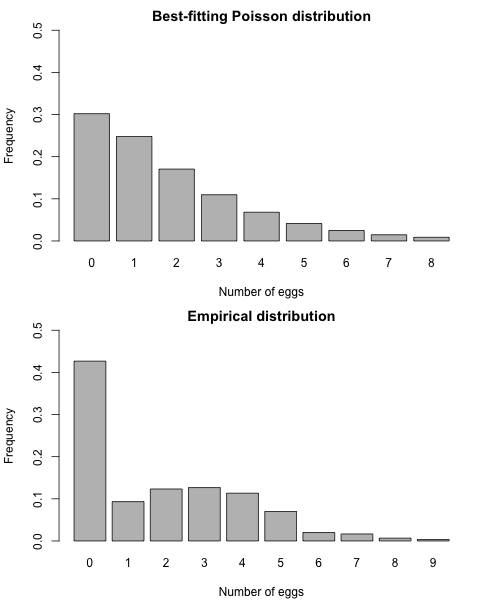

<br>
<span style='color:green'>**Theme Song**</span>
<br>

<audio src="music/California-Dreaming-Chorus.mp3" controls></audio>
<br>

------

# Setting

## SCSS Setup

<style>
pre {
  overflow-x: auto;
}
pre code {
  word-wrap: normal;
  white-space: pre;
}
.table-hover > tbody > tr:hover { 
  background-color: #8D918D;
}
</style>

```{r class.source='bg-success', class.output='bg-primary', message = FALSE, warning = FALSE}
# install.packages("remotes")
library('BBmisc', 'rmsfuns')
#remotes::install_github("rstudio/sass")
lib('sass')
```

```{scss class.source='bg-success', class.output='bg-primary'}
/* https://stackoverflow.com/a/66029010/3806250 */
h1 { color: #002C54; }
h2 { color: #2F496E; }
h3 { color: #375E97; }
h4 { color: #556DAC; }
h5 { color: #92AAC7; }

/* ----------------------------------------------------------------- */
/* https://gist.github.com/himynameisdave/c7a7ed14500d29e58149#file-broken-gradient-animation-less */
.hover01 {
  /* color: #FFD64D; */
  background: linear-gradient(155deg, #EDAE01 0%, #FFEB94 100%);
  transition: all 0.45s;
  &:hover{
    background: linear-gradient(155deg, #EDAE01 20%, #FFEB94 80%);
    }
  }

.hover02 {
  color: #FFD64D;
  background: linear-gradient(155deg, #002C54 0%, #4CB5F5 100%);
  transition: all 0.45s;
  &:hover{
    background: linear-gradient(155deg, #002C54 20%, #4CB5F5 80%);
    }
  }

.hover03 {
  color: #FFD64D;
  background: linear-gradient(155deg, #A10115 0%, #FF3C5C 100%);
  transition: all 0.45s;
  &:hover{
    background: linear-gradient(155deg, #A10115 20%, #FF3C5C 80%);
    }
  }
```

```{r global_options, class.source='hover01', class.output='hover02'}
## https://stackoverflow.com/a/36846793/3806250
options(width = 999)
knitr::opts_chunk$set(class.source = 'hover01', class.output = 'hover02', class.error = 'hover03')
```

<br><br>

## Setup

```{r warning=FALSE, message=FALSE}
if(!suppressPackageStartupMessages(require('BBmisc'))) {
  install.packages('BBmisc', dependencies = TRUE, INSTALL_opts = '--no-lock')
}
suppressPackageStartupMessages(require('BBmisc'))
# suppressPackageStartupMessages(require('rmsfuns'))

pkgs <- c('devtools', 'knitr', 'kableExtra', 'tidyr', 
          'readr', 'lubridate', 'reprex', 'magrittr', 
          'timetk', 'plyr', 'dplyr', 'stringr', 
          'tdplyr', 'tidyverse', 'formattable', 
          'echarts4r', 'paletteer')

suppressAll(lib(pkgs))
# load_pkg(pkgs)

## Set the timezone but not change the datetime
Sys.setenv(TZ = 'Asia/Tokyo')
## options(knitr.table.format = 'html') will set all kableExtra tables to be 'html', otherwise need to set the parameter on every single table.
options(warn = -1, knitr.table.format = 'html')#, digits.secs = 6)

## https://stackoverflow.com/questions/39417003/long-vectors-not-supported-yet-abnor-in-rmd-but-not-in-r-script
knitr::opts_chunk$set(message = FALSE, warning = FALSE)#, 
                      #cache = TRUE, cache.lazy = FALSE)

rm(pkgs)
```

<br><br>

# 受講生によるテスト：BIC for zero-inflated mixtures

**課題をすぐに提出してください**

課題の提出期限は、`6月21日 15:59 JST`ですが、可能であれば1日か2日早く提出してください。 早い段階で提出すると、他の受講生のレビューを時間内に得る可能性が高くなります。

## 説明

In week 2, you considered the problem faced by a biologist is interest in characterizing the number of eggs laid by a particular bird species. The data consisted of a sample $n=300$ nests on a site in Southern California, which were contained in the file `nestsize.csv`:

[`nestsize.csv`](https://github.com/englianhu/Coursera-Bayesian-Statistics-Mixture-Models/blob/main/data/nestsize.csv)

At the time we visually compared the empirical distribution of the data against a Poison distribution whose parameter has been set to its maximum likelihood estimator as a justification for using a mixture model of the form $f(x) = w \delta_0(x) + (1-w) \frac{e^{-\lambda} \lambda^x}{x!} \quad \quad x \in \{0,1,2,\ldots\}$ where $\delta_0(x)$ represents the degenerate distribution placing all of its mass at zero.



You are asked to build on the EM algorithm you constructed in week 2 to compute the BIC associated with this model and contrast it against the BIC for the simpler Poisson model. 

<br><br>

### Review criteria

You will be asked to provide (1) code to compute the BIC for the zero-inflated mixture (which requires an EM algorithm),(2) code to compute the BIC for the Poisson model (which does not require an EM algorithm),(3) provide numerical results for the BIC for each of the two models, and (4) interpret the results in terms of the original problem.

<br><br>

## 自分の提出物

### Assignment

Derive the formula for the BIC associated with the the Poisson model

$$f(x) = \frac{e^{-\lambda} \lambda^x}{x!} \quad \quad x \in \{0,1,2,\ldots\}$$

(Note that you can think about this model as a mixture with a single component).

Then, provide code to compute the BIC and use it to evaluate it for the dataset `nestsize.csv`:

```{r error=TRUE}
suppressAll(lib('EDISON', 'extraDistr', 'MCMCpack', 'invgamma'))

x <- read.csv(file = "data/nestsize.csv", header = FALSE)$V1
n <- length(x)               # number of samples

mle = mean(x)
bic_base = 0
for (i in 1:n) {
  bic_base = bic_base-2*log(dpois(x[i],mle))
}
bic_base = bic_base+log(n)

cat(paste('mle =', mle, '\nbic_base =', bic_base))
```

Derive the formula for the BIC associated with the the Poisson model

$$f(x) = w \delta_0(x) + (1-w) \frac{e^{-\lambda} \lambda^x}{x!} \quad \quad x \in \{0,1,2,\ldots\}$$

Then, provide code to compute the BIC and use it to evaluate it for the dataset `nestsize.csv`:

```{r error=TRUE}
x <- read.csv("data/nestsize.csv", header = F)
n <- nrow(x)
x <- as.matrix(x)

## Run the actual EM algorithm ## Initialize the parameters
w      <- 1/2  #Assign equal weight to each component to start with
lambda <- mean(x)   #lambda set as sample mean
s      <- 0

sw      <- FALSE
QQ      <- -Inf
QQ.out  <- NULL
epsilon <- 10^(-5)

while(!sw){
  ## E step
  v <- array(0, dim = c(n,2))
  
  for(i in 1:n){
    if(x[i]==0){
      v[i,1] <- w
      v[i,2] <- (1-w)*dpois(x[i], lambda)
      v[i,]  <- v[i,]/sum(v[i,])
      
    }else{
      v[i,1] <- 0
      v[i,2] <- 1
    }
  }
  ## M step
  # parameter
  w <- mean(v[,1])
  lambda <- sum(x)/sum(v[,2])
  
  #convergence
  QQn <- 0
  for(i in 1:n){
    if(x[i]==0){
      QQn <- QQn + v[i,1]*log(w) + v[i,2]*(log(1-w) + dpois(x[i], lambda, log=TRUE))
      
    }else{
      QQn <- QQn + v[i,2]*(log(1-w) + dpois(x[i], lambda, log=TRUE))
    }
  }
   if(abs(QQn-QQ)/abs(QQn)<epsilon){
     sw <- TRUE
   }
  QQ <- QQn
  QQ.out <- c(QQ.out, QQ)
  s <- s + 1
  print(paste(s, QQn,w,lambda))
}

bic_mix <- 0
for(i in 1:n) {
  if(x[i]==0){
    bic_mix <- -2*log(w+(1-w)*dpois(x[i],lambda))+bic_mix
  } else {
    bic_mix <- -2*log((1-w)*dpois(x[i],lambda))+bic_mix
  }
}
bic_mix <- bic_mix+2*log(n)
```

Does the BIC provide evidence for the mixture model in the `nestsize.csv` dataset?

```{r error=TRUE}
cat(paste('bic_mix =', bic_mix, '\nbic_base =', bic_base))
```

### Marking

**Is the number of effective parameters correct?**

This model has only 1 parameter (the rate $\lambda$).

- 0点 No
- 1点 Yes

**Is the MLE computed correctly for the Poisson model?**

The MLE for the Poisson model can be obtained analytically and does not require the use of any numerical optimization algorithm. In this case $\hat{\lambda}=\bar{x}$, the average of the observations, is the MLE.
 
```{r error=TRUE}
lambdahat = mean(x)
n = length(x)
```

- 0点 No
- 1点 Yes

**Is the negative log-likelihood evaluated at the MLE computed correctly for the Poisson model?**

The likelihood function in this case is 

$$-2\log L(\lambda) = 2n \bar{x} - 2n\bar{x} \log \bar{x} + 2 \sum_{i=1}^{n} \log x_i !$$

The following R code performs the evaluation:

```{r error=TRUE}
twicenegloglik = 2*n*lambdahat - 2*n*lambdahat*log(lambdahat) + 2*sum(lfactorial(x))
```

Alternatively, you can use the built in functions to evaluate the density of the Poisson distribution,

```{r error=TRUE}
twicenegloglik = -2*sum(dpois(x,lambdahat,log=T))
```

When grading, please remember that there are many ways to do the same thing in R

- 0点 No
- 1点 Yes

**Is the numerical value for the dataset `nestsize.csv`· BIC correct? **

The MLE in this case is $\hat{\lambda} = 1.843333$, which leads to a value of the BIC equal to $1272.2$.

```{r error=TRUE}
BIC1 = twicenegloglik + log(n)
```

```{r error=TRUE}

```

**Is the number of effective parameters correct?**

In this case there are two parameters, $\omega$ and $\lambda$.

- 0点 No
- 1点 Yes

**Is the EM algorithm for fitting the mixture correct?**

You already derived the EM algorithm for this model in week 2 of the course. A draft version of the algorithm is provided below.

```{r error=TRUE}
## Setup controls for the algorithm
s  = 0
sw = FALSE
QQ = -Inf
QQ.out = NULL
epsilon = 10^(-5)

## Initiatlize parameters
w      = 0.1          #Assign equal weight to each component to start with
lambda = mean(x)      #Random cluster centers randomly spread over the support of the data

## Repeat E and M steps until convergence
while(!sw){
  ## E step
  v = array(0, dim=c(n,2))
  for(i in 1:n){
    if(x[i]==0){
      v[i,1] = log(w)    
      v[i,2] = log(1-w) + dpois(x[i], lambda, log=TRUE)  
      v[i,]  = exp(v[i,] - max(v[i,]))/sum(exp(v[i,] - max(v[i,]))) 
    }else{
      v[i,1] = 0
      v[i,2] = 1
    }
  }
  ## M step
  # Weights
  w = mean(v[,1])
  lambda = sum(x)/sum(v[,2])

  ##Check convergence
  QQn = 0
  for(i in 1:n){
    if(x[i]==0){
      QQn = QQn + v[i,1]*log(w) + v[i,2]*(log(1-w) + dpois(x[i], lambda, log=TRUE))
    }else{
      QQn = QQn + v[i,2]*(log(1-w) + dpois(x[i], lambda, log=TRUE))
    }
  }
  if(abs(QQn-QQ)/abs(QQn)<epsilon){
    sw=TRUE
  }
  QQ = QQn
  QQ.out = c(QQ.out, QQ)
  s = s + 1
  print(paste(s, QQn))
}
```

- 0点 No
- 3点 Yes
- 1点 Partially

**Is the negative log-likelihood evaluated at the MLE computed correctly for the mixture model.**

In this case 

$$-2 L \left( \hat{w}, \hat{\lambda} \right) = -2 \sum_{i=1}^{n} \log \left\{ \hat{w}\delta_0(x_i) + (1-\hat{w}) \frac{e^{-\hat{\lambda}} \hat{\lambda}^{x_i}}{x_i!} \right\}$$

Because the two components have different supports, it is preferable to consider two cases when computing the log-likelihood for each observation.  For example

```{r error=TRUE}
## Compute twice the negatie log-likelihood for the model
twicenegloglik = 0
for(i in 1:n){
  if(x[i]==0){
    twicenegloglik = twicenegloglik - 2*log(w + (1-w)*dpois(x[i], lambda))
  }else{
    twicenegloglik = twicenegloglik - 2*( log(1-w) +  dpois(x[i], lambda, log=TRUE))
  }
}
```

However, remember that there are many ways to achieve the same thing in R.

- 0点 No
- 1点 Yes

**Is the numerical value for the BIC correct?**

In this case, the MLEs are (rounded to 2 decimal places) $\omega =0.40$ and $3.07$ (you had already obtained these values in week 2). This leads to a value of the BIC equal to $1056.85$ (rounded to two decimal places)..

```{r error=TRUE}
BIC2 = twicenegloglik + 2*log(n)
```

- 0点 No
- 1点 Yes

**Does the BIC provide evidence for the mixture model in the `nestsize.csv` dataset?**

Yes, the BIC for the mixture model is smaller than the BIC for the simpler Poisson model.  This supports our original observation based on graphical evidence that the mixture model is more appropriate for this data than the simpler Poisson model.

- 0点 No
- 1点 Yes

<br><br>

## ピアレビュー

### 1st Peer

#### Assignment

Derive the formula for the BIC associated with the the Poisson model

$$f(x) = \frac{e^{-\lambda} \lambda^x}{x!} \quad \quad x \in \{0,1,2,\ldots\}$$

(Note that you can think about this model as a mixture with a single component).

Then, provide code to compute the BIC and use it to evaluate it for the dataset `nestsize.csv`:

```{r error=TRUE}
rm(list = ls())
x <- read.csv(file = "data/nestsize.csv", header = FALSE)$V1
n <- length(x)                 # number of samples

mle = mean(x)
bic_base = 0
for (i in 1:n) {
  bic_base = bic_base-2*log(dpois(x[i],mle))
}
bic_base = bic_base+log(n)

cat(paste('mle =', mle, '\nbic_base =', bic_base))
```

Derive the formula for the BIC associated with the the Poisson model

$$f(x) = w \delta_0(x) + (1-w) \frac{e^{-\lambda} \lambda^x}{x!} \quad \quad x \in \{0,1,2,\ldots\}$$

Then, provide code to compute the BIC and use it to evaluate it for the dataset `nestsize.csv`:

```{r error=TRUE}
x = read.csv("data/nestsize.csv", header = F)
n = nrow(x)
x = as.matrix(x)

## Run the actual EM algorithm ## Initialize the parameters
w = 1/2  #Assign equal weight to each component to start with
lambda = mean(x)   #lambda set as sample mean
s  = 0

sw = FALSE
QQ = -Inf
QQ.out = NULL
epsilon = 10^(-5)

while(!sw){
  ## E step
  v = array(0, dim = c(n,2))
  
  for(i in 1:n){
    if(x[i]==0){
      v[i,1] = w
      v[i,2] = (1-w)*dpois(x[i], lambda)
      v[i,]  = v[i,]/sum(v[i,])
      
    }else{
      v[i,1] = 0
         v[i,2] = 1
    }
  }
  ## M step
  # parameter
  w = mean(v[,1])
  lambda = sum(x)/sum(v[,2])
  
  #convergence
  QQn = 0
  for(i in 1:n){
    if(x[i]==0){
      QQn = QQn + v[i,1]*log(w) + v[i,2]*(log(1-w) + dpois(x[i], lambda, log=TRUE))
      
    }else{
      QQn = QQn + v[i,2]*(log(1-w) + dpois(x[i], lambda, log=TRUE))
    }
  }
   if(abs(QQn-QQ)/abs(QQn)<epsilon){
     sw=TRUE
   }
  QQ = QQn
  QQ.out = c(QQ.out, QQ)
  s = s + 1
  print(paste(s, QQn,w,lambda))
}

bic_mix = 0
for(i in 1:n) {
  if(x[i]==0){
    bic_mix = -2*log(w+(1-w)*dpois(x[i],lambda))+bic_mix
  } else {
    bic_mix = -2*log((1-w)*dpois(x[i],lambda))+bic_mix
  }
}
bic_mix = bic_mix+2*log(n)
```

Does the BIC provide evidence for the mixture model in the `nestsize.csv` dataset?

```{r error=TRUE}
# Yes the bic for mixture model is 1056.845 compared to bic of 1272.175 for the base model.
# Despite the mixture model having more parameters the bic is much lower suggesting a better fit.
cat(paste('bic_mix =', bic_mix, '\nbic_base =', bic_base))
```

#### Marking

**Is the number of effective parameters correct?**

This model has only 1 parameter (the rate $\lambda$).

- 0点 No
- 1点 Yes

**Is the MLE computed correctly for the Poisson model?**

The MLE for the Poisson model can be obtained analytically and does not require the use of any numerical optimization algorithm. In this case $\hat{\lambda}=\bar{x}$, the average of the observations, is the MLE.
 
```{r error=TRUE}
lambdahat = mean(x)
n = length(x)
```

- 0点 No
- 1点 Yes

**Is the negative log-likelihood evaluated at the MLE computed correctly for the Poisson model?**

The likelihood function in this case is 

$$-2\log L(\lambda) = 2n \bar{x} - 2n\bar{x} \log \bar{x} + 2 \sum_{i=1}^{n} \log x_i !$$

The following R code performs the evaluation:

```{r error=TRUE}
twicenegloglik = 2*n*lambdahat - 2*n*lambdahat*log(lambdahat) + 2*sum(lfactorial(x))
```

Alternatively, you can use the built in functions to evaluate the density of the Poisson distribution,

```{r error=TRUE}
twicenegloglik = -2*sum(dpois(x,lambdahat,log=T))
```

When grading, please remember that there are many ways to do the same thing in R

- 0点 No
- 1点 Yes

**Is the numerical value for the dataset `nestsize.csv`· BIC correct? **

The MLE in this case is $\hat{\lambda} = 1.843333$, which leads to a value of the BIC equal to $1272.2$.

```{r error=TRUE}
BIC1 = twicenegloglik + log(n)
```

```{r error=TRUE}

```

**Is the number of effective parameters correct?**

In this case there are two parameters, $\omega$ and $\lambda$.

- 0点 No
- 1点 Yes

**Is the EM algorithm for fitting the mixture correct?**

You already derived the EM algorithm for this model in week 2 of the course. A draft version of the algorithm is provided below.

```{r error=TRUE}
## Setup controls for the algorithm
s  = 0
sw = FALSE
QQ = -Inf
QQ.out = NULL
epsilon = 10^(-5)

## Initiatlize parameters
w      = 0.1          #Assign equal weight to each component to start with
lambda = mean(x)      #Random cluster centers randomly spread over the support of the data

## Repeat E and M steps until convergence
while(!sw){
  ## E step
  v = array(0, dim=c(n,2))
  for(i in 1:n){
    if(x[i]==0){
      v[i,1] = log(w)    
      v[i,2] = log(1-w) + dpois(x[i], lambda, log=TRUE)  
      v[i,]  = exp(v[i,] - max(v[i,]))/sum(exp(v[i,] - max(v[i,]))) 
    }else{
      v[i,1] = 0
      v[i,2] = 1
    }
  }
  ## M step
  # Weights
  w = mean(v[,1])
  lambda = sum(x)/sum(v[,2])

  ##Check convergence
  QQn = 0
  for(i in 1:n){
    if(x[i]==0){
      QQn = QQn + v[i,1]*log(w) + v[i,2]*(log(1-w) + dpois(x[i], lambda, log=TRUE))
    }else{
      QQn = QQn + v[i,2]*(log(1-w) + dpois(x[i], lambda, log=TRUE))
    }
  }
  if(abs(QQn-QQ)/abs(QQn)<epsilon){
    sw=TRUE
  }
  QQ = QQn
  QQ.out = c(QQ.out, QQ)
  s = s + 1
  print(paste(s, QQn))
}
```

- 0点 No
- 3点 Yes
- 1点 Partially

**Is the negative log-likelihood evaluated at the MLE computed correctly for the mixture model.**

In this case 

$$-2 L \left( \hat{w}, \hat{\lambda} \right) = -2 \sum_{i=1}^{n} \log \left\{ \hat{w}\delta_0(x_i) + (1-\hat{w}) \frac{e^{-\hat{\lambda}} \hat{\lambda}^{x_i}}{x_i!} \right\}$$

Because the two components have different supports, it is preferable to consider two cases when computing the log-likelihood for each observation.  For example

```{r error=TRUE}
## Compute twice the negatie log-likelihood for the model
twicenegloglik = 0
for(i in 1:n){
  if(x[i]==0){
    twicenegloglik = twicenegloglik - 2*log(w + (1-w)*dpois(x[i], lambda))
  }else{
    twicenegloglik = twicenegloglik - 2*( log(1-w) +  dpois(x[i], lambda, log=TRUE))
  }
}
```

However, remember that there are many ways to achieve the same thing in R.

- 0点 No
- 1点 Yes

**Is the numerical value for the BIC correct?**

In this case, the MLEs are (rounded to 2 decimal places) $\omega =0.40$ and $3.07$ (you had already obtained these values in week 2). This leads to a value of the BIC equal to $1056.85$ (rounded to two decimal places)..

```{r error=TRUE}
BIC2 = twicenegloglik + 2*log(n)
```

- 0点 No
- 1点 Yes

**Does the BIC provide evidence for the mixture model in the `nestsize.csv` dataset?**

Yes, the BIC for the mixture model is smaller than the BIC for the simpler Poisson model.  This supports our original observation based on graphical evidence that the mixture model is more appropriate for this data than the simpler Poisson model.

- 0点 No
- 1点 Yes

<br>

### 2nd Peer

#### Assignment

Derive the formula for the BIC associated with the the Poisson model

$$f(x) = \frac{e^{-\lambda} \lambda^x}{x!} \quad \quad x \in \{0,1,2,\ldots\}$$

(Note that you can think about this model as a mixture with a single component).

Then, provide code to compute the BIC and use it to evaluate it for the dataset `nestsize.csv`:

```{r error=TRUE}
rm(list = ls())
num_eggs <- read.csv(file = "data/nestsize.csv", header = FALSE)$V1
x <- num_eggs
n <- length(x)                 # number of samples

#For Poisson:
lambda_p  = sum(num_eggs)/n
QQp = 0
for(i in 1:n){
  QQp = QQp+ ((dpois(num_eggs[i], lambda=lambda_p, log=TRUE)))
}

BICPoisson = -2*QQp + log(n)
print(paste("Poisson", BICPoisson))
```

Derive the formula for the BIC associated with the the Poisson model

$$f(x) = w \delta_0(x) + (1-w) \frac{e^{-\lambda} \lambda^x}{x!} \quad \quad x \in \{0,1,2,\ldots\}$$

Then, provide code to compute the BIC and use it to evaluate it for the dataset `nestsize.csv`:

```{r error=TRUE}
dat = read.csv(file = "data/nestsize.csv", header = FALSE)
num_eggs = dat$V1

## Run the actual EM algorithm
## Initialize the parameters

KK         = 2                               # number of components
n = length(num_eggs)                         # number of samples
v = array(0, dim=c(n,KK))
v[,1] = 0.5*(num_eggs==0)                    #Assign half weight for nests with 0 eggs to first component
v[,2] = 1-v[,1]                              #Assign all of the remaining nests to the second component
w     = mean(v[,1])                          #weight of the first component
lambda  = sum(num_eggs*v[,2])/sum(v[,2])     #parameter (mean) of the second component


s  = 0
sw = FALSE
QQ = -Inf
QQ.out = NULL
epsilon = 10^(-5)
##Checking convergence of the algorithm
while(!sw){
  ## E step
  v = array(0, dim=c(n,KK))
  v[,1] = (w/(w+(1-w)*exp(-lambda)))*(num_eggs==0)     #first component is non-zero only for the zero egg nestsc
  v[,2] = 1-v[,1]                                      #second component gets rest of the weights
  
  ## M step
  # Weight
  w = mean(v[,1])
  # lambda for the second component
  lambda = sum(v[,2]*num_eggs)/sum(v[,2])
  print(paste(s, w, lambda))
  
  ##Check convergence
  QQn = log(w)*sum(v[,1]) #First component 
  for(i in 1:n){
    QQn = QQn + (v[i,2]*(log(1-w)+dpois(num_eggs[i], lambda=lambda, log=TRUE)))
  }
  if(abs(QQn-QQ)/abs(QQn)<epsilon){
    sw=TRUE
  }
  QQ = QQn
  QQ.out = c(QQ.out, QQ)
  s = s + 1
  print(paste(s, QQn))
  
}

QQ=0
for(i in 1:n){
  if (num_eggs[i]==0) {
    QQ = QQ + log(w+(1-w)*dpois(num_eggs[i], lambda=lambda))
  } else {
    QQ = QQ + log((1-w)*dpois(num_eggs[i], lambda=lambda))
  }
}

BICzeroInflated = -2*QQ + 2*log(n)   #2 parameters
print(paste("Zero Inflated BIC=",BICzeroInflated))
```

Does the BIC provide evidence for the mixture model in the `nestsize.csv` dataset?

```{r error=TRUE}
#Poisson BIC= 1272.1748691699,   Zero Inflated BIC= 1056.84484814988.  Yes, the mixture model is better.
cat(paste(
  "Poisson =", BICPoisson, 
  "\nZero Inflated BIC =",BICzeroInflated
))
```

#### Marking

**Is the number of effective parameters correct?**

This model has only 1 parameter (the rate $\lambda$).

- 0点 No
- 1点 Yes

**Is the MLE computed correctly for the Poisson model?**

The MLE for the Poisson model can be obtained analytically and does not require the use of any numerical optimization algorithm. In this case $\hat{\lambda}=\bar{x}$, the average of the observations, is the MLE.
 
```{r error=TRUE}
lambdahat = mean(x)
n = length(x)
```

- 0点 No
- 1点 Yes

**Is the negative log-likelihood evaluated at the MLE computed correctly for the Poisson model?**

The likelihood function in this case is 

$$-2\log L(\lambda) = 2n \bar{x} - 2n\bar{x} \log \bar{x} + 2 \sum_{i=1}^{n} \log x_i !$$

The following R code performs the evaluation:

```{r error=TRUE}
twicenegloglik = 2*n*lambdahat - 2*n*lambdahat*log(lambdahat) + 2*sum(lfactorial(x))
```

Alternatively, you can use the built in functions to evaluate the density of the Poisson distribution,

```{r error=TRUE}
twicenegloglik = -2*sum(dpois(x,lambdahat,log=T))
```

When grading, please remember that there are many ways to do the same thing in R

- 0点 No
- 1点 Yes

**Is the numerical value for the dataset `nestsize.csv`· BIC correct? **

The MLE in this case is $\hat{\lambda} = 1.843333$, which leads to a value of the BIC equal to $1272.2$.

```{r error=TRUE}
BIC1 = twicenegloglik + log(n)
```

```{r error=TRUE}

```

**Is the number of effective parameters correct?**

In this case there are two parameters, $\omega$ and $\lambda$.

- 0点 No
- 1点 Yes

**Is the EM algorithm for fitting the mixture correct?**

You already derived the EM algorithm for this model in week 2 of the course. A draft version of the algorithm is provided below.

```{r error=TRUE}
## Setup controls for the algorithm
s  = 0
sw = FALSE
QQ = -Inf
QQ.out = NULL
epsilon = 10^(-5)

## Initiatlize parameters
w      = 0.1          #Assign equal weight to each component to start with
lambda = mean(x)      #Random cluster centers randomly spread over the support of the data

## Repeat E and M steps until convergence
while(!sw){
  ## E step
  v = array(0, dim=c(n,2))
  for(i in 1:n){
    if(x[i]==0){
      v[i,1] = log(w)    
      v[i,2] = log(1-w) + dpois(x[i], lambda, log=TRUE)  
      v[i,]  = exp(v[i,] - max(v[i,]))/sum(exp(v[i,] - max(v[i,]))) 
    }else{
      v[i,1] = 0
      v[i,2] = 1
    }
  }
  ## M step
  # Weights
  w = mean(v[,1])
  lambda = sum(x)/sum(v[,2])

  ##Check convergence
  QQn = 0
  for(i in 1:n){
    if(x[i]==0){
      QQn = QQn + v[i,1]*log(w) + v[i,2]*(log(1-w) + dpois(x[i], lambda, log=TRUE))
    }else{
      QQn = QQn + v[i,2]*(log(1-w) + dpois(x[i], lambda, log=TRUE))
    }
  }
  if(abs(QQn-QQ)/abs(QQn)<epsilon){
    sw=TRUE
  }
  QQ = QQn
  QQ.out = c(QQ.out, QQ)
  s = s + 1
  print(paste(s, QQn))
}
```

- 0点 No
- 3点 Yes
- 1点 Partially

**Is the negative log-likelihood evaluated at the MLE computed correctly for the mixture model.**

In this case 

$$-2 L \left( \hat{w}, \hat{\lambda} \right) = -2 \sum_{i=1}^{n} \log \left\{ \hat{w}\delta_0(x_i) + (1-\hat{w}) \frac{e^{-\hat{\lambda}} \hat{\lambda}^{x_i}}{x_i!} \right\}$$

Because the two components have different supports, it is preferable to consider two cases when computing the log-likelihood for each observation.  For example

```{r error=TRUE}
## Compute twice the negatie log-likelihood for the model
twicenegloglik = 0
for(i in 1:n){
  if(x[i]==0){
    twicenegloglik = twicenegloglik - 2*log(w + (1-w)*dpois(x[i], lambda))
  }else{
    twicenegloglik = twicenegloglik - 2*( log(1-w) +  dpois(x[i], lambda, log=TRUE))
  }
}
```

However, remember that there are many ways to achieve the same thing in R.

- 0点 No
- 1点 Yes

**Is the numerical value for the BIC correct?**

In this case, the MLEs are (rounded to 2 decimal places) $\omega =0.40$ and $3.07$ (you had already obtained these values in week 2). This leads to a value of the BIC equal to $1056.85$ (rounded to two decimal places)..

```{r error=TRUE}
BIC2 = twicenegloglik + 2*log(n)
```

- 0点 No
- 1点 Yes

**Does the BIC provide evidence for the mixture model in the `nestsize.csv` dataset?**

Yes, the BIC for the mixture model is smaller than the BIC for the simpler Poisson model.  This supports our original observation based on graphical evidence that the mixture model is more appropriate for this data than the simpler Poisson model.

- 0点 No
- 1点 Yes

<br>

### 3rd Peer

#### Assignment

Derive the formula for the BIC associated with the the Poisson model

$$f(x) = \frac{e^{-\lambda} \lambda^x}{x!} \quad \quad x \in \{0,1,2,\ldots\}$$

(Note that you can think about this model as a mixture with a single component).

Then, provide code to compute the BIC and use it to evaluate it for the dataset `nestsize.csv`:

```{r error=TRUE}
rm(list = ls())
nestsize <- read.csv('data/nestsize.csv', header=FALSE)
x  = nestsize$V1
n = nrow(nestsize)

BIC = -2*sum(dpois(x, mean(x), log = TRUE)) + 2*log(n)
#BIC = 1272.713
paste('BIC =', BIC)

nestsize <- read.csv('data/nestsize.csv')
x  = nestsize$X4
n = nrow(nestsize)

BIC = -2*sum(dpois(x, mean(x), log = TRUE)) + 2*log(n)
#BIC = 1272.713
paste('BIC =', BIC)
```

Derive the formula for the BIC associated with the the Poisson model

$$f(x) = w \delta_0(x) + (1-w) \frac{e^{-\lambda} \lambda^x}{x!} \quad \quad x \in \{0,1,2,\ldots\}$$

Then, provide code to compute the BIC and use it to evaluate it for the dataset `nestsize.csv`:

```{r error=TRUE}
## Run the actual EM algorithm
## Initialize the parameters
set.seed(81196)
x     = nestsize$X4
w.hat = 1/2                         #Assign equal weight to each component to start with
lambda.hat = mean(x)   #Random cluster centers randomly spread over the support of the data
KK = 2
n  = nrow(nestsize)

s       = 0
sw      = FALSE
QQ      = -Inf
QQ.out  = NULL
epsilon = 10^(-5)
while(!sw){
  ## E step
  v     = array(0, dim=c(n,KK))
  v[,1] = w.hat*factor/(w.hat*factor+(1-w.hat)*dpois(x, lambda.hat))    
  v[,2] = (1-w.hat)*dpois(x, lambda.hat)/(w.hat*factor+(1-w.hat)*dpois(x, lambda.hat)) 
  
  ## M step
  # Weights
  w.hat      = sum(v[,1])/(sum(v[,1]) + sum(v[,2]))
  lambda.hat = sum(v[,2] * x)/sum(v[,2])
  
  ##Check convergence
  QQn = 0
  for(i in 1:n){
    QQn = QQn + v[i,1]*log(w.hat) +  v[i,2]*(log(1-w.hat) + dpois(x[i], lambda.hat, log = TRUE))
  }
  if(abs(QQn-QQ)/abs(QQn)<epsilon){
    sw=TRUE
  }
  QQ     = QQn
  QQ.out = c(QQ.out, QQ)
  s      = s + 1
  print(paste(s, QQn))
}
```

Does the BIC provide evidence for the mixture model in the `nestsize.csv` dataset?

```{r error=TRUE}
BIC = -2*log(w.hat*exp(QQn)) + 2*log(n)
#BIC = 1116.189
paste('BIC =', BIC)

#Yes
```

#### Marking

**Is the number of effective parameters correct?**

This model has only 1 parameter (the rate $\lambda$).

- 0点 No
- 1点 Yes

**Is the MLE computed correctly for the Poisson model?**

The MLE for the Poisson model can be obtained analytically and does not require the use of any numerical optimization algorithm. In this case $\hat{\lambda}=\bar{x}$, the average of the observations, is the MLE.
 
```{r error=TRUE}
lambdahat = mean(x)
n = length(x)
```

- 0点 No
- 1点 Yes

**Is the negative log-likelihood evaluated at the MLE computed correctly for the Poisson model?**

The likelihood function in this case is 

$$-2\log L(\lambda) = 2n \bar{x} - 2n\bar{x} \log \bar{x} + 2 \sum_{i=1}^{n} \log x_i !$$

The following R code performs the evaluation:

```{r error=TRUE}
twicenegloglik = 2*n*lambdahat - 2*n*lambdahat*log(lambdahat) + 2*sum(lfactorial(x))
```

Alternatively, you can use the built in functions to evaluate the density of the Poisson distribution,

```{r error=TRUE}
twicenegloglik = -2*sum(dpois(x,lambdahat,log=T))
```

When grading, please remember that there are many ways to do the same thing in R

- 0点 No
- 1点 Yes

**Is the numerical value for the dataset `nestsize.csv`· BIC correct? **

The MLE in this case is $\hat{\lambda} = 1.843333$, which leads to a value of the BIC equal to $1272.2$.

```{r error=TRUE}
BIC1 = twicenegloglik + log(n)
```

```{r error=TRUE}

```

**Is the number of effective parameters correct?**

In this case there are two parameters, $\omega$ and $\lambda$.

- 0点 No
- 1点 Yes

**Is the EM algorithm for fitting the mixture correct?**

You already derived the EM algorithm for this model in week 2 of the course. A draft version of the algorithm is provided below.

```{r error=TRUE}
## Setup controls for the algorithm
s  = 0
sw = FALSE
QQ = -Inf
QQ.out = NULL
epsilon = 10^(-5)

## Initiatlize parameters
w      = 0.1          #Assign equal weight to each component to start with
lambda = mean(x)      #Random cluster centers randomly spread over the support of the data

## Repeat E and M steps until convergence
while(!sw){
  ## E step
  v = array(0, dim=c(n,2))
  for(i in 1:n){
    if(x[i]==0){
      v[i,1] = log(w)    
      v[i,2] = log(1-w) + dpois(x[i], lambda, log=TRUE)  
      v[i,]  = exp(v[i,] - max(v[i,]))/sum(exp(v[i,] - max(v[i,]))) 
    }else{
      v[i,1] = 0
      v[i,2] = 1
    }
  }
  ## M step
  # Weights
  w = mean(v[,1])
  lambda = sum(x)/sum(v[,2])

  ##Check convergence
  QQn = 0
  for(i in 1:n){
    if(x[i]==0){
      QQn = QQn + v[i,1]*log(w) + v[i,2]*(log(1-w) + dpois(x[i], lambda, log=TRUE))
    }else{
      QQn = QQn + v[i,2]*(log(1-w) + dpois(x[i], lambda, log=TRUE))
    }
  }
  if(abs(QQn-QQ)/abs(QQn)<epsilon){
    sw=TRUE
  }
  QQ = QQn
  QQ.out = c(QQ.out, QQ)
  s = s + 1
  print(paste(s, QQn))
}
```

- 0点 No
- 3点 Yes
- 1点 Partially

**Is the negative log-likelihood evaluated at the MLE computed correctly for the mixture model.**

In this case 

$$-2 L \left( \hat{w}, \hat{\lambda} \right) = -2 \sum_{i=1}^{n} \log \left\{ \hat{w}\delta_0(x_i) + (1-\hat{w}) \frac{e^{-\hat{\lambda}} \hat{\lambda}^{x_i}}{x_i!} \right\}$$

Because the two components have different supports, it is preferable to consider two cases when computing the log-likelihood for each observation.  For example

```{r error=TRUE}
## Compute twice the negatie log-likelihood for the model
twicenegloglik = 0
for(i in 1:n){
  if(x[i]==0){
    twicenegloglik = twicenegloglik - 2*log(w + (1-w)*dpois(x[i], lambda))
  }else{
    twicenegloglik = twicenegloglik - 2*( log(1-w) +  dpois(x[i], lambda, log=TRUE))
  }
}
```

However, remember that there are many ways to achieve the same thing in R.

- 0点 No
- 1点 Yes

**Is the numerical value for the BIC correct?**

In this case, the MLEs are (rounded to 2 decimal places) $\omega =0.40$ and $3.07$ (you had already obtained these values in week 2). This leads to a value of the BIC equal to $1056.85$ (rounded to two decimal places)..

```{r error=TRUE}
BIC2 = twicenegloglik + 2*log(n)
```

- 0点 No
- 1点 Yes

**Does the BIC provide evidence for the mixture model in the `nestsize.csv` dataset?**

Yes, the BIC for the mixture model is smaller than the BIC for the simpler Poisson model.  This supports our original observation based on graphical evidence that the mixture model is more appropriate for this data than the simpler Poisson model.

- 0点 No
- 1点 Yes

<br>

### 4th Peer

#### Assignment

Derive the formula for the BIC associated with the the Poisson model

$$f(x) = \frac{e^{-\lambda} \lambda^x}{x!} \quad \quad x \in \{0,1,2,\ldots\}$$

(Note that you can think about this model as a mixture with a single component).

Then, provide code to compute the BIC and use it to evaluate it for the dataset `nestsize.csv`:

```{r error=TRUE}
x <- read.csv(file = "data/nestsize.csv", header = FALSE)$V1
n <- length(x)               # number of samples
#x = dat$V1
#n = length(x)

# Poisson model
lambda_pois = mean(x)
BIC_poiss   = -2 * sum(dpois(x, lambda_pois, log=TRUE)) + log(n)
# Results in BIC_poiss = 1272.175

## Initialize the parameters
w      = sum(x == 0) / length(x)
lambda = mean(x[x > 0])
s  = 0
sw = FALSE
QQ = -Inf
QQ.out  = NULL
epsilon = 10^(-5)

while(!sw){
  ## E step
  v = array(0, dim=c(n,2))
  v[x == 0, 1] = w
  v[x == 0, 2] = (1 - w) * exp(-lambda)
  v[x > 0, 2] = 1
  v = v / rowSums(v)
  
  ## M step
  
  # Weights
  w = mean(v[,1])
  lambda = sum(x) / sum(v[,2])
  
  ##Check convergence
  QQn = sum(v[,1] * log(w) + v[,2] * (log(1 - w) + dpois(x, lambda, log=TRUE)))
  
  if(abs(QQn-QQ)/abs(QQn) < epsilon){
    sw=TRUE
  }
  QQ = QQn
  QQ.out = c(QQ.out, QQ)
  s = s + 1
  
  print(paste(s, QQn))
}
log_likelihood = 0

for(i in 1:n){
  if(x[i]==0){
    log_likelihood = log_likelihood + log(w + (1-w)*dpois(x[i], lambda))
  
  } else {
  
    log_likelihood = log_likelihood + log(1-w) +  dpois(x[i], lambda, log=TRUE)
  }
}
BIC = -2 * log_likelihood + 2 * log(n)
#Results in BIC = 1056.845
BIC
```

Derive the formula for the BIC associated with the the Poisson model

$$f(x) = w \delta_0(x) + (1-w) \frac{e^{-\lambda} \lambda^x}{x!} \quad \quad x \in \{0,1,2,\ldots\}$$

Then, provide code to compute the BIC and use it to evaluate it for the dataset `nestsize.csv`:

```{r error=TRUE}
#Yes, as BIC for mixture model (1056.845) is smaller than BIC for Poisson model (1272.175)
```

Does the BIC provide evidence for the mixture model in the `nestsize.csv` dataset?

```{r error=TRUE}

```

#### Marking

**Is the number of effective parameters correct?**

This model has only 1 parameter (the rate $\lambda$).

- 0点 No
- 1点 Yes

**Is the MLE computed correctly for the Poisson model?**

The MLE for the Poisson model can be obtained analytically and does not require the use of any numerical optimization algorithm. In this case $\hat{\lambda}=\bar{x}$, the average of the observations, is the MLE.
 
```{r error=TRUE}
lambdahat = mean(x)
n = length(x)
```

- 0点 No
- 1点 Yes

**Is the negative log-likelihood evaluated at the MLE computed correctly for the Poisson model?**

The likelihood function in this case is 

$$-2\log L(\lambda) = 2n \bar{x} - 2n\bar{x} \log \bar{x} + 2 \sum_{i=1}^{n} \log x_i !$$

The following R code performs the evaluation:

```{r error=TRUE}
twicenegloglik = 2*n*lambdahat - 2*n*lambdahat*log(lambdahat) + 2*sum(lfactorial(x))
```

Alternatively, you can use the built in functions to evaluate the density of the Poisson distribution,

```{r error=TRUE}
twicenegloglik = -2*sum(dpois(x,lambdahat,log=T))
```

When grading, please remember that there are many ways to do the same thing in R

- 0点 No
- 1点 Yes

**Is the numerical value for the dataset `nestsize.csv`· BIC correct? **

The MLE in this case is $\hat{\lambda} = 1.843333$, which leads to a value of the BIC equal to $1272.2$.

```{r error=TRUE}
BIC1 = twicenegloglik + log(n)
```

```{r error=TRUE}

```

**Is the number of effective parameters correct?**

In this case there are two parameters, $\omega$ and $\lambda$.

- 0点 No
- 1点 Yes

**Is the EM algorithm for fitting the mixture correct?**

You already derived the EM algorithm for this model in week 2 of the course. A draft version of the algorithm is provided below.

```{r error=TRUE}
## Setup controls for the algorithm
s  = 0
sw = FALSE
QQ = -Inf
QQ.out = NULL
epsilon = 10^(-5)

## Initiatlize parameters
w      = 0.1          #Assign equal weight to each component to start with
lambda = mean(x)      #Random cluster centers randomly spread over the support of the data

## Repeat E and M steps until convergence
while(!sw){
  ## E step
  v = array(0, dim=c(n,2))
  for(i in 1:n){
    if(x[i]==0){
      v[i,1] = log(w)    
      v[i,2] = log(1-w) + dpois(x[i], lambda, log=TRUE)  
      v[i,]  = exp(v[i,] - max(v[i,]))/sum(exp(v[i,] - max(v[i,]))) 
    }else{
      v[i,1] = 0
      v[i,2] = 1
    }
  }
  ## M step
  # Weights
  w = mean(v[,1])
  lambda = sum(x)/sum(v[,2])

  ##Check convergence
  QQn = 0
  for(i in 1:n){
    if(x[i]==0){
      QQn = QQn + v[i,1]*log(w) + v[i,2]*(log(1-w) + dpois(x[i], lambda, log=TRUE))
    }else{
      QQn = QQn + v[i,2]*(log(1-w) + dpois(x[i], lambda, log=TRUE))
    }
  }
  if(abs(QQn-QQ)/abs(QQn)<epsilon){
    sw=TRUE
  }
  QQ = QQn
  QQ.out = c(QQ.out, QQ)
  s = s + 1
  print(paste(s, QQn))
}
```

- 0点 No
- 3点 Yes
- 1点 Partially

**Is the negative log-likelihood evaluated at the MLE computed correctly for the mixture model.**

In this case 

$$-2 L \left( \hat{w}, \hat{\lambda} \right) = -2 \sum_{i=1}^{n} \log \left\{ \hat{w}\delta_0(x_i) + (1-\hat{w}) \frac{e^{-\hat{\lambda}} \hat{\lambda}^{x_i}}{x_i!} \right\}$$

Because the two components have different supports, it is preferable to consider two cases when computing the log-likelihood for each observation.  For example

```{r error=TRUE}
## Compute twice the negatie log-likelihood for the model
twicenegloglik = 0
for(i in 1:n){
  if(x[i]==0){
    twicenegloglik = twicenegloglik - 2*log(w + (1-w)*dpois(x[i], lambda))
  }else{
    twicenegloglik = twicenegloglik - 2*( log(1-w) +  dpois(x[i], lambda, log=TRUE))
  }
}
```

However, remember that there are many ways to achieve the same thing in R.

- 0点 No
- 1点 Yes

**Is the numerical value for the BIC correct?**

In this case, the MLEs are (rounded to 2 decimal places) $\omega =0.40$ and $3.07$ (you had already obtained these values in week 2). This leads to a value of the BIC equal to $1056.85$ (rounded to two decimal places)..

```{r error=TRUE}
BIC2 = twicenegloglik + 2*log(n)
```

- 0点 No
- 1点 Yes

**Does the BIC provide evidence for the mixture model in the `nestsize.csv` dataset?**

Yes, the BIC for the mixture model is smaller than the BIC for the simpler Poisson model.  This supports our original observation based on graphical evidence that the mixture model is more appropriate for this data than the simpler Poisson model.

- 0点 No
- 1点 Yes

<br>

### 5th Peer

#### Assignment

Derive the formula for the BIC associated with the the Poisson model

$$f(x) = \frac{e^{-\lambda} \lambda^x}{x!} \quad \quad x \in \{0,1,2,\ldots\}$$

(Note that you can think about this model as a mixture with a single component).

Then, provide code to compute the BIC and use it to evaluate it for the dataset `nestsize.csv`:

```{r error=TRUE}

```

Derive the formula for the BIC associated with the the Poisson model

$$f(x) = w \delta_0(x) + (1-w) \frac{e^{-\lambda} \lambda^x}{x!} \quad \quad x \in \{0,1,2,\ldots\}$$

Then, provide code to compute the BIC and use it to evaluate it for the dataset `nestsize.csv`:

```{r error=TRUE}

```

Does the BIC provide evidence for the mixture model in the `nestsize.csv` dataset?

```{r error=TRUE}

```

#### Marking

**Is the number of effective parameters correct?**

This model has only 1 parameter (the rate $\lambda$).

- 0点 No
- 1点 Yes

**Is the MLE computed correctly for the Poisson model?**

The MLE for the Poisson model can be obtained analytically and does not require the use of any numerical optimization algorithm. In this case $\hat{\lambda}=\bar{x}$, the average of the observations, is the MLE.
 
```{r error=TRUE}
lambdahat = mean(x)
n = length(x)
```

- 0点 No
- 1点 Yes

**Is the negative log-likelihood evaluated at the MLE computed correctly for the Poisson model?**

The likelihood function in this case is 

$$-2\log L(\lambda) = 2n \bar{x} - 2n\bar{x} \log \bar{x} + 2 \sum_{i=1}^{n} \log x_i !$$

The following R code performs the evaluation:

```{r error=TRUE}
twicenegloglik = 2*n*lambdahat - 2*n*lambdahat*log(lambdahat) + 2*sum(lfactorial(x))
```

Alternatively, you can use the built in functions to evaluate the density of the Poisson distribution,

```{r error=TRUE}
twicenegloglik = -2*sum(dpois(x,lambdahat,log=T))
```

When grading, please remember that there are many ways to do the same thing in R

- 0点 No
- 1点 Yes

**Is the numerical value for the dataset `nestsize.csv`· BIC correct? **

The MLE in this case is $\hat{\lambda} = 1.843333$, which leads to a value of the BIC equal to $1272.2$.

```{r error=TRUE}
BIC1 = twicenegloglik + log(n)
```

```{r error=TRUE}

```

**Is the number of effective parameters correct?**

In this case there are two parameters, $\omega$ and $\lambda$.

- 0点 No
- 1点 Yes

**Is the EM algorithm for fitting the mixture correct?**

You already derived the EM algorithm for this model in week 2 of the course. A draft version of the algorithm is provided below.

```{r error=TRUE}
## Setup controls for the algorithm
s  = 0
sw = FALSE
QQ = -Inf
QQ.out = NULL
epsilon = 10^(-5)

## Initiatlize parameters
w      = 0.1          #Assign equal weight to each component to start with
lambda = mean(x)      #Random cluster centers randomly spread over the support of the data

## Repeat E and M steps until convergence
while(!sw){
  ## E step
  v = array(0, dim=c(n,2))
  for(i in 1:n){
    if(x[i]==0){
      v[i,1] = log(w)    
      v[i,2] = log(1-w) + dpois(x[i], lambda, log=TRUE)  
      v[i,]  = exp(v[i,] - max(v[i,]))/sum(exp(v[i,] - max(v[i,]))) 
    }else{
      v[i,1] = 0
      v[i,2] = 1
    }
  }
  ## M step
  # Weights
  w = mean(v[,1])
  lambda = sum(x)/sum(v[,2])

  ##Check convergence
  QQn = 0
  for(i in 1:n){
    if(x[i]==0){
      QQn = QQn + v[i,1]*log(w) + v[i,2]*(log(1-w) + dpois(x[i], lambda, log=TRUE))
    }else{
      QQn = QQn + v[i,2]*(log(1-w) + dpois(x[i], lambda, log=TRUE))
    }
  }
  if(abs(QQn-QQ)/abs(QQn)<epsilon){
    sw=TRUE
  }
  QQ = QQn
  QQ.out = c(QQ.out, QQ)
  s = s + 1
  print(paste(s, QQn))
}
```

- 0点 No
- 3点 Yes
- 1点 Partially

**Is the negative log-likelihood evaluated at the MLE computed correctly for the mixture model.**

In this case 

$$-2 L \left( \hat{w}, \hat{\lambda} \right) = -2 \sum_{i=1}^{n} \log \left\{ \hat{w}\delta_0(x_i) + (1-\hat{w}) \frac{e^{-\hat{\lambda}} \hat{\lambda}^{x_i}}{x_i!} \right\}$$

Because the two components have different supports, it is preferable to consider two cases when computing the log-likelihood for each observation.  For example

```{r error=TRUE}
## Compute twice the negatie log-likelihood for the model
twicenegloglik = 0
for(i in 1:n){
  if(x[i]==0){
    twicenegloglik = twicenegloglik - 2*log(w + (1-w)*dpois(x[i], lambda))
  }else{
    twicenegloglik = twicenegloglik - 2*( log(1-w) +  dpois(x[i], lambda, log=TRUE))
  }
}
```

However, remember that there are many ways to achieve the same thing in R.

- 0点 No
- 1点 Yes

**Is the numerical value for the BIC correct?**

In this case, the MLEs are (rounded to 2 decimal places) $\omega =0.40$ and $3.07$ (you had already obtained these values in week 2). This leads to a value of the BIC equal to $1056.85$ (rounded to two decimal places)..

```{r error=TRUE}
BIC2 = twicenegloglik + 2*log(n)
```

- 0点 No
- 1点 Yes

**Does the BIC provide evidence for the mixture model in the `nestsize.csv` dataset?**

Yes, the BIC for the mixture model is smaller than the BIC for the simpler Poisson model.  This supports our original observation based on graphical evidence that the mixture model is more appropriate for this data than the simpler Poisson model.

- 0点 No
- 1点 Yes

<br>

### 6th Peer

#### Assignment

Derive the formula for the BIC associated with the the Poisson model

$$f(x) = \frac{e^{-\lambda} \lambda^x}{x!} \quad \quad x \in \{0,1,2,\ldots\}$$

(Note that you can think about this model as a mixture with a single component).

Then, provide code to compute the BIC and use it to evaluate it for the dataset `nestsize.csv`:

```{r error=TRUE}

```

Derive the formula for the BIC associated with the the Poisson model

$$f(x) = w \delta_0(x) + (1-w) \frac{e^{-\lambda} \lambda^x}{x!} \quad \quad x \in \{0,1,2,\ldots\}$$

Then, provide code to compute the BIC and use it to evaluate it for the dataset `nestsize.csv`:

```{r error=TRUE}

```

Does the BIC provide evidence for the mixture model in the `nestsize.csv` dataset?

```{r error=TRUE}

```

#### Marking

**Is the number of effective parameters correct?**

This model has only 1 parameter (the rate $\lambda$).

- 0点 No
- 1点 Yes

**Is the MLE computed correctly for the Poisson model?**

The MLE for the Poisson model can be obtained analytically and does not require the use of any numerical optimization algorithm. In this case $\hat{\lambda}=\bar{x}$, the average of the observations, is the MLE.
 
```{r error=TRUE}
lambdahat = mean(x)
n = length(x)
```

- 0点 No
- 1点 Yes

**Is the negative log-likelihood evaluated at the MLE computed correctly for the Poisson model?**

The likelihood function in this case is 

$$-2\log L(\lambda) = 2n \bar{x} - 2n\bar{x} \log \bar{x} + 2 \sum_{i=1}^{n} \log x_i !$$

The following R code performs the evaluation:

```{r error=TRUE}
twicenegloglik = 2*n*lambdahat - 2*n*lambdahat*log(lambdahat) + 2*sum(lfactorial(x))
```

Alternatively, you can use the built in functions to evaluate the density of the Poisson distribution,

```{r error=TRUE}
twicenegloglik = -2*sum(dpois(x,lambdahat,log=T))
```

When grading, please remember that there are many ways to do the same thing in R

- 0点 No
- 1点 Yes

**Is the numerical value for the dataset `nestsize.csv`· BIC correct? **

The MLE in this case is $\hat{\lambda} = 1.843333$, which leads to a value of the BIC equal to $1272.2$.

```{r error=TRUE}
BIC1 = twicenegloglik + log(n)
```

```{r error=TRUE}

```

**Is the number of effective parameters correct?**

In this case there are two parameters, $\omega$ and $\lambda$.

- 0点 No
- 1点 Yes

**Is the EM algorithm for fitting the mixture correct?**

You already derived the EM algorithm for this model in week 2 of the course. A draft version of the algorithm is provided below.

```{r error=TRUE}
## Setup controls for the algorithm
s  = 0
sw = FALSE
QQ = -Inf
QQ.out = NULL
epsilon = 10^(-5)

## Initiatlize parameters
w      = 0.1          #Assign equal weight to each component to start with
lambda = mean(x)      #Random cluster centers randomly spread over the support of the data

## Repeat E and M steps until convergence
while(!sw){
  ## E step
  v = array(0, dim=c(n,2))
  for(i in 1:n){
    if(x[i]==0){
      v[i,1] = log(w)    
      v[i,2] = log(1-w) + dpois(x[i], lambda, log=TRUE)  
      v[i,]  = exp(v[i,] - max(v[i,]))/sum(exp(v[i,] - max(v[i,]))) 
    }else{
      v[i,1] = 0
      v[i,2] = 1
    }
  }
  ## M step
  # Weights
  w = mean(v[,1])
  lambda = sum(x)/sum(v[,2])

  ##Check convergence
  QQn = 0
  for(i in 1:n){
    if(x[i]==0){
      QQn = QQn + v[i,1]*log(w) + v[i,2]*(log(1-w) + dpois(x[i], lambda, log=TRUE))
    }else{
      QQn = QQn + v[i,2]*(log(1-w) + dpois(x[i], lambda, log=TRUE))
    }
  }
  if(abs(QQn-QQ)/abs(QQn)<epsilon){
    sw=TRUE
  }
  QQ = QQn
  QQ.out = c(QQ.out, QQ)
  s = s + 1
  print(paste(s, QQn))
}
```

- 0点 No
- 3点 Yes
- 1点 Partially

**Is the negative log-likelihood evaluated at the MLE computed correctly for the mixture model.**

In this case 

$$-2 L \left( \hat{w}, \hat{\lambda} \right) = -2 \sum_{i=1}^{n} \log \left\{ \hat{w}\delta_0(x_i) + (1-\hat{w}) \frac{e^{-\hat{\lambda}} \hat{\lambda}^{x_i}}{x_i!} \right\}$$

Because the two components have different supports, it is preferable to consider two cases when computing the log-likelihood for each observation.  For example

```{r error=TRUE}
## Compute twice the negatie log-likelihood for the model
twicenegloglik = 0
for(i in 1:n){
  if(x[i]==0){
    twicenegloglik = twicenegloglik - 2*log(w + (1-w)*dpois(x[i], lambda))
  }else{
    twicenegloglik = twicenegloglik - 2*( log(1-w) +  dpois(x[i], lambda, log=TRUE))
  }
}
```

However, remember that there are many ways to achieve the same thing in R.

- 0点 No
- 1点 Yes

**Is the numerical value for the BIC correct?**

In this case, the MLEs are (rounded to 2 decimal places) $\omega =0.40$ and $3.07$ (you had already obtained these values in week 2). This leads to a value of the BIC equal to $1056.85$ (rounded to two decimal places)..

```{r error=TRUE}
BIC2 = twicenegloglik + 2*log(n)
```

- 0点 No
- 1点 Yes

**Does the BIC provide evidence for the mixture model in the `nestsize.csv` dataset?**

Yes, the BIC for the mixture model is smaller than the BIC for the simpler Poisson model.  This supports our original observation based on graphical evidence that the mixture model is more appropriate for this data than the simpler Poisson model.

- 0点 No
- 1点 Yes

<br>

### 7th Peer

#### Assignment

Derive the formula for the BIC associated with the the Poisson model

$$f(x) = \frac{e^{-\lambda} \lambda^x}{x!} \quad \quad x \in \{0,1,2,\ldots\}$$

(Note that you can think about this model as a mixture with a single component).

Then, provide code to compute the BIC and use it to evaluate it for the dataset `nestsize.csv`:

```{r error=TRUE}

```

Derive the formula for the BIC associated with the the Poisson model

$$f(x) = w \delta_0(x) + (1-w) \frac{e^{-\lambda} \lambda^x}{x!} \quad \quad x \in \{0,1,2,\ldots\}$$

Then, provide code to compute the BIC and use it to evaluate it for the dataset `nestsize.csv`:

```{r error=TRUE}

```

Does the BIC provide evidence for the mixture model in the `nestsize.csv` dataset?

```{r error=TRUE}

```

#### Marking

**Is the number of effective parameters correct?**

This model has only 1 parameter (the rate $\lambda$).

- 0点 No
- 1点 Yes

**Is the MLE computed correctly for the Poisson model?**

The MLE for the Poisson model can be obtained analytically and does not require the use of any numerical optimization algorithm. In this case $\hat{\lambda}=\bar{x}$, the average of the observations, is the MLE.
 
```{r error=TRUE}
lambdahat = mean(x)
n = length(x)
```

- 0点 No
- 1点 Yes

**Is the negative log-likelihood evaluated at the MLE computed correctly for the Poisson model?**

The likelihood function in this case is 

$$-2\log L(\lambda) = 2n \bar{x} - 2n\bar{x} \log \bar{x} + 2 \sum_{i=1}^{n} \log x_i !$$

The following R code performs the evaluation:

```{r error=TRUE}
twicenegloglik = 2*n*lambdahat - 2*n*lambdahat*log(lambdahat) + 2*sum(lfactorial(x))
```

Alternatively, you can use the built in functions to evaluate the density of the Poisson distribution,

```{r error=TRUE}
twicenegloglik = -2*sum(dpois(x,lambdahat,log=T))
```

When grading, please remember that there are many ways to do the same thing in R

- 0点 No
- 1点 Yes

**Is the numerical value for the dataset `nestsize.csv`· BIC correct? **

The MLE in this case is $\hat{\lambda} = 1.843333$, which leads to a value of the BIC equal to $1272.2$.

```{r error=TRUE}
BIC1 = twicenegloglik + log(n)
```

```{r error=TRUE}

```

**Is the number of effective parameters correct?**

In this case there are two parameters, $\omega$ and $\lambda$.

- 0点 No
- 1点 Yes

**Is the EM algorithm for fitting the mixture correct?**

You already derived the EM algorithm for this model in week 2 of the course. A draft version of the algorithm is provided below.

```{r error=TRUE}
## Setup controls for the algorithm
s  = 0
sw = FALSE
QQ = -Inf
QQ.out = NULL
epsilon = 10^(-5)

## Initiatlize parameters
w      = 0.1          #Assign equal weight to each component to start with
lambda = mean(x)      #Random cluster centers randomly spread over the support of the data

## Repeat E and M steps until convergence
while(!sw){
  ## E step
  v = array(0, dim=c(n,2))
  for(i in 1:n){
    if(x[i]==0){
      v[i,1] = log(w)    
      v[i,2] = log(1-w) + dpois(x[i], lambda, log=TRUE)  
      v[i,]  = exp(v[i,] - max(v[i,]))/sum(exp(v[i,] - max(v[i,]))) 
    }else{
      v[i,1] = 0
      v[i,2] = 1
    }
  }
  ## M step
  # Weights
  w = mean(v[,1])
  lambda = sum(x)/sum(v[,2])

  ##Check convergence
  QQn = 0
  for(i in 1:n){
    if(x[i]==0){
      QQn = QQn + v[i,1]*log(w) + v[i,2]*(log(1-w) + dpois(x[i], lambda, log=TRUE))
    }else{
      QQn = QQn + v[i,2]*(log(1-w) + dpois(x[i], lambda, log=TRUE))
    }
  }
  if(abs(QQn-QQ)/abs(QQn)<epsilon){
    sw=TRUE
  }
  QQ = QQn
  QQ.out = c(QQ.out, QQ)
  s = s + 1
  print(paste(s, QQn))
}
```

- 0点 No
- 3点 Yes
- 1点 Partially

**Is the negative log-likelihood evaluated at the MLE computed correctly for the mixture model.**

In this case 

$$-2 L \left( \hat{w}, \hat{\lambda} \right) = -2 \sum_{i=1}^{n} \log \left\{ \hat{w}\delta_0(x_i) + (1-\hat{w}) \frac{e^{-\hat{\lambda}} \hat{\lambda}^{x_i}}{x_i!} \right\}$$

Because the two components have different supports, it is preferable to consider two cases when computing the log-likelihood for each observation.  For example

```{r error=TRUE}
## Compute twice the negatie log-likelihood for the model
twicenegloglik = 0
for(i in 1:n){
  if(x[i]==0){
    twicenegloglik = twicenegloglik - 2*log(w + (1-w)*dpois(x[i], lambda))
  }else{
    twicenegloglik = twicenegloglik - 2*( log(1-w) +  dpois(x[i], lambda, log=TRUE))
  }
}
```

However, remember that there are many ways to achieve the same thing in R.

- 0点 No
- 1点 Yes

**Is the numerical value for the BIC correct?**

In this case, the MLEs are (rounded to 2 decimal places) $\omega =0.40$ and $3.07$ (you had already obtained these values in week 2). This leads to a value of the BIC equal to $1056.85$ (rounded to two decimal places)..

```{r error=TRUE}
BIC2 = twicenegloglik + 2*log(n)
```

- 0点 No
- 1点 Yes

**Does the BIC provide evidence for the mixture model in the `nestsize.csv` dataset?**

Yes, the BIC for the mixture model is smaller than the BIC for the simpler Poisson model.  This supports our original observation based on graphical evidence that the mixture model is more appropriate for this data than the simpler Poisson model.

- 0点 No
- 1点 Yes

<br>

### 8th Peer

#### Assignment

Derive the formula for the BIC associated with the the Poisson model

$$f(x) = \frac{e^{-\lambda} \lambda^x}{x!} \quad \quad x \in \{0,1,2,\ldots\}$$

(Note that you can think about this model as a mixture with a single component).

Then, provide code to compute the BIC and use it to evaluate it for the dataset `nestsize.csv`:

```{r error=TRUE}

```

Derive the formula for the BIC associated with the the Poisson model

$$f(x) = w \delta_0(x) + (1-w) \frac{e^{-\lambda} \lambda^x}{x!} \quad \quad x \in \{0,1,2,\ldots\}$$

Then, provide code to compute the BIC and use it to evaluate it for the dataset `nestsize.csv`:

```{r error=TRUE}

```

Does the BIC provide evidence for the mixture model in the `nestsize.csv` dataset?

```{r error=TRUE}

```

#### Marking

**Is the number of effective parameters correct?**

This model has only 1 parameter (the rate $\lambda$).

- 0点 No
- 1点 Yes

**Is the MLE computed correctly for the Poisson model?**

The MLE for the Poisson model can be obtained analytically and does not require the use of any numerical optimization algorithm. In this case $\hat{\lambda}=\bar{x}$, the average of the observations, is the MLE.
 
```{r error=TRUE}
lambdahat = mean(x)
n = length(x)
```

- 0点 No
- 1点 Yes

**Is the negative log-likelihood evaluated at the MLE computed correctly for the Poisson model?**

The likelihood function in this case is 

$$-2\log L(\lambda) = 2n \bar{x} - 2n\bar{x} \log \bar{x} + 2 \sum_{i=1}^{n} \log x_i !$$

The following R code performs the evaluation:

```{r error=TRUE}
twicenegloglik = 2*n*lambdahat - 2*n*lambdahat*log(lambdahat) + 2*sum(lfactorial(x))
```

Alternatively, you can use the built in functions to evaluate the density of the Poisson distribution,

```{r error=TRUE}
twicenegloglik = -2*sum(dpois(x,lambdahat,log=T))
```

When grading, please remember that there are many ways to do the same thing in R

- 0点 No
- 1点 Yes

**Is the numerical value for the dataset `nestsize.csv`· BIC correct? **

The MLE in this case is $\hat{\lambda} = 1.843333$, which leads to a value of the BIC equal to $1272.2$.

```{r error=TRUE}
BIC1 = twicenegloglik + log(n)
```

```{r error=TRUE}

```

**Is the number of effective parameters correct?**

In this case there are two parameters, $\omega$ and $\lambda$.

- 0点 No
- 1点 Yes

**Is the EM algorithm for fitting the mixture correct?**

You already derived the EM algorithm for this model in week 2 of the course. A draft version of the algorithm is provided below.

```{r error=TRUE}
## Setup controls for the algorithm
s  = 0
sw = FALSE
QQ = -Inf
QQ.out = NULL
epsilon = 10^(-5)

## Initiatlize parameters
w      = 0.1          #Assign equal weight to each component to start with
lambda = mean(x)      #Random cluster centers randomly spread over the support of the data

## Repeat E and M steps until convergence
while(!sw){
  ## E step
  v = array(0, dim=c(n,2))
  for(i in 1:n){
    if(x[i]==0){
      v[i,1] = log(w)    
      v[i,2] = log(1-w) + dpois(x[i], lambda, log=TRUE)  
      v[i,]  = exp(v[i,] - max(v[i,]))/sum(exp(v[i,] - max(v[i,]))) 
    }else{
      v[i,1] = 0
      v[i,2] = 1
    }
  }
  ## M step
  # Weights
  w = mean(v[,1])
  lambda = sum(x)/sum(v[,2])

  ##Check convergence
  QQn = 0
  for(i in 1:n){
    if(x[i]==0){
      QQn = QQn + v[i,1]*log(w) + v[i,2]*(log(1-w) + dpois(x[i], lambda, log=TRUE))
    }else{
      QQn = QQn + v[i,2]*(log(1-w) + dpois(x[i], lambda, log=TRUE))
    }
  }
  if(abs(QQn-QQ)/abs(QQn)<epsilon){
    sw=TRUE
  }
  QQ = QQn
  QQ.out = c(QQ.out, QQ)
  s = s + 1
  print(paste(s, QQn))
}
```

- 0点 No
- 3点 Yes
- 1点 Partially

**Is the negative log-likelihood evaluated at the MLE computed correctly for the mixture model.**

In this case 

$$-2 L \left( \hat{w}, \hat{\lambda} \right) = -2 \sum_{i=1}^{n} \log \left\{ \hat{w}\delta_0(x_i) + (1-\hat{w}) \frac{e^{-\hat{\lambda}} \hat{\lambda}^{x_i}}{x_i!} \right\}$$

Because the two components have different supports, it is preferable to consider two cases when computing the log-likelihood for each observation.  For example

```{r error=TRUE}
## Compute twice the negatie log-likelihood for the model
twicenegloglik = 0
for(i in 1:n){
  if(x[i]==0){
    twicenegloglik = twicenegloglik - 2*log(w + (1-w)*dpois(x[i], lambda))
  }else{
    twicenegloglik = twicenegloglik - 2*( log(1-w) +  dpois(x[i], lambda, log=TRUE))
  }
}
```

However, remember that there are many ways to achieve the same thing in R.

- 0点 No
- 1点 Yes

**Is the numerical value for the BIC correct?**

In this case, the MLEs are (rounded to 2 decimal places) $\omega =0.40$ and $3.07$ (you had already obtained these values in week 2). This leads to a value of the BIC equal to $1056.85$ (rounded to two decimal places)..

```{r error=TRUE}
BIC2 = twicenegloglik + 2*log(n)
```

- 0点 No
- 1点 Yes

**Does the BIC provide evidence for the mixture model in the `nestsize.csv` dataset?**

Yes, the BIC for the mixture model is smaller than the BIC for the simpler Poisson model.  This supports our original observation based on graphical evidence that the mixture model is more appropriate for this data than the simpler Poisson model.

- 0点 No
- 1点 Yes

<br>

### 9th Peer

#### Assignment

Derive the formula for the BIC associated with the the Poisson model

$$f(x) = \frac{e^{-\lambda} \lambda^x}{x!} \quad \quad x \in \{0,1,2,\ldots\}$$

(Note that you can think about this model as a mixture with a single component).

Then, provide code to compute the BIC and use it to evaluate it for the dataset `nestsize.csv`:

```{r error=TRUE}

```

Derive the formula for the BIC associated with the the Poisson model

$$f(x) = w \delta_0(x) + (1-w) \frac{e^{-\lambda} \lambda^x}{x!} \quad \quad x \in \{0,1,2,\ldots\}$$

Then, provide code to compute the BIC and use it to evaluate it for the dataset `nestsize.csv`:

```{r error=TRUE}

```

Does the BIC provide evidence for the mixture model in the `nestsize.csv` dataset?

```{r error=TRUE}

```

#### Marking

**Is the number of effective parameters correct?**

This model has only 1 parameter (the rate $\lambda$).

- 0点 No
- 1点 Yes

**Is the MLE computed correctly for the Poisson model?**

The MLE for the Poisson model can be obtained analytically and does not require the use of any numerical optimization algorithm. In this case $\hat{\lambda}=\bar{x}$, the average of the observations, is the MLE.
 
```{r error=TRUE}
lambdahat = mean(x)
n = length(x)
```

- 0点 No
- 1点 Yes

**Is the negative log-likelihood evaluated at the MLE computed correctly for the Poisson model?**

The likelihood function in this case is 

$$-2\log L(\lambda) = 2n \bar{x} - 2n\bar{x} \log \bar{x} + 2 \sum_{i=1}^{n} \log x_i !$$

The following R code performs the evaluation:

```{r error=TRUE}
twicenegloglik = 2*n*lambdahat - 2*n*lambdahat*log(lambdahat) + 2*sum(lfactorial(x))
```

Alternatively, you can use the built in functions to evaluate the density of the Poisson distribution,

```{r error=TRUE}
twicenegloglik = -2*sum(dpois(x,lambdahat,log=T))
```

When grading, please remember that there are many ways to do the same thing in R

- 0点 No
- 1点 Yes

**Is the numerical value for the dataset `nestsize.csv`· BIC correct? **

The MLE in this case is $\hat{\lambda} = 1.843333$, which leads to a value of the BIC equal to $1272.2$.

```{r error=TRUE}
BIC1 = twicenegloglik + log(n)
```

```{r error=TRUE}

```

**Is the number of effective parameters correct?**

In this case there are two parameters, $\omega$ and $\lambda$.

- 0点 No
- 1点 Yes

**Is the EM algorithm for fitting the mixture correct?**

You already derived the EM algorithm for this model in week 2 of the course. A draft version of the algorithm is provided below.

```{r error=TRUE}
## Setup controls for the algorithm
s  = 0
sw = FALSE
QQ = -Inf
QQ.out = NULL
epsilon = 10^(-5)

## Initiatlize parameters
w      = 0.1          #Assign equal weight to each component to start with
lambda = mean(x)      #Random cluster centers randomly spread over the support of the data

## Repeat E and M steps until convergence
while(!sw){
  ## E step
  v = array(0, dim=c(n,2))
  for(i in 1:n){
    if(x[i]==0){
      v[i,1] = log(w)    
      v[i,2] = log(1-w) + dpois(x[i], lambda, log=TRUE)  
      v[i,]  = exp(v[i,] - max(v[i,]))/sum(exp(v[i,] - max(v[i,]))) 
    }else{
      v[i,1] = 0
      v[i,2] = 1
    }
  }
  ## M step
  # Weights
  w = mean(v[,1])
  lambda = sum(x)/sum(v[,2])

  ##Check convergence
  QQn = 0
  for(i in 1:n){
    if(x[i]==0){
      QQn = QQn + v[i,1]*log(w) + v[i,2]*(log(1-w) + dpois(x[i], lambda, log=TRUE))
    }else{
      QQn = QQn + v[i,2]*(log(1-w) + dpois(x[i], lambda, log=TRUE))
    }
  }
  if(abs(QQn-QQ)/abs(QQn)<epsilon){
    sw=TRUE
  }
  QQ = QQn
  QQ.out = c(QQ.out, QQ)
  s = s + 1
  print(paste(s, QQn))
}
```

- 0点 No
- 3点 Yes
- 1点 Partially

**Is the negative log-likelihood evaluated at the MLE computed correctly for the mixture model.**

In this case 

$$-2 L \left( \hat{w}, \hat{\lambda} \right) = -2 \sum_{i=1}^{n} \log \left\{ \hat{w}\delta_0(x_i) + (1-\hat{w}) \frac{e^{-\hat{\lambda}} \hat{\lambda}^{x_i}}{x_i!} \right\}$$

Because the two components have different supports, it is preferable to consider two cases when computing the log-likelihood for each observation.  For example

```{r error=TRUE}
## Compute twice the negatie log-likelihood for the model
twicenegloglik = 0
for(i in 1:n){
  if(x[i]==0){
    twicenegloglik = twicenegloglik - 2*log(w + (1-w)*dpois(x[i], lambda))
  }else{
    twicenegloglik = twicenegloglik - 2*( log(1-w) +  dpois(x[i], lambda, log=TRUE))
  }
}
```

However, remember that there are many ways to achieve the same thing in R.

- 0点 No
- 1点 Yes

**Is the numerical value for the BIC correct?**

In this case, the MLEs are (rounded to 2 decimal places) $\omega =0.40$ and $3.07$ (you had already obtained these values in week 2). This leads to a value of the BIC equal to $1056.85$ (rounded to two decimal places)..

```{r error=TRUE}
BIC2 = twicenegloglik + 2*log(n)
```

- 0点 No
- 1点 Yes

**Does the BIC provide evidence for the mixture model in the `nestsize.csv` dataset?**

Yes, the BIC for the mixture model is smaller than the BIC for the simpler Poisson model.  This supports our original observation based on graphical evidence that the mixture model is more appropriate for this data than the simpler Poisson model.

- 0点 No
- 1点 Yes

<br>

### 10th Peer

#### Assignment

Derive the formula for the BIC associated with the the Poisson model

$$f(x) = \frac{e^{-\lambda} \lambda^x}{x!} \quad \quad x \in \{0,1,2,\ldots\}$$

(Note that you can think about this model as a mixture with a single component).

Then, provide code to compute the BIC and use it to evaluate it for the dataset `nestsize.csv`:

```{r error=TRUE}

```

Derive the formula for the BIC associated with the the Poisson model

$$f(x) = w \delta_0(x) + (1-w) \frac{e^{-\lambda} \lambda^x}{x!} \quad \quad x \in \{0,1,2,\ldots\}$$

Then, provide code to compute the BIC and use it to evaluate it for the dataset `nestsize.csv`:

```{r error=TRUE}

```

Does the BIC provide evidence for the mixture model in the `nestsize.csv` dataset?

```{r error=TRUE}

```

#### Marking

**Is the number of effective parameters correct?**

This model has only 1 parameter (the rate $\lambda$).

- 0点 No
- 1点 Yes

**Is the MLE computed correctly for the Poisson model?**

The MLE for the Poisson model can be obtained analytically and does not require the use of any numerical optimization algorithm. In this case $\hat{\lambda}=\bar{x}$, the average of the observations, is the MLE.
 
```{r error=TRUE}
lambdahat = mean(x)
n = length(x)
```

- 0点 No
- 1点 Yes

**Is the negative log-likelihood evaluated at the MLE computed correctly for the Poisson model?**

The likelihood function in this case is 

$$-2\log L(\lambda) = 2n \bar{x} - 2n\bar{x} \log \bar{x} + 2 \sum_{i=1}^{n} \log x_i !$$

The following R code performs the evaluation:

```{r error=TRUE}
twicenegloglik = 2*n*lambdahat - 2*n*lambdahat*log(lambdahat) + 2*sum(lfactorial(x))
```

Alternatively, you can use the built in functions to evaluate the density of the Poisson distribution,

```{r error=TRUE}
twicenegloglik = -2*sum(dpois(x,lambdahat,log=T))
```

When grading, please remember that there are many ways to do the same thing in R

- 0点 No
- 1点 Yes

**Is the numerical value for the dataset `nestsize.csv`· BIC correct? **

The MLE in this case is $\hat{\lambda} = 1.843333$, which leads to a value of the BIC equal to $1272.2$.

```{r error=TRUE}
BIC1 = twicenegloglik + log(n)
```

```{r error=TRUE}

```

**Is the number of effective parameters correct?**

In this case there are two parameters, $\omega$ and $\lambda$.

- 0点 No
- 1点 Yes

**Is the EM algorithm for fitting the mixture correct?**

You already derived the EM algorithm for this model in week 2 of the course. A draft version of the algorithm is provided below.

```{r error=TRUE}
## Setup controls for the algorithm
s  = 0
sw = FALSE
QQ = -Inf
QQ.out = NULL
epsilon = 10^(-5)

## Initiatlize parameters
w      = 0.1          #Assign equal weight to each component to start with
lambda = mean(x)      #Random cluster centers randomly spread over the support of the data

## Repeat E and M steps until convergence
while(!sw){
  ## E step
  v = array(0, dim=c(n,2))
  for(i in 1:n){
    if(x[i]==0){
      v[i,1] = log(w)    
      v[i,2] = log(1-w) + dpois(x[i], lambda, log=TRUE)  
      v[i,]  = exp(v[i,] - max(v[i,]))/sum(exp(v[i,] - max(v[i,]))) 
    }else{
      v[i,1] = 0
      v[i,2] = 1
    }
  }
  ## M step
  # Weights
  w = mean(v[,1])
  lambda = sum(x)/sum(v[,2])

  ##Check convergence
  QQn = 0
  for(i in 1:n){
    if(x[i]==0){
      QQn = QQn + v[i,1]*log(w) + v[i,2]*(log(1-w) + dpois(x[i], lambda, log=TRUE))
    }else{
      QQn = QQn + v[i,2]*(log(1-w) + dpois(x[i], lambda, log=TRUE))
    }
  }
  if(abs(QQn-QQ)/abs(QQn)<epsilon){
    sw=TRUE
  }
  QQ = QQn
  QQ.out = c(QQ.out, QQ)
  s = s + 1
  print(paste(s, QQn))
}
```

- 0点 No
- 3点 Yes
- 1点 Partially

**Is the negative log-likelihood evaluated at the MLE computed correctly for the mixture model.**

In this case 

$$-2 L \left( \hat{w}, \hat{\lambda} \right) = -2 \sum_{i=1}^{n} \log \left\{ \hat{w}\delta_0(x_i) + (1-\hat{w}) \frac{e^{-\hat{\lambda}} \hat{\lambda}^{x_i}}{x_i!} \right\}$$

Because the two components have different supports, it is preferable to consider two cases when computing the log-likelihood for each observation.  For example

```{r error=TRUE}
## Compute twice the negatie log-likelihood for the model
twicenegloglik = 0
for(i in 1:n){
  if(x[i]==0){
    twicenegloglik = twicenegloglik - 2*log(w + (1-w)*dpois(x[i], lambda))
  }else{
    twicenegloglik = twicenegloglik - 2*( log(1-w) +  dpois(x[i], lambda, log=TRUE))
  }
}
```

However, remember that there are many ways to achieve the same thing in R.

- 0点 No
- 1点 Yes

**Is the numerical value for the BIC correct?**

In this case, the MLEs are (rounded to 2 decimal places) $\omega =0.40$ and $3.07$ (you had already obtained these values in week 2). This leads to a value of the BIC equal to $1056.85$ (rounded to two decimal places)..

```{r error=TRUE}
BIC2 = twicenegloglik + 2*log(n)
```

- 0点 No
- 1点 Yes

**Does the BIC provide evidence for the mixture model in the `nestsize.csv` dataset?**

Yes, the BIC for the mixture model is smaller than the BIC for the simpler Poisson model.  This supports our original observation based on graphical evidence that the mixture model is more appropriate for this data than the simpler Poisson model.

- 0点 No
- 1点 Yes

<br><br>

## ディスカッション

<br><br>

# Appendix

## Blooper

## Documenting File Creation 

It's useful to record some information about how your file was created.

- File creation date: 2021-05-28
- File latest updated date: `r today('Asia/Tokyo')`
- `r R.version.string`
- [**rmarkdown** package](https://github.com/rstudio/rmarkdown) version: `r packageVersion('rmarkdown')`
- File version: 1.0.0
- Author Profile: [®γσ, Eng Lian Hu](https://github.com/scibrokes/owner)
- GitHub: [Source Code](https://github.com/englianhu/coursera-bayesian-statistics-mixture-models)
- Additional session information:

```{r info, warning=FALSE, error=TRUE, results='asis'}
suppressMessages(require('dplyr', quietly = TRUE))
suppressMessages(require('magrittr', quietly = TRUE))
suppressMessages(require('formattable', quietly = TRUE))
suppressMessages(require('knitr', quietly = TRUE))
suppressMessages(require('kableExtra', quietly = TRUE))

sys1 <- devtools::session_info()$platform %>% 
  unlist %>% data.frame(Category = names(.), session_info = .)
rownames(sys1) <- NULL

sys2 <- data.frame(Sys.info()) %>% 
  dplyr::mutate(Category = rownames(.)) %>% .[2:1]
names(sys2)[2] <- c('Sys.info')
rownames(sys2) <- NULL

if (nrow(sys1) == 9 & nrow(sys2) == 8) {
  sys2 %<>% rbind(., data.frame(
  Category = 'Current time', 
  Sys.info = paste(as.character(lubridate::now('Asia/Tokyo')), 'JST🗾')))
} else {
  sys1 %<>% rbind(., data.frame(
  Category = 'Current time', 
  session_info = paste(as.character(lubridate::now('Asia/Tokyo')), 'JST🗾')))
}

sys <- cbind(sys1, sys2) %>% 
  kbl(caption = 'Additional session information:') %>% 
  kable_styling(bootstrap_options = c('striped', 'hover', 'condensed', 'responsive')) %>% 
  row_spec(0, background = 'DimGrey', color = 'yellow') %>% 
  column_spec(1, background = 'CornflowerBlue', color = 'red') %>% 
  column_spec(2, background = 'grey', color = 'black') %>% 
  column_spec(3, background = 'CornflowerBlue', color = 'blue') %>% 
  column_spec(4, background = 'grey', color = 'white') %>% 
  row_spec(9, bold = T, color = 'yellow', background = '#D7261E')

rm(sys1, sys2)
sys
```

## Reference

<br><br>
